# ZCP Bootstrap & Deploy Workflow Specification

> **Status**: Authoritative — all code, content, and improvements MUST conform to this document.
> **Scope**: Container mode only. Local mode shares concepts but has its own specifics (not covered here).
> **Date**: 2026-03-20

---

## 1. Glossary

| Term | Definition |
|------|-----------|
| **Session** | Ephemeral workflow state persisted at `.zcp/state/sessions/{id}.json`. Created on workflow start, deleted on completion. |
| **ServiceMeta** | Persistent per-service evidence file at `.zcp/state/services/{hostname}.json`. Survives session cleanup. Records bootstrap decisions for future workflows. |
| **Mode** | One of `standard`, `dev`, `simple`. Determines service topology, zerops.yml shape, deploy behavior, and iteration model. Chosen during discover step. |
| **Step** | Atomic unit of workflow progress. Has status (pending → in_progress → complete/skipped), attestation (completion proof, min 10 chars), and optional checker. |
| **Attestation** | Agent's self-report of what was accomplished in a step. Minimum 10 characters. Stored in session state. |
| **Iteration** | Reset of creative/deploy steps with incremented counter. Preserves discovery/provision context. Max 10 (configurable via `ZCP_MAX_ITERATIONS`). |
| **Managed-only** | Project with zero runtime services — only databases, caches, storage. Skips generate/deploy/strategy steps. |
| **Immediate workflow** | Stateless workflow (debug, scale, configure) — returns guidance without creating a session. |
| **Runtime class** | Verification classification: Dynamic (nodejs, go, bun...), Implicit (php-nginx, php-apache), Static (nginx, static), Worker (no ports), Managed (postgresql, valkey...). |

---

## 2. System Model

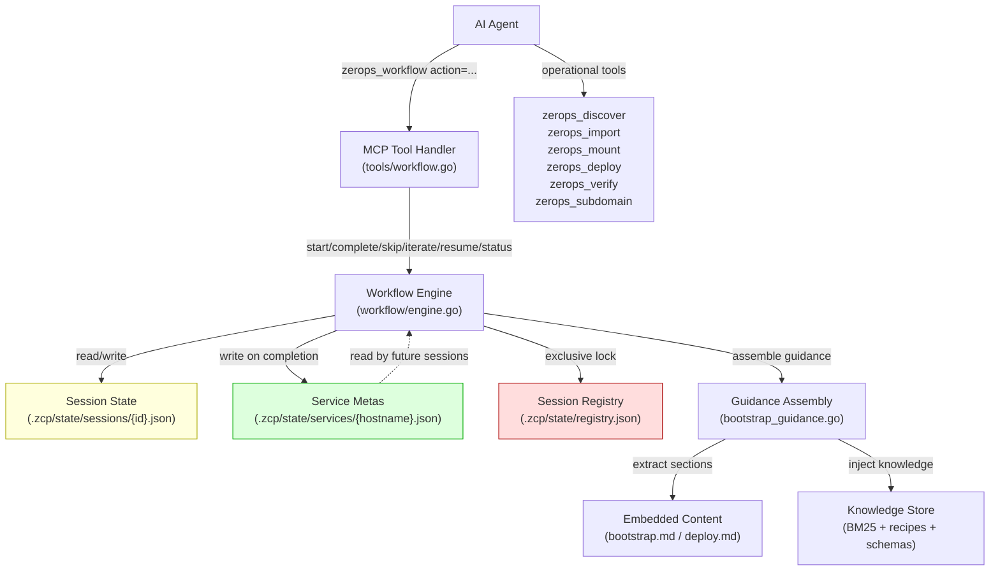

The workflow system is a **step-based state machine** that guides an AI agent through infrastructure setup. The engine:
- Manages session lifecycle (create, progress, iterate, resume, complete)
- Injects context-aware guidance at each step (mode-specific, iteration-aware, knowledge-enriched)
- Validates progress through attestations and optional checkers
- Persists decisions as ServiceMeta files that inform future workflows

---

## 3. Bootstrap Flow

### 3.1 Lifecycle Overview

**Entry**: `zerops_workflow action="start" workflow="bootstrap"`
- Creates exclusive session (only one bootstrap at a time, enforced via registry lock)
- Sets first step (discover) to `in_progress`
- Returns available stack catalog for type validation

**Progression**: 6 steps, strictly linear. Each step transitions:
`pending → in_progress → complete | skipped`

**Exit**: All 6 steps complete/skipped → session file deleted, ServiceMeta files written, reflog appended to CLAUDE.md.

**Exclusivity**: Only one bootstrap session can be active per project. Enforced by `InitSessionAtomic()` with file-based lock on `.zcp/state/.registry.lock`.

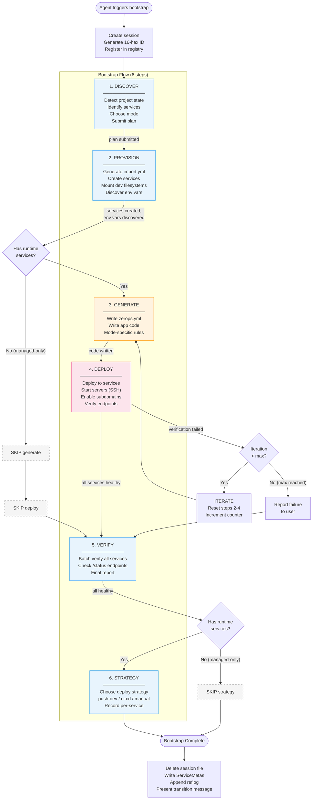

### 3.2 Step Specifications

---

#### Step 1: DISCOVER (fixed, mandatory)

**Purpose**: Detect project state, identify required services, choose bootstrap mode, submit structured plan.

**Inputs**:
- Project ID (from auth)
- Live API access (zerops_discover)
- User intent (what they want to build)

**Outputs**:
- Project state classification (FRESH / CONFORMANT / NON_CONFORMANT)
- ServicePlan with validated targets
- Chosen mode (standard / dev / simple)

**Procedure**:

1. **Detect project state** — call `zerops_discover` to see existing services:

   | Result | State | Action |
   |--------|-------|--------|
   | No runtime services | FRESH | Full bootstrap |
   | Requested services exist as dev+stage pairs with matching stack | CONFORMANT | Route to deploy workflow (skip bootstrap) |
   | Services exist but don't match expected pattern | NON_CONFORMANT | STOP. Present to user. NEVER auto-delete. |

2. **Identify stack components** from user request:
   - **Runtime services**: type + framework (e.g., `nodejs@22` with Next.js)
   - **Managed services**: type + version (e.g., `postgresql@16`, `valkey@7.2`)
   - If unspecified, ASK. Don't guess frameworks.

3. **Validate all types** against `availableStacks` field in the workflow response.

4. **Choose bootstrap mode** — present to user, get confirmation:
   - **Standard** (default): `{name}dev` + `{name}stage` + shared managed. Dev for iteration, stage for validation.
   - **Dev**: `{name}dev` + managed only. No stage. For prototyping.
   - **Simple**: `{name}` + managed. Real start command, auto-starts. Only if user explicitly requests.

5. **Load recipe** (optional): `zerops_knowledge recipe="{name}"` for framework-specific patterns.

6. **Present plan to user**: "I'll set up: [services]. Mode: [mode]. OK?"

7. **Submit plan** after confirmation:
   ```
   zerops_workflow action="complete" step="discover" plan=[{
     runtime: {devHostname, type, bootstrapMode},
     dependencies: [{hostname, type, mode, resolution}]
   }]
   ```

**Plan validation** (server-side, automatic):
- Hostnames: `[a-z0-9]` only, max 25 chars
- Types: matched against live platform catalog
- Mode: `""` | `"standard"` | `"dev"` | `"simple"` (empty defaults to standard)
- Standard mode: devHostname must end in `"dev"`, stage derived as `{prefix}stage`
- Dependencies: resolution must be `CREATE` | `EXISTS` | `SHARED`
  - CREATE: service must NOT exist
  - EXISTS: service MUST exist
  - SHARED: another target must CREATE this hostname
- Managed mode: auto-defaults to `NON_HA` if omitted

**Mode-specific behavior**:

| Aspect | Standard | Dev | Simple |
|--------|----------|-----|--------|
| Hostnames | `{name}dev` + `{name}stage` | `{name}dev` | `{name}` |
| Plan targets | devHostname + stage derived | devHostname only | hostname only |

**Managed-only behavior**:
- Plan with zero runtime targets, only dependencies submitted directly
- **Current code gap**: `validate.go` requires `len(targets) > 0` — needs fix to allow empty targets with non-empty dependencies
- Route: discover → provision → SKIP generate → SKIP deploy → verify → SKIP strategy

**Invariants**:
- Plan validated against live API types before storage
- User must confirm plan before submission
- CONFORMANT projects skip bootstrap entirely → deploy workflow
- NON_CONFORMANT projects require explicit user decision

---

#### Step 2: PROVISION (fixed, mandatory)

**Purpose**: Create infrastructure on Zerops, mount dev filesystems, discover environment variables.

**Inputs**:
- ServicePlan from discover step
- Live API access

**Outputs**:
- All services created on Zerops platform
- Dev filesystems mounted via SSHFS at `/var/www/{hostname}/`
- Env var names discovered and stored in session (`BootstrapState.DiscoveredEnvVars`)

**Procedure**:

1. **Generate import.yml** based on plan:

   | Property | Dev service | Stage service | Simple service | Managed |
   |----------|------------|---------------|----------------|---------|
   | `startWithoutCode` | `true` | omit | `true` | N/A |
   | `maxContainers` | `1` | omit (default) | omit | N/A |
   | `enableSubdomainAccess` | `true` | `true` | `true` | N/A |
   | `mount` (shared-storage) | `[{storage}]` | `[{storage}]` | `[{storage}]` | N/A |

2. **Present import.yml** to user for review.

3. **Import services**: `zerops_import content="<import.yml>"` — blocks until all processes complete. Returns per-service status (FINISHED/FAILED).

4. **Verify services**: `zerops_discover` — confirm all services exist in expected states (RUNNING for dev, READY_TO_DEPLOY for stage).

5. **Mount dev filesystems**: `zerops_mount action="mount" serviceHostname="{devHostname}"` for each runtime dev service. NOT stage. NOT managed. Mount path: `/var/www/{hostname}/`.

6. **Discover env vars**: `zerops_discover includeEnvs=true` — single call returns ALL services with actual env var values. **Store NAMES ONLY** in session state:
   ```
   BootstrapState.DiscoveredEnvVars = map[hostname][]varNames
   ```

**Mode-specific behavior**:

| Aspect | Standard | Dev | Simple | Managed-only |
|--------|----------|-----|--------|-------------|
| Services created | dev + stage + managed | dev + managed | service + managed | managed only |
| Stage exists | Yes (READY_TO_DEPLOY) | No | No | No |
| Mounts | dev only | dev only | service | None |
| Env var discovery | All managed services | All managed | All managed | All managed |

**Key rules**:
- `mount:` in import.yml only applies to ACTIVE services. Stage is READY_TO_DEPLOY → mount silently ignored. After first stage deploy, connect via `zerops_manage action="connect-storage"`.
- Two kinds of "mount": (1) `zerops_mount` = SSHFS dev tool, (2) shared-storage mount = platform `mount:` in import.yml + zerops.yml.

**Invariants**:
- All plan services exist in API after import
- Dev services mounted and writable
- Env var names (never values) stored in session state

---

#### Step 3: GENERATE (creative, skippable)

**Purpose**: Write zerops.yml and application code to mounted filesystem.

**Skip condition**: No runtime services in plan (managed-only).

**Inputs**:
- Mounted filesystem at `/var/www/{hostname}/`
- Discovered env var names from provision step
- Runtime knowledge (injected automatically)
- Recipe knowledge (if loaded in discover)

**Outputs**:
- `zerops.yml` with correct setup entry
- Application code with required endpoints (`/`, `/health`, `/status`)

**Procedure**:

1. **Write all files to SSHFS mount path** `/var/www/{hostname}/` (NOT `/var/www/`).

2. **Write zerops.yml** per mode (see mode-specific rules below).

3. **Write application code**:
   - HTTP server on port from zerops.yml `run.ports`
   - Read env vars via runtime's native API (NOT `.env` files)
   - Bind to `0.0.0.0`, NOT localhost

4. **Required endpoints**:

   | Endpoint | Response | Purpose |
   |----------|----------|---------|
   | `GET /` | `"Service: {hostname}"` | Smoke test |
   | `GET /health` | `{"status":"ok"}` (200) | Liveness probe |
   | `GET /status` | Connectivity JSON (200) | Proves managed service connections |

   `/status` MUST actually connect to each dependency and report:
   ```json
   {
     "service": "{hostname}",
     "status": "ok",
     "connections": {
       "db": {"status": "ok", "latency_ms": 5},
       "cache": {"status": "ok", "latency_ms": 1}
     }
   }
   ```

5. **Map env vars** in zerops.yml using ONLY discovered names:
   ```yaml
   envVariables:
     DATABASE_URL: ${db_connectionString}
     REDIS_HOST: ${cache_host}
   ```

6. **Run pre-deploy checklist** (mode-specific, see below).

**Mode-specific zerops.yml rules**:

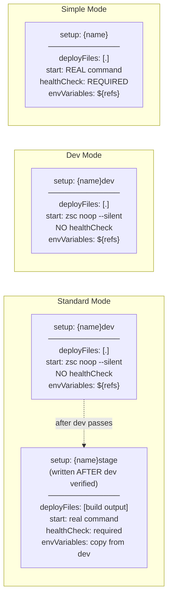

| Property | Standard (dev entry) | Dev | Simple |
|----------|---------------------|-----|--------|
| `deployFiles` | `[.]` ALWAYS | `[.]` ALWAYS | `[.]` ALWAYS |
| `start` | `zsc noop --silent` | `zsc noop --silent` | Real command (`node index.js`, etc.) |
| `healthCheck` | None | None | Required (`httpGet` on app port) |
| `buildCommands` | Deps install only | Deps install only | Deps + compile if needed |
| PHP runtimes | Omit `start:` entirely | Omit `start:` entirely | Omit `start:` entirely |

**Pre-deploy checklist** (all modes):
- [ ] `setup:` hostname matches plan
- [ ] `deployFiles: [.]` — NO EXCEPTIONS for self-deploying services
- [ ] `start:` correct for mode (noop for standard/dev, real for simple; omit for PHP)
- [ ] `run.ports` matches app listen port (omit for PHP)
- [ ] `envVariables` uses ONLY discovered var names
- [ ] App binds to `0.0.0.0:{port}`
- [ ] Simple mode: `healthCheck` present
- [ ] Standard mode: NO stage entry yet (comes after dev verification)

**Invariants**:
- zerops.yml references only discovered env vars
- `deployFiles: [.]` for all self-deploying services
- No `.env` files created (Zerops injects env vars as OS vars)

---

#### Step 4: DEPLOY (branching, skippable)

**Purpose**: Deploy code to runtime services, start servers, enable subdomains, verify health.

**Skip condition**: No runtime services in plan (managed-only).

**Inputs**:
- zerops.yml and code on mounted filesystem
- Discovered env vars in session

**Outputs**:
- All runtime services deployed and verified healthy
- Subdomains enabled with URLs

**Core principle**: Deploy first — env vars activate at deploy time. Dev is for iterating and fixing. Stage (standard mode) is for final validation.

**Procedure by mode**:

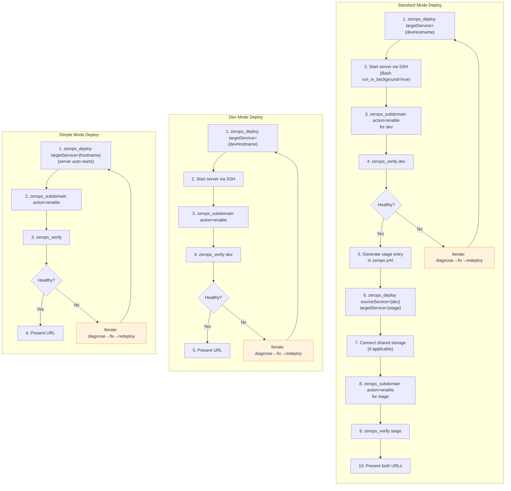

**Operational details**:

| Operation | Behavior |
|-----------|----------|
| `zerops_deploy targetService=X` | SSH self-deploy: auto-infers sourceService, forces includeGit=true, SSHes into container, runs `git init` + `zcli push`. **Blocks** until build completes. Returns DEPLOYED or BUILD_FAILED with build logs. |
| `zerops_deploy sourceService=X targetService=Y` | Cross-deploy: pushes from source container to target. Target runs its own build pipeline. Stage has real `start:` → server auto-starts. |
| `zerops_subdomain action="enable"` | **MUST be called after every deploy** even if `enableSubdomainAccess` was in import. Returns `subdomainUrls` — the ONLY source for URLs. Idempotent. |
| `zerops_verify` | 6 checks for dynamic runtime, fewer for static/implicit/managed. Returns healthy/degraded/unhealthy with `checks` array. |
| SSH server start | `Bash run_in_background=true`. Kill previous first. NOT needed for PHP/nginx/static (implicit-webserver auto-starts). NOT needed for simple mode (real start command auto-starts). |

**Dev iteration cycle** (standard + dev modes):
1. Edit code on mount path → changes appear instantly in container
2. Kill previous server, start new one via SSH
3. Check startup via TaskOutput
4. Test: `ssh {dev} "curl -s localhost:{port}/health"` | jq .
5. Redeploy ONLY if zerops.yml changed. Code-only changes → server restart only.

**Stage deploy rules** (standard mode only):
- Stage entry written AFTER dev passes verification
- `start:` = real production command (NOT `zsc noop`)
- `healthCheck` required — server auto-starts and auto-restarts
- `deployFiles` = build output (NOT `[.]`) — stage receives compiled artifacts
- `envVariables` copied from dev (already proven via /status)
- Connect shared-storage after first stage deploy via `zerops_manage`

**Multi-service orchestration** (2+ runtime services):
- Parent agent imports all, mounts all, discovers all env vars
- Spawns Service Bootstrap Agent per runtime service pair (in parallel)
- Each subagent gets: mount path, env vars, runtime knowledge, service bootstrap prompt
- Parent runs final verification after all subagents complete

**Invariants**:
- Dev deployed and verified BEFORE stage
- Server started via SSH after every dev deploy (container restarts kill server)
- Subdomain enabled after every deploy (even if set in import)
- Simple mode: no SSH start needed (real start command + healthCheck auto-starts)
- Implicit-webserver runtimes: no SSH start needed (auto-starts)

---

#### Step 5: VERIFY (fixed, mandatory)

**Purpose**: Independent batch verification of all services and final report.

**Inputs**: Deployed services (or managed services for managed-only)

**Outputs**: Health status report with URLs

**Procedure**:

1. **Batch verify**: `zerops_verify` (no hostname = all services)
2. **Check results per service**:

   | Runtime class | Checks performed |
   |--------------|-----------------|
   | Dynamic (nodejs, go, bun, python, rust, java, deno, dotnet) | service_running, error_logs, startup_detected, http_root (/), http_status (/status) |
   | Implicit (php-nginx, php-apache) | service_running, error_logs, http_root, http_status |
   | Static (nginx, static) | service_running, http_root |
   | Worker (no ports) | service_running, error_logs |
   | Managed (postgresql, valkey...) | service_running only |

3. **Aggregate status**:
   - **healthy**: all checks pass (info checks don't count as failure)
   - **degraded**: service running but some checks fail
   - **unhealthy**: service not running

4. **Present final report**: hostnames, types, status, subdomain URLs, next steps.

**Invariants**:
- All plan target services must be verified
- error_logs checks return `info` (advisory), not `fail` — SSH deploy logs often classified as errors

---

#### Step 6: STRATEGY (fixed, skippable)

**Purpose**: Record deployment strategy for each runtime service.

**Skip condition**: No runtime services (managed-only).

**Inputs**: Verified services

**Outputs**: Per-hostname strategy stored in session and ServiceMeta

**Procedure**:

1. Present options to user:

   | Strategy | How it works | Best for |
   |----------|-------------|----------|
   | `push-dev` | SSH push to running container | Local dev, prototyping |
   | `ci-cd` | Git pipeline trigger | Teams, production |
   | `manual` | No automation, monitoring only | Existing pipelines |

2. Record: `zerops_workflow action="complete" step="strategy" strategies={"hostname": "push-dev"}`

**Auto-assignment**: dev and simple modes auto-assign `push-dev` if no explicit choice.

---

### 3.3 Managed-Only Fast Path

For projects with only managed services (databases, caches, storage) and no runtime:

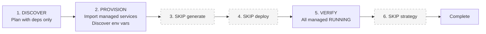

**Key differences**:
- Plan submitted with zero `targets` array, dependencies listed at top level (code gap: currently requires `len(targets) > 0`)
- No SSHFS mounts (no runtime filesystem to mount)
- Env vars still discovered (available for future runtime additions)
- ServiceMeta written for managed services without mode/stage fields

---

## 4. Deploy Flow

### 4.1 Relationship to Bootstrap

Deploy is a **derived subset** of bootstrap. It operates on services that already exist (created by bootstrap) and uses ServiceMeta files for context.

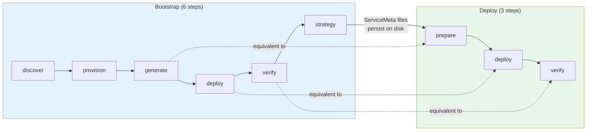

| Aspect | Bootstrap Deploy (step 4) | Deploy Workflow |
|--------|--------------------------|-----------------|
| Context source | Plan + session state | ServiceMeta files from prior bootstrap |
| Session | Part of bootstrap session | Own separate session |
| Prerequisites | Provision done, filesystems mounted, code written | Services exist, zerops.yml exists |
| Mode detection | From plan targets | From ServiceMeta.Mode field |
| Deploy mechanism | Same (SSH) | Same (SSH) |
| Iteration | Resets bootstrap steps 2-4 | Resets deploy steps 1-2 |

### 4.2 Step Specifications

**Entry**: `zerops_workflow action="start" workflow="deploy"`
- Reads ServiceMeta files from `.zcp/state/services/`
- Filters to runtime services (those with Mode or StageHostname)
- Builds ordered deploy targets (dev first, then stage for standard mode)
- Creates deploy session

---

#### Deploy Step 1: PREPARE

**Purpose**: Discover target services, check zerops.yml, load knowledge.

**Procedure**:
1. `zerops_discover includeEnvs=true` — note each service status
2. Route based on status:
   - RUNNING + zerops.yml exists → skip to deploy
   - RUNNING + no zerops.yml → load knowledge, fix config
   - READY_TO_DEPLOY → first deploy, generate config
   - Not found → wrong hostname or not created, use bootstrap
3. Verify zerops.yml has correct `setup:` entries for all targets

---

#### Deploy Step 2: DEPLOY

**Purpose**: Execute deployments per mode.

**Procedure**: Same as bootstrap deploy step, per mode:

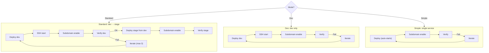

Per-target tracking: each target has status (pending/deployed/verified/failed/skipped).
Dev targets must pass before stage targets are attempted.

---

#### Deploy Step 3: VERIFY

Same protocol as bootstrap verify step. Batch verification of all deploy targets.

---

## 5. State Model

### 5.1 Session State (ephemeral)

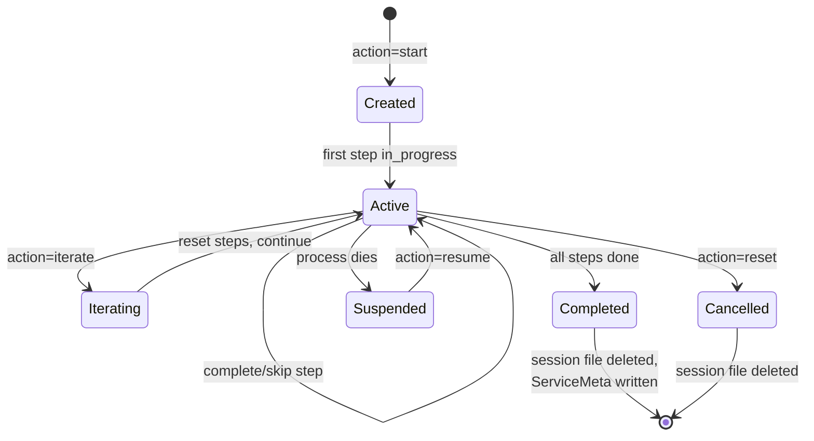

**Structure** (`.zcp/state/sessions/{id}.json`):
```
WorkflowState {
  Version:    "1"
  SessionID:  16-hex random
  PID:        process owner (liveness signal)
  ProjectID:  Zerops project ID
  Workflow:   "bootstrap" | "deploy" | "cicd"
  Iteration:  cycle counter (0, 1, 2, ...)
  Intent:     user's stated goal
  CreatedAt:  RFC3339
  UpdatedAt:  RFC3339
  Bootstrap:  *BootstrapState  (if bootstrap)
  Deploy:     *DeployState     (if deploy)
}
```

**Session registry** (`.zcp/state/registry.json`):
- Tracks all active sessions with PID, workflow, project
- Exclusive lock via `.registry.lock` file
- Auto-prunes dead PIDs and sessions >24h old

### 5.2 ServiceMeta (persistent evidence)

**Structure** (`.zcp/state/services/{hostname}.json`):
```
ServiceMeta {
  Hostname:         string          // immutable
  Type:             string          // e.g., "nodejs@22"
  Mode:             string          // "standard" | "dev" | "simple" (empty for managed)
  Status:           string          // "planned" → "provisioned" → "bootstrapped"
  StageHostname:    string          // derived stage (standard mode only)
  Dependencies:     []string        // dependency hostnames
  BootstrapSession: string          // session ID that created this
  BootstrappedAt:   string          // date
  Decisions:        map[string]string  // {deployStrategy: "push-dev"}
}
```

**Write lifecycle**:

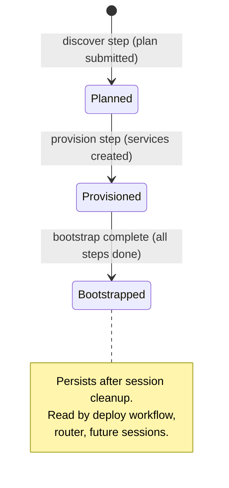

**Rules**:
- EXISTS/SHARED dependencies: never overwrite existing ServiceMeta files
- CREATE dependencies: write new ServiceMeta with managed type, no mode
- Runtime services: write with mode, stageHostname (standard only), dependencies
- Auto-assign `push-dev` strategy for dev/simple modes if no explicit choice

### 5.3 Discovered Environment Variables

**Storage**: `BootstrapState.DiscoveredEnvVars = map[hostname][]varNames`

**Flow**:
1. `zerops_discover includeEnvs=true` returns actual values (passwords, connection strings) — TRANSIENT
2. Session stores NAMES ONLY — PERSISTENT during session
3. Agent guidance uses `${hostname_varName}` references — SAFE (no secrets in prompts)
4. Agents write references in zerops.yml `envVariables` — resolved at container level

**Security**: Discover tool exposes unmasked values. This is by design for validation purposes. Agent prompts receive names only. Values never persisted in session state.

---

## 6. Mode Behavior Matrix

Complete cross-reference of how each mode affects every aspect of the workflow:

| Aspect | Standard | Dev | Simple | Managed-only |
|--------|----------|-----|--------|-------------|
| **Services created** | `{name}dev` + `{name}stage` + managed | `{name}dev` + managed | `{name}` + managed | managed only |
| **import.yml dev** | `startWithoutCode: true`, `maxContainers: 1` | same | `startWithoutCode: true` | N/A |
| **import.yml stage** | No `startWithoutCode` (stays READY_TO_DEPLOY) | N/A | N/A | N/A |
| **SSHFS mounts** | dev only | dev only | service only | None |
| **zerops.yml entries** | Dev first, stage AFTER dev verified | Dev only | Single entry | N/A |
| **zerops.yml start** | `zsc noop --silent` (dev) / real (stage) | `zsc noop --silent` | Real command | N/A |
| **zerops.yml healthCheck** | None (dev) / required (stage) | None | Required | N/A |
| **zerops.yml deployFiles** | `[.]` (dev) / build output (stage) | `[.]` | `[.]` | N/A |
| **Server start method** | SSH manual (dev) / auto (stage) | SSH manual | Auto (healthCheck) | N/A |
| **Subdomain enable** | Both dev + stage | Dev only | Service only | N/A |
| **Deploy flow** | dev→verify→stage→verify | dev→verify | deploy→verify | N/A |
| **Iteration resets** | Steps 2-4 (generate/deploy/verify) | Same | Same | N/A |
| **Strategy auto-assign** | None (user chooses) | `push-dev` | `push-dev` | N/A |
| **Skip generate** | No | No | No | Yes |
| **Skip deploy** | No | No | No | Yes |
| **Skip strategy** | No | No | No | Yes |
| **PHP runtimes** | Omit `start:` entirely | Same | Same | N/A |

---

## 7. Flow Transitions & Resumption

### 7.1 Bootstrap → Deploy Transition

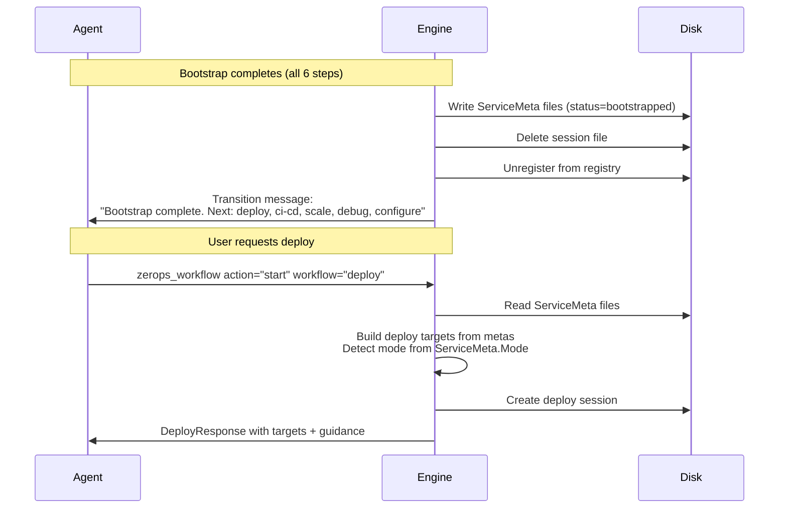

### 7.2 Resumption After Interruption

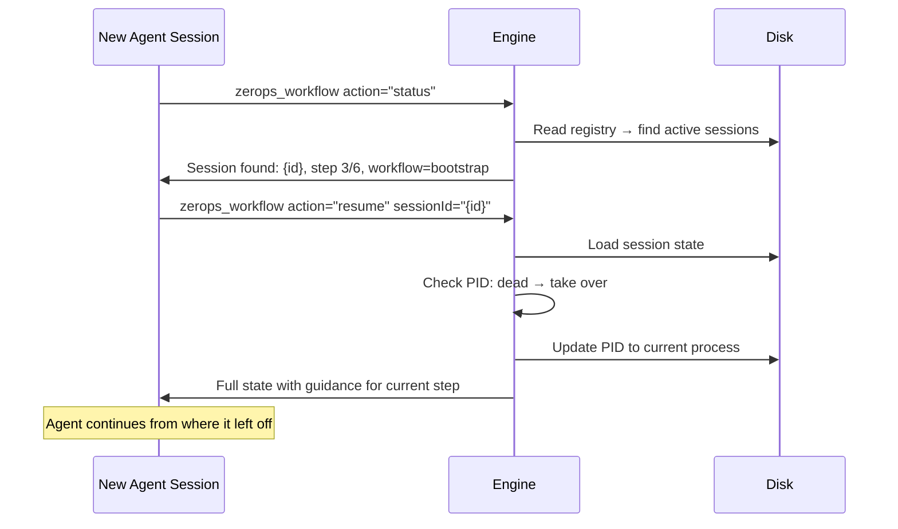

**PID-based ownership**: Session bound to creating process via PID. If PID is dead, any process can resume. If PID is alive, resume fails (session owned by another process).

### 7.3 Iteration

**Bootstrap iteration** (`action="iterate"`):
- Increments `Iteration` counter
- Resets steps 2-4 (generate, deploy, verify) to `pending`
- Sets `CurrentStep = 2` (generate), marks `in_progress`
- **Preserves**: discover attestation, provision attestation + env vars, plan, ServiceMetas, strategy if set

**Deploy iteration** (`action="iterate"`):
- Increments `Iteration` counter
- Resets steps 1-2 (deploy, verify) to `pending`
- Resets all target statuses to `pending`
- Sets `CurrentStep = 1` (deploy)
- **Preserves**: prepare step

**Escalating guidance** (injected at deploy step based on iteration count):
- **Iterations 1-2**: "DIAGNOSE: check errors, fix, redeploy"
- **Iterations 3-4**: Systematic checklist (env vars, zerops.yml, binding, ports)
- **Iterations 5+**: "STOP. Present full diagnosis to user. Ask before continuing."

---

## 8. Invariants & Contracts

### Session Invariants

| ID | Invariant | Enforced by |
|----|-----------|-------------|
| I1 | Only one bootstrap session active at any time | `InitSessionAtomic()` with registry lock |
| I2 | Step completion requires attestation ≥ 10 chars | `CompleteStep()` validation |
| I3 | Steps progress strictly in order | `CompleteStep()` name-matching check |
| I4 | discover, provision, verify cannot be skipped | `SkipStep()` checks `Skippable` field |
| I5 | generate and deploy cannot be skipped when runtime targets exist | `validateConditionalSkip()` |
| I6 | Session file atomically written (temp + rename) | `SaveSessionState()` |
| I7 | Completed sessions cleaned up (file deleted, registry entry removed) | `ResetSessionByID()` at completion |

### State Invariants

| ID | Invariant | Enforced by |
|----|-----------|-------------|
| S1 | ServiceMeta written at three lifecycle points: planned, provisioned, bootstrapped | `writeBootstrapOutputs()` |
| S2 | EXISTS/SHARED dependencies never overwrite existing ServiceMeta | `writeBootstrapOutputs()` skip check |
| S3 | Env var names (not values) stored in session state | `DiscoveredEnvVars` type is `map[string][]string` (names) |
| S4 | Strategy stored in both session (transient) and ServiceMeta.Decisions (persistent) | `writeBootstrapOutputs()` |

### Knowledge Invariants

| ID | Invariant | Enforced by |
|----|-----------|-------------|
| K1 | Generate step receives: runtime briefing, dependency wiring, discovered env vars, zerops.yml schema | `assembleKnowledge()` for generate step |
| K2 | Deploy step receives: schema rules, env vars | `assembleKnowledge()` for deploy step |
| K3 | Provision step receives: import.yml schema | `assembleKnowledge()` for provision step |
| K4 | Iteration > 0 on deploy returns escalating recovery guidance | `resolveIterationGuidance()` |

### Flow Invariants

| ID | Invariant | Enforced by |
|----|-----------|-------------|
| F1 | Deploy workflow requires existing ServiceMeta files | `handleDeployStart()` reads + validates metas |
| F2 | Router uses live API + ServiceMeta to suggest workflows | `Route()` in router.go |
| F3 | Immediate workflows (debug, scale, configure) are stateless | `IsImmediateWorkflow()` check |
| F4 | Bootstrap auto-resets completed sessions on new start | `engine.Start()` checks Active=false |

### Operational Invariants

| ID | Invariant | Enforced by |
|----|-----------|-------------|
| O1 | `zerops_deploy` blocks until build completes | `PollBuild()` in ops/deploy.go |
| O2 | `zerops_import` blocks until all processes complete | Process polling in ops/import.go |
| O3 | `zerops_subdomain` must be called after every deploy | Documented in guidance + deploy step |
| O4 | `zerops_verify` runtime checks depend on runtime class | `classifyRuntime()` in ops/verify.go |
| O5 | Server must be started via SSH after every dev deploy | Container restart kills server; guidance enforces |

---

## 9. Recovery & Error Handling

### Verification Failure Diagnosis

| Failed check | Diagnosis | Fix |
|-------------|-----------|-----|
| service_running: fail | Service not running | Check deploy status, read `zerops_logs severity=error` |
| startup_detected: fail | App crashed on start | `zerops_logs severity=error since=5m` |
| error_logs: info | Advisory — errors found | Read detail. SSH/infra noise → ignore. App errors → investigate. |
| http_root: fail | App not responding on / | Check port, binding, start command |
| http_status: fail | Managed service connectivity | Check env var mapping vs discovered vars |

### Common Fix Patterns

| Symptom | Likely cause | Fix |
|---------|-------------|-----|
| Build FAILED: "command not found" | Wrong buildCommands | Check runtime knowledge |
| Build FAILED: "module not found" | Missing dependency install | Add install to buildCommands |
| App crashes: "EADDRINUSE" | Port conflict | Ensure port matches zerops.yml |
| App crashes: "connection refused" | Wrong env var name | Check envVariables vs discovered vars |
| HTTP 502 | Subdomain not activated | Call `zerops_subdomain action="enable"` |
| Empty response | Not listening on 0.0.0.0 | Fix app binding |
| HTTP 500 | App error | Check `zerops_logs` + framework log files FIRST |

---

## 10. Known Gaps & Future Work

| Gap | Impact | Status |
|-----|--------|--------|
| Managed-only plan validation (`len(targets) > 0` required) | Cannot bootstrap managed-only projects | Code fix needed in validate.go |
| Dev mode hostname suffix enforcement (must end in "dev") | Dev mode can use non-standard hostnames | 2-line validation fix in validate.go |
| Env var reference validation at generate step | Invalid `${hostname_varName}` refs silently kept as literals | No validation against discovered vars |
| Import error surfacing (per-service API errors) | Partial import failures hard to diagnose | Better error detail needed |
| Least-privilege discover mode | Discover unnecessarily returns actual secret values | Future: names-only mode option |
