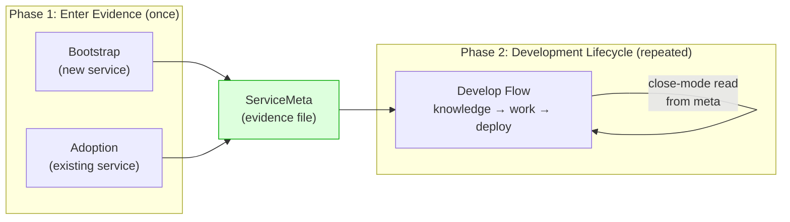
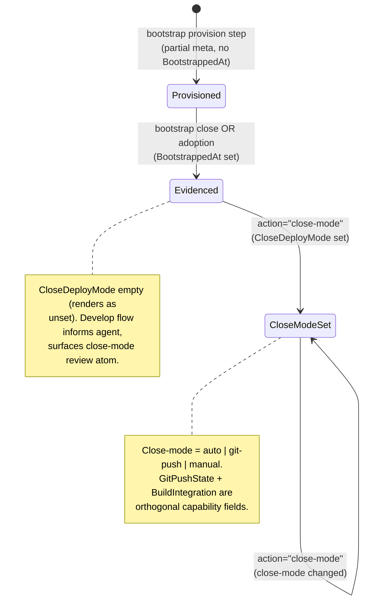
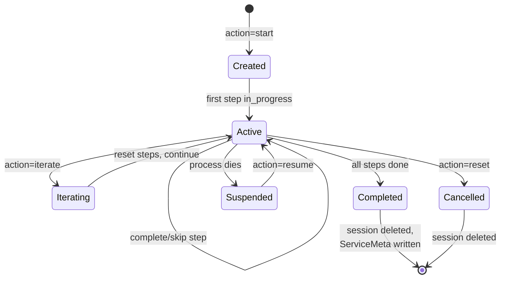
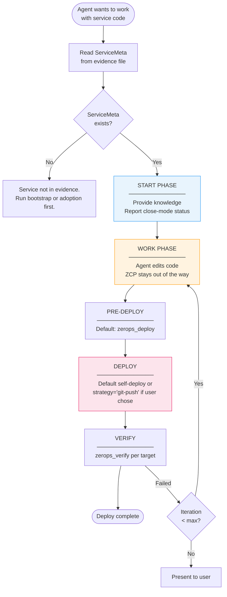

# ZCP Workflow Specification

> **Scope**: Bootstrap, adoption, close-mode + git-push capability + build-integration management (central deploy-config entries — `action="close-mode"`, `action="git-push-setup"`, `action="build-integration"`), develop, recipe, export — both container and local environments, all modes; plus the envelope/plan/atom pipeline that feeds every workflow-aware response.
> **Companion docs**:
> - `docs/spec-scenarios.md` — per-scenario acceptance walkthrough (S1–S13), pinned by `internal/workflow/scenarios_test.go`.
> - `docs/spec-work-session.md` — per-PID Work Session for develop.
> - `docs/spec-knowledge-distribution.md` — atom corpus authoring model (axes, priorities, placeholders).

---

## 1. Lifecycle Overview

### 1.1 Service Lifecycle — Two Phases

Every service on Zerops goes through two phases:



**Phase 1 — Infrastructure**: Bootstrap creates new services (or adoption registers existing ones) and writes an evidence file (ServiceMeta). Only a **verification server** is deployed — a hello-world proving infrastructure works (/, /health, /status). No application logic, no close-mode. Phase 1 answers: "can this service start, respond, and reach its dependencies?"

**Phase 2 — Development**: Develop flow covers ALL code work on the service — implementing the user's actual application, bug fixes, config changes, everything. It discovers what code exists (verification server from bootstrap or existing application), provides runtime knowledge, lets the agent implement what the user wants, and deploys at the end. CloseDeployMode + GitPushState + BuildIntegration are always read fresh from ServiceMeta.

**The boundary is strict**: Bootstrap writes zerops.yaml + infrastructure verification server. The moment the agent needs to write application logic, it must be in develop flow. If the user says "create me an app for uploading photos in Bun", bootstrap creates Bun service + dependencies with a hello-world verification server, then develop flow implements the photo upload app.

### 1.2 Phase Enum — The Single State Variable

The lifecycle above is collapsed into a single typed `Phase` field carried in every `StateEnvelope` (see §1.6). The enum is exhaustive — every tool response resolves to exactly one phase:

| Phase | Meaning | Set by |
|---|---|---|
| `idle` | No active workflow session for this PID. | Default; or after session closes. |
| `bootstrap-active` | A bootstrap session is in progress. | `zerops_workflow action=start workflow=bootstrap`. |
| `develop-active` | A per-PID Work Session is open. | `zerops_workflow action=start workflow=develop`. |
| `develop-closed-auto` | Work Session has `ClosedAt` set and `CloseReason=auto-complete`. Transitional phase — awaits explicit close + next. | Auto-close in `EvaluateAutoClose` when every scope service has a succeeded deploy + passed verify. |
| `recipe-active` | A recipe-authoring session is in progress. | `zerops_workflow action=start workflow=recipe`. |
| `strategy-setup` | Stateless synthesis phase (no session) emitted by `action="git-push-setup"` and `action="build-integration"` — delivers the env-scoped + capability-scoped setup atoms (`setup-git-push-{container,local}`, `setup-build-integration-{webhook,actions}`). | `zerops_workflow action="git-push-setup" service="..."` or `action="build-integration" service="..." integration="..."`. |
| `export-active` | Stateless immediate workflow returning export guidance. | `zerops_workflow action=start workflow=export`. |

Invariant: at most one non-idle **stateful** phase per PID at a time. `strategy-setup`/`export-active` are stateless — they synthesize guidance and return without touching session state, so they never conflict with an active bootstrap/develop/recipe session.

`strategy-setup` replaces the retired `cicd-active` phase. Deploy configuration is now three orthogonal operations:
- `zerops_workflow action="close-mode" closeMode={hostname:auto|git-push|manual}` — what `action="close"` does at develop close.
- `zerops_workflow action="git-push-setup" service="..." remoteUrl="..."` — provisions GIT_TOKEN / .netrc / remote URL and stamps `GitPushState=configured`.
- `zerops_workflow action="build-integration" service="..." integration="webhook|actions"` — chooses the ZCP-managed CI shape (requires `GitPushState=configured`).

See `plans/instruction-delivery-rewrite.md` §4.1 for the concrete Go enum.

### Why Verification-First — The Foundational Principle

The two-phase separation (bootstrap verification → develop application) is the foundational architectural decision of the workflow system. It applies to **ALL modes** — standard, dev, and simple — without exception, even when it appears as overhead for simple setups.

**Fault isolation.** When bootstrap and application are separate, failures have unambiguous origin. If verification fails during bootstrap, the problem is infrastructure — service config, env vars, managed service connectivity. If the app fails during develop, infrastructure is already proven healthy. Without this separation, every failure requires diagnosing both layers simultaneously, which is exponentially harder for an AI agent.

**Universal deployment flow.** By always following the same two-phase pattern, every mode behaves predictably. The deploy step's structure (deploy → verify → iterate) is identical regardless of whether it's standard mode with dev/stage pairs or simple mode with a single service. This universality makes the deployment flow stable and eliminates mode-specific edge cases.

**Reduced blast radius.** Infrastructure problems are caught before any application code exists. The verification server is ~50 lines — when it fails, there are very few places the bug can hide. Once infra is proven, the develop workflow adds application complexity on a stable foundation.

**Faster iteration in develop.** Once bootstrap completes, the develop workflow knows that env vars resolve, managed services connect, and the service can start and respond. Develop iterations focus purely on application logic — no re-verification of infrastructure plumbing.

This principle must never be bypassed. An agent that writes application code during bootstrap (even for simple mode) violates this boundary and loses all four benefits above.

### ServiceMeta — The Evidence File

ServiceMeta (`.zcp/state/services/{hostname}.json`) is the persistent evidence that a service is under ZCP management.

```
ServiceMeta {
  Hostname                 string           // service identifier
  Mode                     Mode             // standard | dev | simple | local-stage | local-only
  StageHostname            string           // stage pair (standard mode only; requires ExplicitStage on the plan target — no hostname-suffix derivation since Release B.4)
  CloseDeployMode          CloseDeployMode  // unset | auto | git-push | manual (how develop close runs)
  CloseDeployModeConfirmed bool             // true after user explicitly confirms/sets close-mode
  GitPushState             GitPushState     // unconfigured | configured | broken | unknown (git-push capability, orthogonal to close-mode)
  RemoteURL                string           // configured git remote (set when GitPushState=configured)
  BuildIntegration         BuildIntegration // none | webhook | actions (ZCP-managed CI shape, requires GitPushState=configured)
  BootstrapSession         string           // session ID that created this; EMPTY for adoption
  BootstrappedAt           string           // date — empty = incomplete (bootstrap in progress)
  FirstDeployedAt          string           // stamped on first real deploy (session or adoption-at-ACTIVE)
}
```

The three axis-bearing fields (`Mode`, `CloseDeployMode`,
`GitPushState`/`BuildIntegration`) are typed Go enums living in
`internal/topology/`. They're orthogonal — a service can be on
`CloseDeployMode=auto` (close runs `zerops_deploy`) while
`GitPushState=configured` (push capability exists, just not used at
close); flipping `CloseDeployMode=git-push` later doesn't require a
re-setup. `Environment` is not persisted: environment is a property of
the currently running ZCP process (runtime-detected), not of a service.

**`BootstrapSession == ""` convention.** Empty (JSON-wise: empty string, not
null) is the adoption marker. Fresh bootstraps set this to the 16-hex
session ID; adoption path writes it as empty. `IsAdopted()` disambiguates
adopted metas from orphan incomplete metas (which also carry an empty
session ID) by requiring `BootstrappedAt` to be set: an adopted meta is
always complete, an orphan never is.



`IsComplete()` returns true when `BootstrappedAt` is set.
`IsAdopted()` returns true when `BootstrapSession` is empty AND the meta
`IsComplete()`. CloseDeployMode + GitPushState + BuildIntegration are
always read from meta at the moment they're needed — never copied into
session state.

### Principles

- **Workflow is NOT a gate.** An agent does not need to start a workflow to call `zerops_scale`, `zerops_manage`, or any other direct tool. Workflows add structure for multi-step operations.
- **Strategy never blocks work.** Agent can always start editing code. Strategy is resolved before deploying, not before working.
- **Tools work independently.** `zerops_discover`, `zerops_verify`, `zerops_knowledge` work without any active workflow.

### 1.3 Delivery Pipeline — Envelope → Plan → Atoms

Every workflow-aware tool response is produced by the same three-stage pipeline, not by ad-hoc guidance assembly.

```
          ┌───────────────┐      ┌────────────┐      ┌──────────────┐
          │ ComputeEnvelope│──▶──▶│ BuildPlan  │      │  Synthesize  │
          │ (state + live  │      │ (Primary,  │  ┌──▶│  (atom filter│
          │  API + session)│      │  Secondary,│  │   │  + compose)  │
          └───────────────┘      │  Alts)     │  │   └──────────────┘
                 │               └────────────┘  │         ▲
                 │                    │          │         │
                 │                    └────────┬─┘         │
                 ▼                             ▼           │
          StateEnvelope  ──────▶──────▶──────▶─┴─── LoadAtomCorpus
                                                     (//go:embed atoms/*.md)
                                 │
                                 ▼
                         ┌────────────────┐
                         │  RenderStatus  │
                         │  (markdown UI) │
                         └────────────────┘
```

**Stage 1 — `ComputeEnvelope`** (`internal/workflow/compute_envelope.go`): the single entry point for state gathering. Reads services from the platform API, service metas from `.zcp/state/services/`, bootstrap session state, the current Work Session, and runtime detection — merging them into a `StateEnvelope`. Called by every workflow-aware tool handler. I/O is parallelised so a tool response pays one round-trip for the envelope regardless of how many state sources are involved.

**Stage 2 — `BuildPlan`** (`internal/workflow/build_plan.go`): a pure function `Plan = BuildPlan(env)`. Deterministic — no I/O, no randomness — so the plan can be reproduced verbatim after LLM context compaction from the same envelope. Branching is a fixed nine-case switch driven by `env.Phase` plus envelope shape (see §1.4).

**Stage 3 — `Synthesize`** (`internal/workflow/synthesize.go`): pure function `guidance = Synthesize(env, corpus)`. Loads the atom corpus once (`LoadAtomCorpus`), filters by axis-match against the envelope, sorts by priority + id, substitutes placeholders from the envelope, and returns the composed bodies. Same compaction-safety invariant: byte-identical output for byte-equal envelopes.

**Stage 4 — `RenderStatus`** (`internal/workflow/render.go`): consumes a `Response{Envelope, Guidance, Plan}` and emits the markdown status block shown to the LLM. The Next section renders the typed `Plan` with priority markers — no free-form Next string, no ad-hoc branching in the renderer.

### 1.4 Plan — Typed Trichotomy

The Plan is the single source of truth for "what should the agent do next". Every workflow-aware response carries one.

```go
type Plan struct {
    Primary      NextAction   // never zero — if we don't know, we error out upstream
    Secondary    *NextAction  // set only when a second action is commonly done in tandem
    Alternatives []NextAction // genuinely alternative paths
}
```

Dispatch (strict order, first match wins — see `build_plan.go` for the code):

1. `PhaseDevelopClosed` → Primary=close-session, Secondary=start-next.
2. `PhaseDevelopActive`, some service without a successful deploy (including last-attempt-failed) → Primary=deploy.
3. `PhaseDevelopActive`, deploy done but verify missing (including last-verify-failed) → Primary=verify.
4. `PhaseDevelopActive`, everything green but session still open → Primary=close.
5. `PhaseBootstrapActive` → Primary=continue-bootstrap (route-specific).
6. `PhaseRecipeActive` → Primary=continue-recipe.
7. `PhaseIdle` with no services → Primary=start-bootstrap.
8. `PhaseIdle` with bootstrapped services → Primary=start-develop + alternatives (adopt if any unmanaged, add-more-services always).
9. `PhaseIdle` with only unmanaged runtimes → Primary=adopt-via-develop.

Failed-last-attempt cases fold into branches 2 and 3 — `firstServiceNeedingDeploy` / `firstServiceNeedingVerify` both key off `!attempts[last].Success`, so a failed service surfaces as a deploy or verify target. Iteration-tier guidance (diagnose / systematic-check / STOP) rides along via atoms, not a distinct Plan branch.

Gate semantics in the Plan are informational, not structural: e.g. `CloseDeployMode=unset` does not block the Plan from naming a deploy action. The first deploy always uses the default self-deploy mechanism regardless of close-mode; once `FirstDeployedAt` is stamped, the `develop-strategy-review` atom (`phases: [develop-active]`, `deployStates: [deployed]`, `closeDeployModes: [unset]`) prompts the agent to confirm an ongoing close-mode. This keeps `BuildPlan` a pure dispatch over envelope shape.

### 1.5 Atom Corpus — Orthogonal Knowledge Matrix

Runtime-dependent guidance lives as ~74 atoms under `internal/content/atoms/*.md`, embedded via `//go:embed`. Each atom has YAML frontmatter declaring its `AxisVector` and a markdown body.

```yaml
---
id: develop-dynamic-runtime-start-container
priority: 3
phases: [develop-active]
runtimes: [dynamic]
environments: [container]
modes: [dev, standard]
title: "Dynamic runtime — start dev server via zerops_dev_server (container)"
---

After a dev-mode dynamic-runtime deploy the container runs `zsc noop`. Start
the dev server via the canonical primitive:
    zerops_dev_server action=start hostname={hostname} command="{start-command}" port={port} healthPath="{path}"
```

Atom bodies are authored elsewhere — this spec references them as
authoritative, not as content copied inline. See
`internal/content/atoms/develop-dynamic-runtime-start-container.md` for
the full prescription.

**Axes** (the knowledge-variation dimensions):

| Axis | Values | Emptiness semantic |
|---|---|---|
| `phases` | `idle`, `bootstrap-active`, `develop-active`, `develop-closed-auto`, `recipe-active`, `strategy-setup`, `export-active` | MUST be non-empty. |
| `modes` | `dev`, `stage`, `simple` | Empty = any mode. |
| `environments` | `container`, `local` | Empty = either. |
| `closeDeployModes` | `unset`, `auto`, `git-push`, `manual` | Empty = any close-mode. |
| `gitPushStates` | `unconfigured`, `configured`, `broken`, `unknown` | Empty = any git-push capability state. |
| `buildIntegrations` | `none`, `webhook`, `actions` | Empty = any build integration. |
| `runtimes` | `dynamic`, `static`, `implicit-webserver`, `managed`, `unknown` | Empty = any runtime. |
| `routes` | `recipe`, `classic`, `adopt` | Bootstrap-only. Empty = any route. |
| `steps` | bootstrap step names | Bootstrap-only. Empty = any step. |

**Synthesizer contract**:

1. Filter: an atom matches iff every non-empty axis permits the envelope. Service-scoped axes (`modes`/`closeDeployModes`/`gitPushStates`/`buildIntegrations`/`runtimes`) match if *any* service in `env.Services` matches.
2. Sort: priority ascending (1 first), then id lexicographically.
3. Substitute: `{hostname}`, `{stage-hostname}`, `{project-name}` are replaced from the envelope; a whitelist of agent-filled placeholders (`{start-command}`, `{port}`, …) survives untouched. Any unknown `{word}` token is a build-time error.
4. Return: ordered list of rendered bodies.

**Compaction-safety invariant**: for byte-equal envelopes, `Synthesize` MUST return byte-identical output. No map iteration, no timestamps, no randomness leaks into the body.

### 1.6 StateEnvelope — Live Data Contract

`StateEnvelope` is the single typed data structure passed between stages. It is attached verbatim to every workflow-aware tool response, so the LLM can reconstruct state post-compaction.

| Field | Purpose |
|---|---|
| `Phase` | The phase enum from §1.2. Drives atom filtering and plan dispatch. |
| `Environment` | `container` or `local`. Driven by `runtime.Info.InContainer`. |
| `SelfService` | Hostname of the ZCP control-plane container (container env only). |
| `Project` | `{ID, Name}` — project identity. |
| `Services[]` | Sorted snapshots: hostname, type+version, runtime class, status, bootstrapped flag, mode, closeDeployMode, gitPushState, buildIntegration, stage pair. |
| `WorkSession` | Open develop session summary: intent, scope, deploy/verify attempts, close state. `nil` outside develop. |
| `Recipe` | Recipe session summary. `nil` outside recipe-active. |
| `Bootstrap` | Bootstrap session summary: route, step, iteration. `nil` outside bootstrap-active. |
| `Generated` | Timestamp for the envelope (diagnostics only — not part of synthesis input). |

Slices sort by hostname; attempt lists sort by time; maps use key-sorted encoding. The JSON form is deterministic, which is what makes §1.3's compaction-safety invariant provable.

Full field-level Go definitions live in `internal/workflow/envelope.go` and `plans/instruction-delivery-rewrite.md` §4.

---

## 2. Bootstrap Flow

Bootstrap creates a new service on Zerops and writes the evidence file. That is its only job — it does NOT set close-mode or any deploy-config fields.

```mermaid
flowchart TD
    Start([Agent triggers bootstrap]) --> Discovery["Discovery call<br/>action=start workflow=bootstrap<br/>(no route yet)"]
    Discovery --> Options{routeOptions[]}
    Options -->|resume| Commit
    Options -->|adopt| Commit
    Options -->|recipe + slug| Commit
    Options -->|classic| Commit
    Commit["Commit call<br/>action=start workflow=bootstrap route=<chosen><br/>(engine writes session)"] --> CreateSession
    CreateSession["Create session<br/>Generate 16-hex ID<br/>Register in registry"] --> Discover

    subgraph Bootstrap ["Bootstrap Flow (3 steps — Option A: infra only)"]
        direction TB
        Discover["1. DISCOVER<br/>─────────────<br/>Classify services<br/>Identify stack<br/>Choose mode<br/>Submit plan"]

        Provision["2. PROVISION<br/>─────────────<br/>Generate import.yaml<br/>Create services<br/>Mount dev filesystems<br/>Discover env vars"]

        Close["3. CLOSE<br/>─────────────<br/>Verify services RUNNING<br/>Write ServiceMeta<br/>Append reflog<br/>Hand off to develop"]
    end

    Discover -->|"plan submitted"| Provision
    Provision -->|"services created"| Close

    Provision -->|"failed"| HardStop["HARD STOP<br/>(bootstrap never iterates;<br/>escalate to user)"]

    Close --> Complete

    Complete([Bootstrap Complete<br/>ServiceMeta BootstrappedAt set<br/>FirstDeployedAt empty — develop owns first deploy])

    style Discover fill:#e8f4fd,stroke:#2196F3
    style Provision fill:#e8f4fd,stroke:#2196F3
    style Close fill:#e8f4fd,stroke:#2196F3
    style HardStop fill:#fce4ec,stroke:#E91E63
```

**Option A (since v8.100+)** — bootstrap is infrastructure only. No
application code, no deploy. Develop owns the entire code-and-deploy
continuum including the first deploy (see `develop-first-deploy-*` atoms
and the `deployStates: [never-deployed]` branch). Bootstrap never
iterates; retry on provision failure hard-stops and escalates to the
user because re-running infra provisioning without human judgment
almost never recovers (stuck metas, conflicting imports).

### 2.0 Route Discovery (first-call split)

Starting a bootstrap is a two-call flow. The first call omits `route`
and returns a ranked `routeOptions[]` list without committing a
session; the second call supplies `route=...` (and `recipeSlug=...`
when `route=recipe`) to commit the session.

```
# 1. Discovery — no session committed
zerops_workflow action="start" workflow="bootstrap" intent="<one sentence>"
→ BootstrapDiscoveryResponse { routeOptions: [...], message: "..." }

# 2. Commit — engine locks in the chosen route
zerops_workflow action="start" workflow="bootstrap" route="recipe" recipeSlug="laravel-minimal"
→ BootstrapResponse { sessionId, progress, current, ... }
```

**Ranking**: `resume` > `adopt` > `recipe` (top `MaxRecipeOptions` above
`MinRecipeConfidence`) > `classic`. `classic` is always present as the
last option — it's the explicit override for "none of the above".

**Route semantics at commit**:

| Route     | When it's offered                                                                | Commit requires             |
|-----------|----------------------------------------------------------------------------------|-----------------------------|
| `resume`  | An incomplete `ServiceMeta` is tagged to a prior session                         | `sessionId` from discovery  |
| `adopt`   | Runtime services exist without complete `ServiceMeta` (and no resumable session) | —                           |
| `recipe`  | Intent scores ≥ `MinRecipeConfidence` against a recipe corpus match              | `recipeSlug`                |
| `classic` | Always                                                                            | —                           |

**Collision annotation**: `recipe` options carry a `collisions[]` list
of hostnames that the recipe's import YAML would clash with in the
current project. Advisory only — provision still catches the conflict
— but the LLM uses it as a pre-flight gate.

**Forcing a route**: A caller that has already decided (e.g. from a
prior discovery round, from a direct user instruction, or from an
internal auto-adoption helper) skips discovery by passing `route=`
on the first call. The engine commits the session immediately.

See `internal/workflow/route.go` for the discriminator implementation
(`BuildBootstrapRouteOptions`) and `internal/workflow/engine.go` for
the commit path (`BootstrapDiscover`, `BootstrapStartWithRoute`,
`BootstrapStart` as the classic-default wrapper).

### 2.1 Session Lifecycle



**Create**: `zerops_workflow action="start" workflow="bootstrap" intent="..."`
- Generates 16-hex session ID, registers in registry with PID.
- Sets step 0 (discover) to `in_progress`.
- Returns available stack catalog from live API.

**Progress**: `action="complete" step="{name}" attestation="..."` (min 10 chars).
- Optional checker validates before allowing completion. Failure → step stays, agent gets details.

**Skip**: `action="skip" step="{name}" reason="..."`.
- `discover` and `provision`: NEVER skippable.
- `close`: skippable only when the plan has no runtime targets
  (managed-only) OR every runtime target has `IsExisting=true`
  (pure-adoption). See §2.8.

**Iterate**: Bootstrap never iterates under Option A. Provision failure
is a hard stop — retrying the same infra-create call without user
intervention almost never recovers (stuck metas, conflicting imports).
`action="iterate"` on an active bootstrap session surfaces the hard-stop
message and closes the work session with `CloseReason=iteration-cap` so
the LLM stops retrying and reports to the user. Only recipe/develop flows
iterate (the `develop` 3-tier deploy ladder caps at 5 attempts).

**Resume**: `action="resume" sessionId="..."` takes over dead session
(PID check). Continues from current step. Also surfaced as
`route="resume"` in the discovery response when an incomplete
`ServiceMeta` is tagged to a prior session.

### 2.2 Exclusivity

Per-service, not global. Multiple bootstraps coexist for different services. Same-hostname lock: incomplete ServiceMeta from alive session blocks new bootstrap for that hostname. Dead PID → auto-unlock.

### 2.3 Step 1: Discover

**Purpose**: Classify services, identify stack, choose mode, submit plan.

**Procedure**:
1. `zerops_discover` — see existing services.
2. Identify runtime + dependencies from user intent.
3. Validate types against `availableStacks`.
4. Choose mode:
   - **Standard** (default): `{name}dev` + `{name}stage` + managed.
   - **Dev**: `{name}dev` + managed.
   - **Simple**: `{name}` + managed.
5. Present plan to user, get confirmation.
6. Submit: `action="complete" step="discover" plan=[...]`

**Plan structure**:
```
ServicePlan {
  Targets: [{
    Runtime: {
      DevHostname    string  // a-z0-9, max 25 chars
      Type           string  // validated against live catalog
      IsExisting     bool    // true = adoption path (see §3)
      BootstrapMode  string  // "standard" | "dev" | "simple" (empty → standard)
      ExplicitStage  string  // optional stage hostname override
    },
    Dependencies: [{
      Hostname    string
      Type        string
      Mode        string  // "HA" | "NON_HA" (defaults to NON_HA for managed)
      Resolution  string  // "CREATE" | "EXISTS" | "SHARED"
    }]
  }]
}
```

**Validation**: Hostnames `[a-z0-9]` max 25 chars. Standard mode: devHostname must end in "dev", stage derived as `{prefix}stage`. Types against live catalog. Resolution: CREATE = must not exist, EXISTS = must exist, SHARED = another target creates it. Hostname lock check. Errors accumulated (all reported at once).

### 2.4 Step 2: Provision

**Purpose**: Create infrastructure, mount filesystems, discover env vars.

**Procedure**:
1. Generate import.yaml → `zerops_import` (blocks until all processes complete).
2. `zerops_discover` — verify services exist.
3. Mount: container = `zerops_mount` per dev runtime at `/var/www/{hostname}/`. Local = none.
4. `zerops_discover includeEnvs=true` — discover env var NAMES only.

**Env var security model**:
- `includeEnvs=true` returns keys and annotations only — SAFE by default.
- `includeEnvValues=true` opt-in exposes actual values — for troubleshooting only.
- Session stores NAMES ONLY — never values.
- Agent uses `${hostname_varName}` references — resolved at container level.

**import.yaml by mode**:

| Property | Dev service | Stage service | Simple service |
|----------|-----------|---------------|----------------|
| `startWithoutCode` | `true` | omit | `true` |
| `maxContainers` | `1` | omit | omit |
| `enableSubdomainAccess` | `true` | `true` | `true` |

**Expected states**: dev → RUNNING, stage → READY_TO_DEPLOY, managed → RUNNING/ACTIVE.

**On completion (container env)** — `action="complete" step="provision"` triggers `autoMountTargets` (`internal/tools/workflow_bootstrap.go`) which runs per runtime target in `plan.Targets`:

1. `ops.MountService` — SSHFS mount base from ZCP host at `/var/www/{hostname}/`.
2. `ops.InitServiceGit` — SSH-exec `git init` + identity config inside the target container at `/var/www/.git/` (GLC-1). This is the canonical `.git/` creation: runs once per service, owned by `zerops:zerops`, identity = `agent@zerops.io` / `Zerops Agent`. Errors are logged but do not mark the mount FAILED — the deploy path's atomic safety-net (GLC-2) re-inits on demand if this step hiccups.

Mount + InitServiceGit are skipped entirely in local env (`mounter == nil`, `sshDeployer == nil`) — local working dirs are the user's own git territory (GLC-6).

**On completion (both envs)**: Writes partial ServiceMeta (no BootstrappedAt) — signals bootstrap in-progress, provides hostname lock.

**Checker**: All services exist, types match, status correct, managed dependency env vars discovered.

### 2.5 Step 3: Generate

**Purpose**: Write zerops.yaml and an **infrastructure verification server** proving services are reachable. NOT the user's application.

**Scope boundary**: Generate writes the MINIMUM needed to verify infrastructure:
- zerops.yaml with mode-specific rules
- A verification server with exactly three endpoints (/, /health, /status) — under 50 lines
- Env var wiring to prove dependency connectivity

Generate does NOT write application logic, business features, or the user's actual request. That happens in develop flow (§4). If the user asked for "a photo upload app", generate creates a verification server with /status proving S3 connectivity — the photo upload implementation comes in develop flow.

**Skip**: Only if managed-only.

**Required endpoints** (minimal proof-of-concept):

| Endpoint | Response | Purpose |
|----------|----------|---------|
| `GET /` | `"Service: {hostname}"` | Smoke test |
| `GET /health` | `{"status":"ok"}` (200) | Liveness probe |
| `GET /status` | Connectivity JSON (200) | Proves managed service connections |

`/status` must actually connect to each dependency:
```json
{
  "service": "{hostname}",
  "status": "ok",
  "connections": {
    "db": {"status": "ok", "latency_ms": 5},
    "cache": {"status": "ok", "latency_ms": 1}
  }
}
```

**zerops.yaml rules by mode**:

| Property | Standard (dev entry) | Standard (stage entry) | Dev | Simple |
|----------|---------------------|----------------------|-----|--------|
| `start` | `zsc noop --silent` | real command | `zsc noop --silent` | real command |
| `healthCheck` | none | required | none | required |
| `deployFiles` | `[.]` | build output (NOT `[.]`) | `[.]` | `[.]` |
| `buildCommands` | deps install | deps + compile | deps install | deps + compile |
| PHP runtimes | omit `start:` | omit `start:` | omit `start:` | omit `start:` |
| Stage entry | NOT YET (written after dev verified) | — | N/A | N/A |

**Why `zsc noop`**: Manual server lifecycle control. With real start, deploy auto-starts and agent can't iterate without redeploying.

**Why no healthCheck on dev**: `zsc noop` exits immediately — healthCheck would restart container in a loop.

**Why stage entry deferred**: Written after dev verification. Prevents deploying untested config.

**Why stage `deployFiles` is build output, NOT `[.]`**: Stage receives compiled artifacts optimized for production. Dev uses `[.]` because it iterates on source.

**Pre-deploy checklist** (agent verifies before completing step):
- [ ] `setup:` hostname matches plan
- [ ] `deployFiles: [.]` for dev services (NO EXCEPTIONS)
- [ ] `start:` correct for mode (noop for standard/dev, real for simple, omit for PHP)
- [ ] `run.ports` matches app listen port (omit for PHP)
- [ ] `envVariables` uses ONLY discovered var names
- [ ] App binds to `0.0.0.0:{port}` (NOT localhost)
- [ ] Simple mode: `healthCheck` present
- [ ] Standard mode: NO stage entry yet

**Checker**: zerops.yaml exists, setup entries match plan, env refs match discovered vars, ports defined, deployFiles set.

### 2.6 Step 4: Deploy

**Purpose**: Deploy code, start servers, enable subdomains, verify health.

**Skip**: Only if managed-only.

**Standard mode (container)**:
```
Phase 1 — Deploy Dev:
  1. zerops_deploy targetService={dev}     ← blocks until build completes;
                                             auto-enables L7 subdomain on
                                             first deploy (response carries
                                             subdomainAccessEnabled + URL)
  2. zerops_dev_server action=start         ← dev has zsc noop; container env
  3. zerops_verify serviceHostname={dev}

Phase 2 — Deploy Stage (after dev healthy):
  4. Write stage entry in zerops.yaml (real start, healthCheck, deployFiles=build output)
  5. zerops_deploy sourceService={dev} targetService={stage}  ← cross-deploy
                                                                 also auto-enables
                                                                 stage subdomain
  6. zerops_manage action="connect-storage" (if shared-storage)
  7. zerops_verify serviceHostname={stage}

Phase 3 — Cross-verify:
  8. zerops_verify (batch, all targets)
```

**Dev mode**: Steps 1-3 only.

**Simple mode**: Deploy → auto-starts (healthCheck) → verify.

**Local (any mode)**: Per-target `zcli push` → verify. No SSH.

**Dev iteration cycle** (code-only changes, container):
1. Edit code on SSHFS mount → changes instant on service
2. Kill previous server, start new via SSH
3. Check startup via TaskOutput
4. Test: `ssh {dev} "curl -s localhost:{port}/health"` | jq .
5. Redeploy ONLY if zerops.yaml changed. Code-only → server restart only.

**Multi-service orchestration** (3+ services): Parent agent spawns sub-agents per service pair in parallel. Each gets mount path, env vars, runtime knowledge. Parent runs final cross-verification.

**Checker**: `VerifyAll()` (HTTP + logs + startup) + subdomain access.

**Verification failure diagnosis**:

| Failed check | Diagnosis | Fix |
|-------------|-----------|-----|
| `service_running`: fail | Service not running | Check deploy status, `zerops_logs severity=error` |
| `error_logs`: info | Advisory — errors found | Read detail. Infra noise → ignore. App errors → investigate. |
| `http_root`: fail | HTTP server returned 5xx or refused connection (4xx passes — proof-of-life check, not an endpoint contract check) | Check port, binding, start command, runtime logs |

Workflow-specific endpoint-shape checks (`/api/health`, `/status`, Laravel `/up`, etc.) are NOT in `zerops_verify` — their paths are framework-dependent. Verify those paths with explicit `curl` commands in the workflow that knows them (bootstrap's `/status` curl, recipe's `feature-sweep-dev` sub-step iterating `plan.Features`).

### 2.7 Step 5: Close

**Purpose**: Write final evidence file. Bootstrap is done.

**On completion** (Active→false):
1. Write final ServiceMeta per runtime target:
   - `BootstrappedAt` = today's date
   - `CloseDeployMode` = **empty** (NEVER set during bootstrap; renders as `unset`)
   - `GitPushState` = **empty** (renders as `unconfigured`)
   - `BuildIntegration` = **empty** (renders as `none`)
   - Container: hostname = devHostname
   - Local + standard: hostname = stageHostname (inverted)
2. Append reflog to CLAUDE.md.
3. Delete session, unregister.
4. Return completion message: service list with modes. NO close-mode prompt.

**Bootstrap is done. Services are provisioned (managed = RUNNING,
runtimes = bootstrapped but not-yet-deployed), ServiceMeta written with
BootstrappedAt. No application code written, nothing deployed.**

**Natural transition**: Under Option A the next step is always
`workflow="develop"`. Develop owns all code + the first deploy. Runtimes
entering develop with empty `FirstDeployedAt` trigger the first-deploy
branch (`deployStates: [never-deployed]` atoms) — scaffold
`zerops.yaml`, write code, deploy, verify, stamp `FirstDeployedAt`.

### 2.8 Fast Paths — Managed-Only and Pure-Adoption

`validateSkip` allows `close` to be skipped in either of two shapes:

1. **Managed-only** — the plan has no runtime targets (`len(Targets)==0`).
   No runtime ServiceMeta to write (managed services are API-authoritative).
2. **Pure-adoption** — every runtime target in the plan has
   `IsExisting=true` (`plan.IsAllExisting()`). ServiceMeta for adopted
   services is written inline from the provision step (see §3.2).

In both shapes the bootstrap walks discover → provision → SKIP close.
Mixed plans (some new runtime targets + some adopted) walk the full
flow and write close normally.

### 2.9 Mode Behavior Matrix

| Aspect | Standard | Dev | Simple |
|--------|----------|-----|--------|
| Services | `{name}dev` + `{name}stage` + managed | `{name}dev` + managed | `{name}` + managed |
| Mounts (container) | dev only | dev only | service |
| zerops.yaml start (dev) | `zsc noop --silent` | `zsc noop --silent` | real command |
| zerops.yaml start (stage) | real command | N/A | N/A |
| healthCheck | none (dev) / required (stage) | none | required |
| deployFiles | `[.]` (dev) / build output (stage) | `[.]` | `[.]` |
| Server start (container) | SSH manual (dev) / auto (stage) | SSH manual | auto |
| Deploy sequence | dev → verify → stage → verify | dev → verify | deploy → verify |
| Subdomain enable | auto (deploy handler, first deploy) | auto | auto |
| PHP runtimes | omit `start:` entirely | omit `start:` | omit `start:` |

---

## 3. Adoption Flow

Adoption registers an existing unmanaged service into ZCP management. The outcome is the same as bootstrap: a ServiceMeta with mode and BootstrappedAt.

### 3.1 When Adoption Applies

- Project has runtime services with `managedByZCP=false` (no complete ServiceMeta).
- Init instructions label these as "needs ZCP adoption."
- `zerops_workflow action="route"` offers adoption.

### 3.2 What Happens

Adoption is a simplified process:

1. **Discover**: Agent classifies the existing service. Determines mode from hostname patterns (dev+stage → standard, dev-only → dev, no suffix → simple).
2. **Verify**: Confirm the service is running and healthy (`zerops_verify`).
3. **Write evidence**: Create ServiceMeta with:
   - Hostname, Mode, StageHostname (if standard)
   - Environment (container/local)
   - `BootstrapSession` = empty (not created by bootstrap — the
     adoption marker; combined with `IsComplete()` this makes
     `IsAdopted()` return true, see §1.1 and invariant E7)
   - `BootstrappedAt` = today's date
   - `CloseDeployMode` = empty (renders as `unset`)

No import, no code generation, no deploy. The service already exists and runs.

### 3.3 Mixed Adoption + New

When the user wants to adopt existing services AND create new ones, this goes through bootstrap (§2) with `isExisting: true` on adopted targets. Each target follows its path:
- New targets: full 3-step bootstrap (discover, provision, close)
- Existing targets: ServiceMeta written inline by the provision step

**Pure-adoption fast path**: When *every* runtime target in the plan has
`IsExisting=true`, bootstrap routes through the fast path in §2.8 — the
`close` step is skipped because adoption writes ServiceMeta from
provision directly. Mixed plans (any new runtime target) walk the full
three-step flow and complete close normally.

### 3.4 Outcome

ServiceMeta identical in structure to bootstrap output. The service is now "managed by ZCP" and can enter develop flow.

---

## 4. Develop Flow

Develop flow is the **development lifecycle** for any service under ZCP management. It is the MANDATORY wrapper for any code work on runtime services — implementing features, fixing bugs, changing config. No code change should happen outside of this flow.



### 4.1 When Develop Flow Starts

Develop flow MUST start for ANY work on runtime service code:

- **After bootstrap**: Service has only a verification server — develop flow implements the user's actual application
- **Implementing features**: User said "add photo upload" → develop flow
- **Bug fixes**: "Login doesn't work" → develop flow
- **Config changes**: "Change the port" → develop flow
- **Any code modification**: If it touches a runtime service's files → develop flow

Develop flow discovers what code exists on the service (verification server from bootstrap or existing application) and acts accordingly. Bootstrap created infrastructure; develop flow is for all development.

**Agent MUST NOT** edit runtime service code outside of develop flow. The flow ensures the agent has platform knowledge, knows the close-mode, and deploys + verifies at the end.

### 4.2 Start Phase — Close-Mode from Meta

At the start of develop flow, the system reads ServiceMeta and informs the agent about close-mode status. This is **informational, not blocking**.

**Key principle**: Close-mode is never a gate — for work-session creation or for the first deploy. The first deploy always uses the default self-deploy mechanism (`zerops_deploy targetService=X` with no strategy argument), because `git-push` and `manual` require state (committed code, `GIT_TOKEN`, configured remote, or user presence) that doesn't exist before the first deploy lands. Close-mode surfaces through atoms post-first-deploy:

- `deployStates: [never-deployed]` → first-deploy-branch atoms own the guidance; the `develop-strategy-review` atom does not fire.
- `deployStates: [deployed] + closeDeployModes: [unset]` → `develop-strategy-review` fires and prompts the agent to confirm an ongoing close-mode.
- Confirmed close-mode → close-mode-specific atoms take over (`develop-close-mode-auto`, `develop-close-mode-git-push`, `develop-close-mode-manual` and their environment-scoped siblings).

Close-mode is always read fresh from `ServiceMeta.CloseDeployMode` — no caching. Agent can change it at any time via `zerops_workflow action="close-mode"`.

### 4.3 Close-Mode Options (Three Orthogonal Dimensions)

Close-mode controls **what `zerops_workflow action="close"` does**, not how `zerops_deploy` works mid-task. After the first deploy lands, three orthogonal dimensions describe the develop session:

| Dimension | Field | Values | Meaning |
|---|---|---|---|
| Close-mode | `CloseDeployMode` | unset / auto / git-push / manual | What happens at develop close |
| Git-push capability | `GitPushState` + `RemoteURL` | unconfigured / configured / broken / unknown | Whether `strategy="git-push"` works |
| Build integration | `BuildIntegration` | none / webhook / actions | Which ZCP-managed CI shape consumes pushes |

Capability fields are independent of close-mode: `GitPushState=configured` can coexist with `CloseDeployMode=auto` (push capability exists but close still uses the default deploy). Switching `CloseDeployMode=git-push` later doesn't require re-setup.

#### auto
- Close runs `zerops_deploy targetService="{hostname}"` directly. Default self-deploy mechanism.
- **Good for**: Quick iteration cycles, single-developer projects.
- **First deploy**: same command — `auto` is the implicit default for any service that hasn't been deployed yet.

#### git-push
- Close commits + pushes to a configured git remote (`RemoteURL`); Zerops or your CI picks the push up and builds.
- **Setup prerequisite**: `GitPushState=configured` (run `action="git-push-setup"`).
- **Optional CI**: `BuildIntegration=webhook` (Zerops dashboard pulls + builds) or `BuildIntegration=actions` (GitHub Actions runs `zcli push` from CI).
- **Pre-flight gate** (`zerops_deploy strategy="git-push"`): refuses with `PREREQUISITE_MISSING` when `FirstDeployedAt` is empty. Git-push requires code on the container to commit + push.
- **Good for**: Team development, CI/CD pipelines, code in git.

#### manual
- Close yields — user owns the deploy/verify/close decisions via slash commands, hooks, or external automation.
- ZCP records evidence (deploys, verifies) but doesn't drive the close.
- **Good for**: Experienced users, external CI/CD systems.

### 4.4 Setting and Changing Close-Mode + Capabilities

```
zerops_workflow action="close-mode"     closeMode={"appdev": "auto"}
zerops_workflow action="git-push-setup" service="appdev" remoteUrl="git@github.com:org/repo.git"
zerops_workflow action="build-integration" service="appdev" integration="webhook"
```

- `action="close-mode"` validates to one of `auto`, `git-push`, or `manual` and writes `ServiceMeta.CloseDeployMode` + `CloseDeployModeConfirmed=true`.
- `action="git-push-setup"` writes `GitPushState=configured` + `RemoteURL`.
- `action="build-integration"` writes `BuildIntegration` (only valid when `GitPushState=configured`).
- All three actions can be called at ANY time — before, during, or between develop flows.
- Subsequent develop flow reads the updated values from meta.
- Returns guidance for the chosen close-mode + capability state.

**Close-mode + capabilities are always read from meta, never cached in deploy session.** This means:
- User changes close-mode between deploys → next close uses the new mode automatically.
- User flips `BuildIntegration` mid-flow → next push picks up the new integration.
- No "session strategy" concept — meta is the single source of truth.

### 4.5 Pre-Deploy Phase

Before actual deployment, the system:
1. Reads `CloseDeployMode` + `GitPushState` + `BuildIntegration` from ServiceMeta (fresh read, not cached).
2. The first deploy always uses the default self-deploy mechanism regardless of close-mode.
3. Subsequent deploys honor an explicit `strategy="git-push"` parameter on `zerops_deploy`; otherwise default self-deploy.

**Deploy checker** (`checkDeployPrepare`):
- zerops.yaml exists and parses.
- Setup entries match targets (tries role name: "dev"/"stage"/"prod", then hostname).
- DM-2 enforcement: self-deploy's `deployFiles` must be `.`/`./` (blocking; narrower patterns destroy target's working tree — see §8 Deploy Modes).
- Env var references (`${hostname_varName}`) re-discovered from API and validated.

**Not validated client-side**: post-build filesystem existence of `deployFiles` paths. Platform builder owns that check (DM-3/DM-4).

### 4.6 Mode-Specific Deploy Behavior

Deploy modes (self-deploy vs cross-deploy) are orthogonal to workflow modes and carry distinct `deployFiles` contracts. See §8 Deploy Modes (DM-1…DM-5) for the invariants.

**Standard mode** (container):
1. Deploy dev → manual start → verify dev (**self-deploy** — `deployFiles: [.]`)
2. Write stage entry (real start, healthCheck, `deployFiles`=build output path)
3. Deploy stage (from dev) → auto-starts → verify stage (**cross-deploy** — source≠target, `deployFiles` selects build output)

**Standard mode** (local):
1. `zcli push` per target → verify

**Dev mode**: Dev deploy + start + verify only.

**Simple mode**: Deploy → auto-starts → verify.

**Deploy result checker** (`checkDeployResult`):
- `RUNNING`/`ACTIVE` → pass
- `READY_TO_DEPLOY` → fail: "container didn't start — check start command, ports, env vars"
- Other status → fail: "check zerops_logs severity=error"
- Subdomain access check for services with ports

### 4.7 Iteration on Failure

When deploy fails, the agent can iterate. Escalating guidance tiers live in `internal/workflow/iteration_delta.go` and are shared by bootstrap and develop deploys:

| Iteration | Tier | Guidance |
|---|---|---|
| 1-2 | DIAGNOSE | `zerops_logs severity=error since=5m`, fix the specific error, redeploy + verify. |
| 3-4 | SYSTEMATIC | "PREVIOUS FIXES FAILED" — walk the env-vars / bind-address / deployFiles / ports / start checklist. |
| 5 | STOP | Present to user: what was tried, current error, "should I continue or will you debug manually?" — do NOT attempt another fix. |

`defaultMaxIterations = 5` caps the session, so the STOP tier fires exactly once and then the session closes with `CloseReason=iteration-cap`. Continuing requires a fresh `zerops_workflow action=start`, making continuation an explicit user decision (fixes defect D5 in `plans/instruction-delivery-rewrite.md`).

### 4.8 Operational Details

- `zerops_deploy` blocks until build completes. Returns DEPLOYED or BUILD_FAILED. For dev/stage/simple/standard/local-stage modes, the handler auto-enables the L7 subdomain on first deploy and waits for HTTP readiness before returning — the response carries `subdomainAccessEnabled: true` and `subdomainUrl`. Agents normally never call `zerops_subdomain action=enable` directly; the tool stays available for recovery, production opt-in, and disable operations.
- Dev server start needed after every deploy for dev-mode dynamic runtimes. Container env uses `zerops_dev_server action=start`; local env uses the harness background task primitive. NOT needed for implicit-webserver (`php-nginx`, `php-apache`) / `nginx` / `static` runtimes or for simple/stage modes (those auto-start via `healthCheck`).
- Stage entry written AFTER dev verified (standard mode).
- `zerops_deploy sourceService={dev} targetService={stage}` for cross-deploy.
- `zerops_manage action="connect-storage"` after first stage deploy (if shared-storage).

---

## 5. Environment Differences

Both environments follow the same flows but with different mechanisms.

### 5.1 Container Mode

```
┌─────────────────────────────────────┐
│  zcpx container (ZCP service)       │
│                                     │
│  SSHFS mounts:                      │
│    /var/www/appdev/  ──────────┐    │
│    /var/www/apidev/  ──────┐   │    │
│                            │   │    │
│  Agent edits code here     │   │    │
│  Changes appear instantly  │   │    │
│  on target containers      │   │    │
└────────────────────────────┼───┼────┘
                             │   │
                    ┌────────┘   └────────┐
                    ▼                     ▼
           ┌──────────────┐     ┌──────────────┐
           │  apidev      │     │  appdev      │
           │  container   │     │  container   │
           │  /var/www/   │     │  /var/www/   │
           └──────────────┘     └──────────────┘
```

- **Detection**: `serviceId` env var present.
- **Code access**: SSHFS mounts at `/var/www/{hostname}/`.
- **Deploy (push-dev)**: SSH into service, git init + zcli push from inside.
- **Deploy (push-git)**: SSH into service, git commit + push to remote.
- **Server start**: `zerops_dev_server action=start` for dev (`zsc noop`) in container env. Auto for stage/simple via `healthCheck`.
- **Commands**: `ssh {hostname} "cd /var/www && {command}"`.
- **Mount tool**: Available.
- **ServiceMeta hostname**: devHostname (standard), hostname (dev/simple).

### 5.2 Local Mode

```
┌─────────────────────────────────────┐
│  Developer's machine                │
│                                     │
│  Code in working directory          │
│  zerops.yaml at repository root     │
│  Deploy pushes code via zcli push   │
└─────────────────────────────────────┘
           │
           │ zcli push
           ▼
    ┌──────────────┐
    │  Zerops      │
    │  service     │
    │  container   │
    └──────────────┘
```

- **Detection**: `serviceId` env var absent.
- **Code access**: Working directory.
- **Deploy (push-dev)**: `zcli push` from local machine.
- **Deploy (push-git)**: git commit + push from local.
- **Server start**: Real start command in zerops.yaml. healthCheck always.
- **Mount tool**: Not available.
- **ServiceMeta hostname**: stageHostname for standard (inverted), hostname for dev/simple.

### 5.3 Guidance Adaptation

Environment-specific guidance is handled at the atom level, not in conductor code: atoms tagged `environments: [local]` cover local-only guidance (e.g. `bootstrap-generate-local`, `bootstrap-deploy-local`, `develop-local-workflow`), atoms tagged `environments: [container]` cover container-only guidance, and atoms with an empty `environments` axis apply to both. The synthesizer picks the right combination per turn — no hand-coded addendum/replacement logic in Go. See `docs/spec-knowledge-distribution.md` for the authoring model.

---

## 6. Workflow Routing

`zerops_workflow action="route"` returns prioritized offerings based on project state.

**Priority ordering**:
1. (P1) Incomplete bootstrap → resume/start hint
2. (P1) Unmanaged runtimes → adoption offering
3. (P1-P2) Managed services with push-dev/push-git → deploy offering
4. (P1-P2) Managed services with push-git → CI/CD setup hint
5. (P3) Add new services → bootstrap hint
6. (P4-P5) Utilities → recipe, scale

Manual strategy → no deploy offering (user manages directly).

Route returns **facts, not recommendations**.

---

## 7. Session Management

ZCP has **two independent session kinds**, owned by different layers and
governed by different lifetimes. Full philosophical treatment in
`spec-work-session.md`.

### 7.1 Infrastructure Sessions (Bootstrap / Recipe)

Stored at `.zcp/state/sessions/{id}.json`:
```
WorkflowState {
  Version    "1"
  SessionID  16-hex random
  PID        process owner
  ProjectID  Zerops project
  Workflow   "bootstrap" | "recipe"
  Iteration  counter
  Intent     user's goal
  CreatedAt  RFC3339
  UpdatedAt  RFC3339
  Bootstrap  *BootstrapState
  Recipe     *RecipeState
}
```

Lifetime = workflow duration. Survives process restart via registry
claim-on-boot (dead-PID auto-recovery).

### 7.2 Work Sessions (Develop)

Stored at `.zcp/state/work/{pid}.json`, one per process:
```
WorkSession {
  Version         "1"
  PID             int
  ProjectID       string
  Environment     "container" | "local"
  Intent          string
  Services        []hostname
  CreatedAt       RFC3339
  LastActivityAt  RFC3339
  Deploys         map[hostname][]DeployAttempt  // capped at 10
  Verifies        map[hostname][]VerifyAttempt  // capped at 10
  ClosedAt        RFC3339 (empty = open)
  CloseReason     "explicit" | "auto-complete"
}
```

Lifetime = one LLM task per process. Does **not** survive restart — code
work survives in git and on disk. Dead-PID work sessions are pruned on
engine boot, never claimed.

### 7.3 Registry

`.zcp/state/registry.json` — tracks both infrastructure sessions
(`SessionID` = 16-hex) and work sessions (`SessionID` = `work-{pid}`),
with file lock via `.registry.lock`. Auto-prunes dead PIDs and sessions
>24h old on new-session creation. This is the single source of session
ownership; no other state files track active sessions.

### 7.4 Actions

| Action | Applies to | Effect |
|--------|-----------|--------|
| `start workflow=bootstrap\|recipe` | infra | Creates infra session |
| `start workflow=develop` | work | Creates Work Session for current PID |
| `complete step=...` | infra | Advances infra step |
| `iterate` | infra | Resets generate+deploy (bootstrap) |
| `status` | both | Returns Work Session if present, else infra |
| `close workflow=develop` | work | Closes Work Session, deletes file |
| `reset` | both | Deletes active session(s) |
| `resume sessionId=...` | infra | Claims dead-PID infra session |

Develop has **no** `iterate` or `complete step` — it is stateless by
design; deploy/verify attempts accumulate in the Work Session for
visibility.

---

## 8. Invariants

### Evidence

| ID | Invariant |
|----|-----------|
| E1 | Every managed runtime service has a ServiceMeta with Mode and BootstrappedAt |
| E2 | Bootstrap creates ServiceMeta with empty CloseDeployMode + GitPushState + BuildIntegration |
| E3 | Adoption creates ServiceMeta with empty BootstrapSession (marker for the adoption path) |
| E4 | IsComplete() = BootstrappedAt is non-empty |
| E5 | Partial meta (no BootstrappedAt) signals bootstrap in-progress |
| E6 | Only runtime services get ServiceMeta — managed services are API-authoritative |
| E7 | IsAdopted() = BootstrapSession is empty AND IsComplete() — disambiguates adopted metas from orphan incomplete metas |
| E8 | Runtime meta is pair-keyed, not hostname-keyed. Every managed runtime service is represented by exactly one ServiceMeta file keyed by m.Hostname. In container+standard and local+standard modes that single file represents two live hostnames — one in m.Hostname, its pair in m.StageHostname. In dev/simple/local-only modes m.StageHostname is empty. Consequences: (a) any code that maps hostnames → metas MUST iterate m.Hostnames() or use workflow.ManagedRuntimeIndex, never keying on m.Hostname alone; (b) lifecycle stamps (FirstDeployedAt, CloseDeployMode, GitPushState, BuildIntegration) written to either half apply to the pair as a whole; (c) the envelope pipeline deliberately splits the pair into two ServiceSnapshots for atom filtering — that split is a render concern, not a storage concern. Enforced by TestNoInlineManagedRuntimeIndex. |

### Deploy Modes

| ID | Invariant |
|----|-----------|
| DM-1 | Every `zerops_deploy` invocation resolves to exactly one of two **deploy classes** at tool entry: **self-deploy** when `sourceService == targetService` (after auto-infer from omitted source), **cross-deploy** otherwise — including `strategy=git-push`. The class is a carried parameter through `DeploySSH` / `DeployLocal` / `handleGitPush` and into `ValidateZeropsYml`. No layer infers the class heuristically later. `ClassifyDeploy(source, target) DeployClass` in `internal/ops/deploy_common.go` is the canonical computation. |
| DM-2 | Self-deploy's `deployFiles` for the resolved setup block MUST be `.` or `./`. Narrower patterns destroy the target's working tree on artifact extraction: the artifact contains only the cherry-picked subset, the runtime's `/var/www/` is overwritten with that subset, and the source is permanently lost on the target (and on subsequent self-deploys, since the target no longer has source to re-upload). Client-side pre-flight rejects DM-2 violations with `ErrInvalidZeropsYml` before any build triggers. |
| DM-3 | Cross-deploy's `deployFiles` is defined over the **build container's post-`buildCommands` filesystem**. The source tree is INPUT (uploaded by `zcli push`), the build output is OUTPUT (produced by `buildCommands`), and `deployFiles` selects from OUTPUT. A cross-deploy `deployFiles` path that doesn't exist in the source tree (e.g. `./out`, `./dist`, `./target`, `./bin`) is normal, not an error. ZCP client-side pre-flight MUST NOT stat-check source-tree existence for cross-deploy `deployFiles`. |
| DM-4 | Validation is layered with disjoint authority. ZCP client-side pre-flight validates only source-tree-knowable facts: YAML syntax, schema shape, role↔setup coherence, DM-2. Zerops API pre-flight (`ValidateZeropsYaml`) validates field values against the live service-type catalog. Zerops builder validates the post-build filesystem at build time (deployFiles paths existing in build container, emitted via tag-scoped `FetchBuildWarnings`). Runtime validates initCommands, readiness checks, start command. **No layer duplicates another's authority.** Formalizes W6 of `plans/api-validation-plumbing.md`. |
| DM-5 | At runtime start, CWD is `/var/www`. Content-root expectations of foreground processes (ASP.NET's `ContentRootPath = Directory.GetCurrentDirectory()` → `wwwroot/` lookup at `/var/www/wwwroot`; Python's `__file__`-relative resolution; Java's classpath) are **runtime concerns**. Recipes MUST document content-root implications when their default `deployFiles` pattern interacts with a well-known runtime gotcha. Agents pick `deployFiles` preserve-vs-extract (`./out` vs `./out/~`) to match the runtime's content-root expectation — tilde extraction strips the prefix segment, preserve retains it. |

### Bootstrap (Option A — infrastructure only)

| ID | Invariant |
|----|-----------|
| B1 | 3 steps in strict order: discover → provision → close |
| B2 | discover/provision always mandatory; close skippable only for managed-only or pure-adoption plans (§2.8) |
| B3 | Starting bootstrap is a two-call flow: first call without `route` returns `routeOptions[]` (no session); second call with `route=<chosen>` commits. Empty-route commits are rejected except the classic-default convenience wrapper `BootstrapStart(pid, intent)` used by internal callers |
| B4 | Attestation ≥ 10 chars on completion |
| B5 | Checker failure blocks step advancement; bootstrap **hard-stops** on retry — iterate is disabled and escalates to the user |
| B6 | Per-service exclusivity via hostname lock |
| B7 | Bootstrap does NOT write application code, does NOT deploy, does NOT set deploy strategy. Develop owns all three |
| B8 | Non-discover steps require plan from discover step (defense-in-depth) |
| B9 | `route="recipe"` requires a valid `recipeSlug`; unknown slugs error BEFORE session creation (no orphan session leak) |
| B10 | After bootstrap close, develop owns everything code-related: scaffolding zerops.yaml, writing the application, running the first deploy, stamping `FirstDeployedAt` |

### Develop Flow / Work Session

| ID | Invariant |
|----|-----------|
| D1 | Develop flow requires ServiceMeta with BootstrappedAt |
| D0 | ALL code changes to runtime services MUST go through develop flow |
| D2 | Close-mode is NEVER a gate for Work Session creation — briefing always proceeds |
| D2a | First deploy always uses the default self-deploy mechanism regardless of meta.CloseDeployMode; `git-push` / `manual` take effect only after `FirstDeployedAt` is stamped |
| D2b | `handleGitPush` refuses with `PREREQUISITE_MISSING` when the target meta has no `FirstDeployedAt` — defense in depth against agents that ignore the atom guidance |
| D2c | `MarkServiceDeployed` resolves the meta via `findMetaForHostname` (Hostname OR StageHostname match). Verifying either half of a container+standard pair stamps the same dev-keyed meta, so the first-deploy branch exits regardless of which half the agent verified first. |
| D2d | Standard-mode first-deploy fires `develop-first-deploy-promote-stage` atom (`modes: [standard]`, `deployStates: [never-deployed]`) to cover dev→stage cross-deploy. Auto-close requires both halves to be deployed+verified. |
| D2e | Local-mode close guidance lives in `develop-close-push-dev-local` atom (`modes: [dev, stage]`, `environments: [local]`). Covers local+dev and local+standard (where the envelope surfaces the stage half as `Mode=stage`). |
| D3 | CloseDeployMode + GitPushState + BuildIntegration are read from meta at deploy time, never cached in Work Session |
| D4 | Close-mode review surfaces via `develop-strategy-review` atom (deployStates=[deployed], closeDeployModes=[unset]) — the atom layer owns the prompt, not the briefing |
| D5 | CloseDeployMode can be changed at any time via action="close-mode"; GitPushState via "git-push-setup"; BuildIntegration via "build-integration" |
| D6 | git-push capability setup is a separate explicit action; build-integration is a third orthogonal action |
| D7 | manual close-mode: agent informs, user executes |
| D8 | Deploy checkers validate platform integration, not application correctness |
| D9 | Checker failure blocks step advancement — agent receives CheckResult with details |
| D10 | Mixed `strategy=` values across targets in a single deploy session are rejected |
| W1 | Work Session is per-PID, stored at `.zcp/state/work/{pid}.json` |
| W2 | Work Session stores only intent + scope + deploy/verify history — never close-mode, mode, or service status (those are read fresh) |
| W3 | Work Session does NOT survive process restart; dead-PID files are pruned, never claimed |
| W4 | Deploy and verify tools append to Work Session as side-effects, capped at 10 entries per hostname |
| W5 | Work Session auto-closes when every service in scope has a succeeded deploy AND a passed verify |
| W6 | Work Session is advisory (Lifecycle Status in system prompt); it does not gate tool calls |

### Close-mode + capabilities

| ID | Invariant |
|----|-----------|
| S1 | Four CloseDeployMode values: unset, auto, git-push, manual |
| S2 | Never auto-assigned — bootstrap leaves it `unset`; user opts in via `action="close-mode"` |
| S3 | Set via explicit action="close-mode" / "git-push-setup" / "build-integration", writes to ServiceMeta |
| S4 | Develop flow always reads CloseDeployMode + GitPushState + BuildIntegration fresh from meta |
| S5 | Capability fields are orthogonal to close-mode: `GitPushState=configured` can hold while `CloseDeployMode=auto`, and switching to git-push later doesn't require re-setup |

### Operational

| ID | Invariant |
|----|-----------|
| O1 | zerops_deploy blocks until build completes |
| O2 | zerops_import blocks until all processes complete |
| O3 | L7 subdomain activation is a deploy-handler concern, not an agent-step concern. `zerops_deploy` auto-enables the subdomain on first deploy for eligible modes (dev/stage/simple/standard/local-stage) and waits for HTTP readiness before returning; the response carries `subdomainAccessEnabled` and `subdomainUrl`. The underlying `ops.Subdomain` path (used by the `zerops_subdomain` MCP tool for recovery or production opt-in) is idempotent via check-before-enable: it reads `SubdomainAccess` from a fresh `GetService` (REST-authoritative) and short-circuits to `status=already_enabled` without calling `EnableSubdomainAccess` when already live, preventing the platform's garbage FAILED-process pattern on redundant enable. |
| O4 | Dev-server lifecycle in develop workflow is owned by `zerops_dev_server` (container env) or the harness background-task primitive (local env — e.g. `Bash run_in_background=true` in Claude Code). Platform auto-starts the process only for `simple`/`stage` modes and `implicit-webserver`/`static` runtimes — dev-mode dynamic runtimes start `zsc noop` and the agent runs the real process via the canonical primitive. `zerops_dev_server` returns structured `{running, healthStatus, startMillis, reason, logTail}` from a single call so diagnosis needs no follow-up. Agents never hand-roll SSH backgrounding (`ssh {host} "cmd &"`) for dev-server lifecycle in container env — the SSH channel holds open until the 120 s bash timeout because the child still owns stdio. Runtime-class guidance for agents lives in the atom corpus (develop-dynamic-runtime-start-container, develop-dev-server-triage, develop-platform-rules-container); post-deploy messages in `zerops_deploy` are honest about completion state without branching on runtime class. |
| O5 | Stage entry written AFTER dev verified (standard mode) |
| O6 | Stage deployFiles = build output, NOT [.] |

### Git Lifecycle (container env)

Managed runtime services carry a `/var/www/.git/` that is the container-side substrate `zerops_deploy` runs `git add -A && git commit` against. These invariants pin where it's created, who owns it, and how the deploy path tolerates its absence on migrated services. Background: `plans/archive/git-service-lifecycle.md`.

**Execution flow — when `.git/` is created**:

- **Bootstrap/adopt time (canonical path, GLC-1)** — When `zerops_workflow action="complete" step="provision"` succeeds, `autoMountTargets` iterates `plan.Targets` and for each runtime target runs `ops.MountService` followed by `ops.InitServiceGit`. The init runs SSH-exec (not SFTP) so `.git/` lands owned by `zerops:zerops`. Identity (`agent@zerops.io` / `Zerops Agent`) is written to `/var/www/.git/config` at this moment and persists for the service's lifetime. This happens **once per service**.

- **Deploy time — happy path (GLC-2)** — Every `zerops_deploy` in container mode runs `buildSSHCommand`'s safety-net `(test -d .git || (git init && git config ...))`. On a service where bootstrap has already run, `test -d .git` short-circuits the OR and the whole init+config branch is skipped — the deploy goes straight to `git add -A && git commit`. Per-deploy overhead: one stat syscall.

- **Deploy time — migration / recovery (GLC-2 cold path)** — If `.git/` is missing (service provisioned before this feature shipped, or someone ran `sudo rm -rf /var/www/.git` for recovery), `test -d .git` fails and the OR branch fires. Init + identity land together atomically, so the subsequent `git add -A && git commit` succeeds without needing a separate pre-step.

- **Never** — ZCP-host container's own `/var/www` (GLC-4: it's the SSHFS mount base, not a code directory); user's local working directory (GLC-6: that's the user's own git territory); any path that went through the SSHFS mount from the ZCP host (GLC-5: mount-side `git init` would produce root-owned dirs due to a zembed SFTP MKDIR regression).

**Single source of identity (GLC-3)**: `ops.DeployGitIdentity` is read by two call sites — `InitServiceGit` at bootstrap and `buildSSHCommand`'s safety-net at deploy time. `BuildGitPushCommand` and the deploy-ssh top level both dropped their `id GitIdentity` parameters; nothing else writes identity.

| ID | Invariant |
|----|-----------|
| GLC-1 | Every runtime service added to the project via bootstrap or adopt has `/var/www/.git/` initialized **container-side** (via `ops.SSHDeployer.ExecSSH`, never SFTP MKDIR), owned by `zerops:zerops`, with `user.email = agent@zerops.io` and `user.name = Zerops Agent` persisted in `.git/config`. Enforced by `autoMountTargets` post-mount hook: after `ops.MountService` succeeds it calls `ops.InitServiceGit`. The SSH-exec path matters because zembed's SFTP MKDIR regression creates root-owned directories, which would corrupt `.git/objects/` and break subsequent `git add`. Errors are logged but do not mark the mount FAILED — GLC-2 is the safety net. |
| GLC-2 | `deploy_ssh.go::buildSSHCommand` must tolerate a missing `.git/` as the migration/recovery fallback but must not configure identity inline at the top level. Config lives atomically inside the OR branch: `(test -d .git || (git init -q -b main && git config user.email ... && git config user.name ...))`. Splitting identity out of the OR reintroduces "fatal: empty ident name" on services whose `.git/` was never InitServiceGit'd. On the happy path `test -d` short-circuits and the OR is skipped entirely. |
| GLC-3 | `ops.DeployGitIdentity` is the single source of deploy identity. Consumers: `ops.InitServiceGit` (per-service local config at bootstrap), `buildSSHCommand` atomic safety-net (same config, fallback only). `BuildGitPushCommand` and `buildSSHCommand` both dropped their `id GitIdentity` parameters in favor of reading the constant directly at the one call site that needs it. No other code paths write identity. |
| GLC-4 | The ZCP-host container has no git state. `/var/www` there is the SSHFS mount base, not a code directory; no `.git/` is ever initialized on it, and no `git config --global` is written. `zcp init` in container mode (`init_container.go::containerSteps`) performs only Claude config + optional VS Code setup. Developer-side git workflows (e.g. `zcp sync recipe push-app`) run on developer laptops with the developer's own `~/.gitconfig` and are never expected to pass through a Zerops-deployed ZCP service. |
| GLC-5 | Mount-side `git init` (from the ZCP-host into a managed service's SSHFS-mounted `/var/www/{hostname}/`) is forbidden agent behavior, covered by `develop-first-deploy-write-app.md` guidance and by the `bootstrap-git-init` eval scenario's `forbiddenPatterns`. zembed's SFTP MKDIR would produce root-owned `.git/objects/` which poisons every subsequent deploy. Recovery: `ssh {host} "sudo rm -rf /var/www/.git"` and let GLC-2's safety net re-init. |
| GLC-6 | Local-env `strategy=git-push` requires a user-owned git repo with ≥1 commit (verified against `zcli@v1.0.61` `handler_archiveGitFiles.go:67-75`). ZCP does **not** auto-init git in the user's working directory — identity, default branch and `.gitignore` conventions are personal. `develop-platform-rules-local.md` instructs the agent to ask the user to run `git init && git add -A && git commit -m '<msg>'` themselves; `handleLocalGitPush` pre-flight catches the case as a hard fallback. The default `zerops_deploy` strategy uses `zcli --no-git` and needs no git state. |

### Recipe Collision Override (F6)

The recipe route allows the agent to resolve hostname collisions with
existing project services by declaring non-colliding hostnames directly
in the plan — ZCP then rewrites the recipe's canonical import YAML to
match. These invariants pin the rewrite contract so managed-service
runtime references (`${hostname_*}` in the recipe's app repo
`zerops.yaml`) stay resolvable. Background: `plans/friction-audit-2026-04-24.md` §6.

**Execution flow — when the rewrite runs**:

- **Plan-submit pre-flight (RCO-1)** — `BootstrapCompletePlan` runs
  `RewriteRecipeImportYAML(recipeYAML, plan)` as a probe after
  `ValidateBootstrapTargets` and `ValidateBootstrapRecipeMode` pass.
  Probe failure rejects the plan with a specific error naming the
  offending target / dependency, so the agent learns at plan-submit
  time rather than during provision. Success is discarded; the actual
  rewrite re-runs at provision from the stored plan.

- **Provision-step guidance (RCO-2)** — `buildGuide(StepProvision)`
  calls `RewriteRecipeImportYAML` once more and injects the rewritten
  YAML into the atom surface. The agent copies that block into
  `zerops_import` — hostnames match the plan, `zeropsSetup`/`type`/
  `buildFromGit`/`priority`/`mode` are recipe-verbatim.

- **Discover-step guidance (RCO-3)** — plan is not yet submitted, so
  the recipe YAML is injected verbatim. The agent uses that shape to
  write their plan (with or without renames).

| ID | Invariant |
|----|-----------|
| RCO-1 | Recipe route plan submission (`BootstrapCompletePlan` when `state.Bootstrap.Route == BootstrapRouteRecipe`) pre-flights a `RewriteRecipeImportYAML` call against the recipe's canonical YAML. Any error — managed rename, runtime type mismatch, YAML parse failure — rejects the plan BEFORE persistence, so invalid plans never reach provision. |
| RCO-2 | Runtime-service hostname rename is the ONLY per-service field the rewrite mutates. `type`, `zeropsSetup`, `buildFromGit`, `priority`, `mode`, `enableSubdomainAccess`, `verticalAutoscaling`, `envVariables`, `envSecrets` — all pass through byte-verbatim. Changing any of these requires `route="classic"`. |
| RCO-3 | Managed-service hostnames are IMMUTABLE across the rewrite. A plan `Dependency` whose `Hostname` differs from the recipe's corresponding managed service triggers a rejection at RCO-1. Rationale: the recipe's app repo `zerops.yaml` holds `${hostname_*}` env-var references; a mutable hostname would leave those dangling. Rename is architecturally out of scope for F6. |
| RCO-4 | `Dependency.Resolution == EXISTS` on a managed dep drops the corresponding service entry from the rewritten YAML entirely. `zerops_import` must not attempt to create a service with an EXISTING hostname (the platform would reject with `serviceStackNameUnavailable`); runtime `${hostname_*}` refs resolve to the pre-existing service automatically. |
| RCO-5 | Discover step injects the recipe YAML VERBATIM; provision step injects the REWRITTEN YAML. Discover is called before the plan exists — the agent uses the canonical shape to draft their plan. Provision is called after plan submission — the agent executes with plan-driven hostnames. Enforced by `bootstrap_guide_assembly.go::buildGuide` step-branch. |
| RCO-6 | `runtimeSlot` matching consumes plan targets in first-unused order by `(type, role)` where role is `dev` (zeropsSetup=dev) or `stage` (anything else). Each runtime target's dev + stage halves MUST map to exactly one recipe runtime service; unmatched slots mean the plan declares a runtime type not present in the recipe, rejected at RCO-1. |

### Pipeline

| ID | Invariant |
|----|-----------|
| P1 | `ComputeEnvelope` is the single entry point for state gathering — no tool handler reads `.zcp/state/` or the platform API directly for envelope fields. |
| P2 | `BuildPlan(env)` is pure: no I/O, no time, no randomness. Same envelope JSON → same Plan. |
| P3 | `Synthesize(env, corpus)` is pure under the same contract as P2. Same envelope JSON → byte-identical composed guidance. |
| P4 | `zerops_workflow action="status"` returns the canonical lifecycle envelope (envelope + plan + guidance) and is the supported recovery primitive after context compaction. Mutation responses (start, complete, strategy, close, deploy, verify, manage, scale, env, mount, dev_server, subdomain) MAY be terse — their lifecycle context is recovered via `status`. Free-form `next` strings remain rejected everywhere; tools that point at a next action return a typed `Plan`. Error responses MUST remain leaf payloads (`convertError` does not attach an envelope) — the same recovery contract: `status` is the single entry point. Pre-Phase-1 wording mandated `Response{Envelope, Guidance, Plan}` on every workflow-aware response; that ambition was over-spec'd against the actual `action=status` recovery primitive and was revised by `plans/plan-pipeline-repair.md` Phase 5. |
| P5 | `Plan.Primary` is never zero. If dispatch finds no branch, an empty Plan is returned and treated as a construction bug — callers MUST error, not silently continue. |
| P6 | Each atom declares a non-empty `phases` axis. Atoms with empty phases are rejected at corpus load (`LoadAtomCorpus`). |
| P7 | Unknown `{placeholder}` tokens in atom bodies are build-time errors — none leak to the LLM as literal braces. |
| P8 | `strategy-setup` is a stateless phase: it synthesizes guidance from the atom corpus and returns without touching session state. The `export-active` phase still has stateless atom rendering (six topic-scoped atoms compose the agent-facing guide), BUT the underlying handler does multi-call narrowing through the `WorkflowInput.{TargetService, Variant, EnvClassifications}` per-request inputs — see §9 Export-for-buildFromGit Flow. |
| P9 | Recipe authoring (`workflow=recipe`) uses its own section-parser pipeline (`recipe_block_parser.go`, `recipe_decisions.go`, …), NOT the atom synthesizer. The pipelines are intentionally independent. |

---

## 9. Export-for-buildFromGit Flow

The export workflow turns a deployed runtime service into a re-importable single-repo bundle (`zerops-project-import.yaml` + `zerops.yaml` + source code) so the same infrastructure can be reproduced in a fresh project via `zcli project project-import`. Conceptually it is the inverse of `buildFromGit:` import — a snapshot+reify pass that captures live state into a self-referential repo whose `buildFromGit:` URL points at itself.

Spec: `plans/archive/export-buildfromgit-2026-04-28.md` (when archived; live at `plans/export-buildfromgit-2026-04-28.md` during execution). Pinned by `internal/tools/workflow_export_test.go::TestHandleExport_*` + `internal/ops/export_bundle_test.go::TestBuildBundle_*`.

### 9.1 Multi-call narrowing

Stateless three-call narrowing per CLAUDE.md "Stateless STDIO tools" invariant — `WorkflowInput.{TargetService, Variant, EnvClassifications}` are per-request inputs the agent threads across calls. The handler returns one of seven structured response shapes:

| Status | When | Contents |
|---|---|---|
| `scope-prompt` | `TargetService` empty | List of project runtimes; agent picks one. |
| `variant-prompt` | `TargetService` set, source mode is `ModeStandard`/`ModeStage`/`ModeLocalStage`, `Variant` empty | `dev` / `stage` options for the pair half. |
| `scaffold-required` | `/var/www/zerops.yaml` missing or empty | Chain to `scaffold-zerops-yaml` atom; do NOT silent-emit. |
| `git-push-setup-required` | Live `git remote get-url origin` empty OR `meta.GitPushState != configured` | Chain to `setup-git-push-{container,local}`; preview included if bundle composed. |
| `classify-prompt` | Project has envs + `EnvClassifications` incomplete | Per-env review table (key + currentBucket only — values redacted; agent fetches via `zerops_discover includeEnvs=true includeEnvValues=true`). |
| `validation-failed` | `BuildBundle` schema validation surfaced blocking errors | `bundle.errors` carries JSON-pointer paths + messages. Validation outranks `git-push-setup-required` (a schema-invalid bundle would fail at re-import even after setup). |
| `publish-ready` | All gates passed | `bundle.importYaml` + `bundle.zeropsYaml` + `nextSteps` (write yamls, commit, push via `zerops_deploy strategy="git-push"`). |

### 9.2 Bundle shape

`zerops-project-import.yaml` carries:

- `project: { name, envVariables: {...} }` — name copied from source; envVariables filtered + classified per §3.4 of the export plan.
- ONE runtime service entry with: `hostname`, `type`, `mode: NON_HA` (Zerops platform scaling enum, NOT ZCP topology — the topology dev/simple/local-only distinction is established by ZCP's bootstrap on import, not embedded in the bundle), `buildFromGit: <live-remote-url>`, `zeropsSetup: <matched-setup-name>`, `enableSubdomainAccess` (when source had it).
- N managed service entries — included so `${db_*}` / `${redis_*}` references in the bundled `zerops.yaml` resolve at re-import. Each entry carries `hostname` + `type` + `priority: 10` + `mode` (HA/NON_HA preserved from Discover).

`zerops.yaml` is the verbatim live `/var/www/zerops.yaml` body from the chosen runtime container. Pre-flight verifies the named `setup:` block exists.

### 9.3 Four-category secret classification

Per-env classification protocol (LLM-driven, no hardcoded heuristics in Go) — see `internal/content/atoms/export-classify-envs.md` for the full agent-facing protocol with worked examples. Buckets:

| Bucket | Detection | Emit shape |
|---|---|---|
| `infrastructure` | Value resolves to a managed-service-emitted reference (`${db_*}`, `${redis_*}`, plus per-service variants). Includes compound URLs assembled from `${...}` components. | DROP from `project.envVariables`; `${...}` reference in zerops.yaml resolves at re-import against the (re-imported) managed service. |
| `auto-secret` | Source/framework convention uses var as local encryption/signing key. | `<@generateRandomString(32, true, false)>` — re-import gets a fresh secret. |
| `external-secret` | Third-party SDK call (Stripe, OpenAI, Mailgun, GitHub, …). | `<@pickRandom(["REPLACE_ME"])>` placeholder; new project owner sets the real key. |
| `plain-config` | Literal runtime config (LOG_LEVEL, NODE_ENV, FEATURE_FLAGS). | Verbatim. |

The handler emits the per-env review table on `classify-prompt`; the agent fetches values separately via `zerops_discover`, classifies, and re-calls with the populated map. Phase 3 redaction: classify-prompt rows carry `key` + `currentBucket` only — no raw value field.

### 9.4 Invariants

| ID | Invariant |
|----|-----------|
| E1 | Export bundle includes EXACTLY ONE buildFromGit-bearing runtime service. Managed services from the source project are included as plain entries (no `buildFromGit`) for `${...}` reference resolution at re-import. Pinned by `TestHandleExport_PublishReady` + `integration/export_test.go::TestExportFlow_MultiCallThroughServer`. |
| E2 | Generated `import.yaml` and `zerops.yaml` MUST schema-validate against the published JSON schemas (`import-project-yml-json-schema.json` / `zerops-yml-json-schema.json`) BEFORE publish. Validation failures populate `ExportBundle.Errors`; the handler returns `status="validation-failed"` instead of `publish-ready`. Pinned by `TestHandleExport_ValidationFailed` + `TestValidateImportYAML_*` + `TestValidateZeropsYAML_*`. |
| E3 | `meta.GitPushState=configured` is a Phase C (publish) prereq only — Phase A (probe) and Phase B (generate) run with no git-push capability and surface preview/classification + chain pointer when configured. Pinned by `TestHandleExport_GitPushUnconfigured_ChainsAfterClassify` + `TestHandleExport_MissingGitRemote_ChainsToGitPushSetup`. |
| E4 | `services[].mode` in the rendered import.yaml is the Zerops platform scaling enum (`HA` / `NON_HA`), NOT ZCP topology. Single-runtime bundles always emit `NON_HA`. Pinned by `TestRuntimeImportMode` + `TestComposeImportYAML_*`. |
| E5 | Live `git remote get-url origin` is the source of truth for the `buildFromGit:` URL; `ServiceMeta.RemoteURL` is a cache that gets refreshed on every export pass via `refreshRemoteURLCache`. Drift surfaces as a non-fatal warning in `bundle.warnings`; cache-write failures also surface as warnings (non-fatal — bundle uses live remote regardless). Pinned by `TestHandleExport_RemoteURLDrift_SurfacesWarning` + `TestRefreshRemoteURLCache`. |

### 9.5 Why this is not a recipe

Recipes (`zerops_recipe`) are a multi-repo, registry-published product with separation between an app-repo (source code) and a recipe-repo (zerops.yml + import.yaml templates). Export-for-buildFromGit is a SINGLE-repo self-referential snapshot: source code + `zerops.yaml` + `zerops-project-import.yaml` all live in ONE repo, and the import.yaml's `buildFromGit:` URL points at THAT same repo. The shared primitives (buildFromGit, zerops.yaml at root) make some code reuse possible but the user-facing intent differs — recipes are templated for many users; export is a single-project snapshot. The export workflow does NOT route to recipe-publish.

---

## 10. Planned Features

### 9.1 Mode Expansion (simple/dev → standard)

**Status**: Partially implemented (ServiceMeta merge + awareness atom); generate/deploy flow for the new stage service is delegated to the agent via the `develop-mode-expansion` atom's guidance.

**Problem**: A service bootstrapped in simple or dev mode needs to expand to standard (dev+stage). This requires creating a new stage service, updating zerops.yaml with a stage entry, deploying to stage, and updating ServiceMeta.

**Mechanism**: Bootstrap in expansion mode — the existing runtime is flagged `isExisting: true` with `bootstrapMode: "standard"` and an explicit `stageHostname`. Plan example:

```json
{
  "runtime": {
    "devHostname": "app",
    "type": "bun@1.3",
    "isExisting": true,
    "bootstrapMode": "standard",
    "stageHostname": "appstage"
  }
}
```

What the engine guarantees:

1. **Meta merge** (`writeProvisionMetas`, `writeBootstrapOutputs`): when an existing complete `ServiceMeta` is detected for the runtime hostname AND the target carries `IsExisting=true`, the about-to-be-written meta is merged with the existing one. Upgrade fields (`Mode`, `StageHostname`) come from the plan; user-authored fields (`BootstrappedAt`, `CloseDeployMode`, `CloseDeployModeConfirmed`, `GitPushState`, `RemoteURL`, `BuildIntegration`, `FirstDeployedAt`) are preserved. Without this, a dev→standard upgrade would silently revert the user's close-mode + capability choices and lose the original bootstrap date.
2. **Awareness atom** (`develop-mode-expansion.md`, `modes: [dev, simple]`, `deployStates: [deployed]`, priority 6): fires during develop flow for deployed single-slot services so the agent is prompted with the expansion command and the required plan shape. Gated on `deployed` because expansion is a post-first-deploy decision — suggesting it before the current single-slot setup has validated would be premature.
3. **Fast-path**: because `plan.IsAllExisting()` returns true for an existing runtime with no new dependencies, bootstrap auto-skips the `close` step after provision — meta write fires from the provision tail via `writeBootstrapOutputs`.

What the agent still owns: generating the import YAML fragment that creates only the new stage service (not the existing dev), appending the `setup: prod` entry to `zerops.yaml`, and running the cross-deploy `zerops_deploy sourceService="{dev}" targetService="{stage}"`. The atom body includes the step-by-step instructions; bootstrap provides the session frame and the meta merge, but does not auto-generate stage code.

**Why bootstrap, not develop**: Creating services is infrastructure work. Bootstrap already handles service creation, ServiceMeta writes, and hostname locks. Develop flow handles code changes, not infrastructure topology changes.

---

## Appendix A: Recovery Patterns

| Symptom | Cause | Fix |
|---------|-------|-----|
| Build FAILED: "command not found" | Wrong buildCommands | Check runtime knowledge |
| Build FAILED: "module not found" | Missing deps | Add to buildCommands |
| App crash: "EADDRINUSE" | Port conflict | Match port to zerops.yaml |
| App crash: "connection refused" | Wrong env var | Check envVariables vs discovered |
| HTTP 502 | Subdomain not active (auto-enable skipped on managed/prod, or failed) | Redeploy (auto-enable retries), or `zerops_subdomain action="enable"` as explicit recovery |
| Empty response | Not on 0.0.0.0 | Fix binding |
| READY_TO_DEPLOY after deploy | Start failed | Check start command, runtime version |
