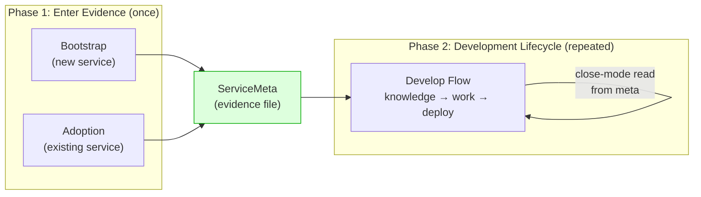
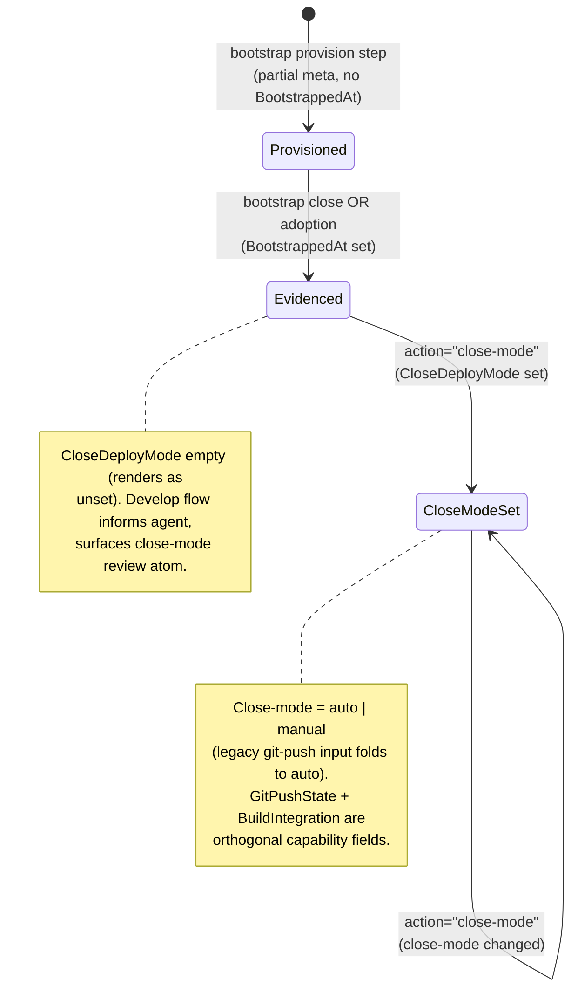
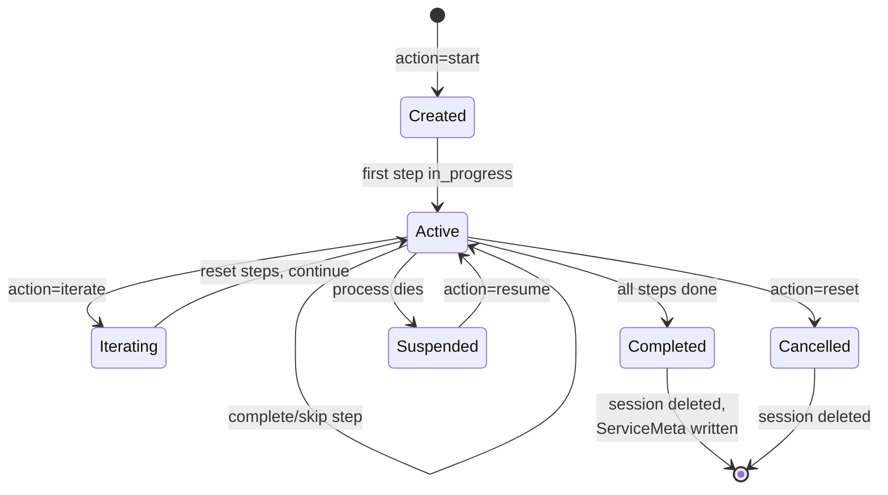
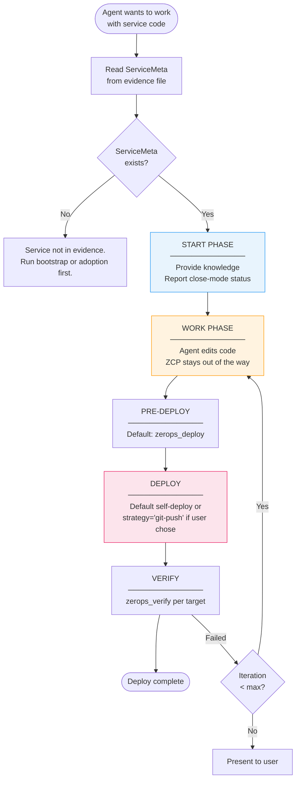

# ZCP Workflow Specification

> **Scope**: Bootstrap, adoption, close-mode + git-push capability + build-integration management (central deploy-config entries — `action="close-mode"`, `action="git-push-setup"`, `action="build-integration"`), develop, recipe, export — both container and local environments, all modes; plus the envelope/plan/atom pipeline that feeds every workflow-aware response.
> **Companion docs**:
> - `docs/spec-scenarios.md` — per-scenario acceptance walkthrough (S1–S13), pinned by `internal/workflow/scenarios_test.go`.
> - `docs/spec-work-session.md` — per-PID Work Session for develop.
> - `docs/spec-knowledge-distribution.md` — atom corpus authoring model (axes, priorities, placeholders).

---

## 1. Lifecycle Overview

### 1.1 Service Lifecycle — Two Phases

Every service on Zerops goes through two phases:


```mermaid
flowchart LR
    subgraph Phase1 ["Phase 1: Enter Evidence (once)"]
        Bootstrap["Bootstrap<br/>(new service)"]
        Adoption["Adoption<br/>(existing service)"]
    end

    subgraph Phase2 ["Phase 2: Development Lifecycle (repeated)"]
        Develop["Develop Flow<br/>knowledge → work → deploy"]
    end

    Bootstrap --> Meta["ServiceMeta<br/>(evidence file)"]
    Adoption --> Meta
    Meta --> Develop
    Develop -->|"close-mode read<br/>from meta"| Develop

    style Meta fill:#dfd,stroke:#0a0
```

**Phase 1 — Infrastructure** (Option A since v8.100+): Bootstrap creates new services (or adoption registers existing ones) and writes an evidence file (ServiceMeta). Services come up with `startWithoutCode: true` so dev containers reach RUNNING with empty filesystems; managed dependencies reach RUNNING/ACTIVE. **No application code, no `zerops.yaml`, no first deploy.** Phase 1 answers: "are the services provisioned, mounted, and discoverable?"

**Phase 2 — Development**: Develop flow covers ALL code work on the service AND the first deploy — scaffold `zerops.yaml`, write the user's actual application, deploy, verify, iterate. CloseDeployMode + GitPushState + BuildIntegration are always read fresh from ServiceMeta; `develop-strategy-review` prompts the close-mode DECISION as soon as it is `unset` — even before the first deploy (B5), since the decision is deploy-state-independent and gates the whole session's auto-close.

**The boundary is strict**: Bootstrap stops at infrastructure provisioning. The moment any application code, `zerops.yaml`, or `zerops_deploy` is needed, it belongs to develop. If the user says "create me an app for uploading photos in Bun", bootstrap creates the Bun service + dependencies (empty containers); develop scaffolds `zerops.yaml`, implements the photo upload app, runs the first deploy, and stamps `FirstDeployedAt`.

### 1.2 Phase Enum — The Single State Variable

The lifecycle above is collapsed into a single typed `Phase` field carried in every `StateEnvelope` (see §1.6). Every tool response resolves to exactly one phase (the `Phase` Go enum in `internal/workflow/envelope.go`):

| Phase | Meaning | Set by |
|---|---|---|
| `idle` | No active workflow session for this PID. | Default; or after session closes. |
| `bootstrap-active` | A bootstrap session is in progress. | `zerops_workflow action=start workflow=bootstrap`. |
| `develop-active` | A per-PID Work Session is open. | `zerops_workflow action=start workflow=develop`. |
| `develop-closed-auto` | **Derived, not stamped**: every DECLARED scope service has a succeeded deploy + a passed verify that does not predate it (the auto-close gate passes; a redeploy re-opens verify). Transitional phase — awaits explicit close + next. | Computed by `DeriveCloseState`/`EvaluateAutoClose` at read time; never persisted to `ClosedAt`, so the gate cannot desync from what's displayed. |
| `strategy-setup` | Stateless synthesis phase (no session) emitted by `action="git-push-setup"` and `action="build-integration"` — delivers the env-scoped + capability-scoped setup atoms (`setup-git-push-{container,local}`, `setup-build-integration-{webhook,actions}`). | `zerops_workflow action="git-push-setup" service="..."` or `action="build-integration" service="..." integration="..."`. |
| `export-active` | Stateless immediate workflow returning export guidance. | `zerops_workflow action=start workflow=export`. |
| `launch-production-active` | Stateless multi-call narrowing for launch-production; the handler emits its own per-status guidance and `BuildPlan` returns an empty Plan (like `export-active`). | `zerops_workflow action=start workflow=launch-production`. |

Invariant: at most one non-idle **stateful** phase per PID at a time. `strategy-setup`/`export-active`/`launch-production-active` are stateless — they synthesize guidance and return without touching session state, so they never conflict with an active bootstrap/develop session. (`recipe-active` is an atom phases-axis value, not a `Phase` constant — bootstrap's recipe route runs under `bootstrap-active`.)

`strategy-setup` replaces the retired `cicd-active` phase. Deploy configuration is now three orthogonal operations:
- `zerops_workflow action="close-mode" closeMode={hostname:auto|manual}` — declares the develop session's done-ness ownership; delivery is derived from `GitPushState` (§4.3). Drives auto-close gating + selects which `develop-close-mode-*` atoms fire. Legacy `git-push` input is accepted but folds to `auto`.
- `zerops_workflow action="git-push-setup" service="..." remoteUrl="..." gitToken="..."` (container) or `... remoteUrl="..."` (local) — **probe-first verifier**. The handler probes the supplied (remoteUrl, gitToken) pair against the remote BEFORE writing any PROJECT state — no remote ref, no secret, no origin sync, no meta write (inline session-env credential helper — the ephemeral-.netrc era is over, nothing touches disk). Container mode first self-heals the push source's LOCAL repo if needed (init-if-missing + set-if-absent identity + a HEAD guarantee — never a user-visible commit; git-contract fix §Git Lifecycle GLC-2/3) so the probe below is the real write-proof rather than its weaker read-only fallback; that local repair is best-effort and unconditional — it can happen even when the probe subsequently fails. On success: writes GIT_TOKEN as a SERVICE-scope SECRET on the push source, syncs `origin` + a url-scoped credential helper in the working tree's git config (the helper reads the live `$GIT_TOKEN` per invocation — fresh SSH sessions see a rotated value within seconds, NO restart involved), verifies a fresh session end-to-end, then stamps `meta.GitPushState=configured` + `meta.RemoteURL`. A re-call with the SAME canonical remote + a NEW gitToken is ROTATION intent (full probe → re-write → re-verify) — a vanished `/var/www/.git` on that path still triggers the non-destructive RECONSTRUCTION from the recorded remote, never the local self-heal, so the recorded history is never masked by a bare marker commit; token-less re-calls short-circuit after verifying the wiring exists (same reconstruction fallback). On probe failure: structured `GIT_TOKEN_INVALID`, no PROJECT state mutation (the local repo may already have been self-heal-repaired, independent of the failure). Local mode skips the token (uses local credential helper, no local self-heal); container mode requires HTTPS only (PAT auth; SCP-form SSH rejected). Pinned by `TestGitPushSetupContainer_*` (incl. `_SameRemoteNewToken_Rotates`, `_SessionAuthFails_NoStamp`, `_ReconstructsMissingGit`, `_EnsuresRepoHeadBeforeProbe`, `_RotationWithToken_MissingGitStillReconstructs`) + `TestGitPushSetupLocal_*`; the credential helper is owned by `internal/ops/git_credential.go`.
- `zerops_workflow action="build-integration" service="..." integration="webhook|actions"` — chooses the ZCP-managed CI shape (requires `GitPushState=configured`). Records the choice and emits the handoff (workflow YAML body + `gh secret set` commands for actions, dashboard URL for webhook); ZCP does NOT verify that the agent committed the workflow / set secrets / completed OAuth — `BuildIntegration=actions/webhook` means "this integration shape was wired", not "the build trigger is confirmed live".

See `plans/instruction-delivery-rewrite.md` §4.1 for the concrete Go enum.

### Why Infrastructure-First — The Foundational Principle

The two-phase separation (bootstrap infra → develop application + first deploy) is the foundational architectural decision of the workflow system. It applies to **ALL modes** — standard, dev, and simple — without exception.

**Fault isolation.** When bootstrap and application are separate, failures have unambiguous origin. If bootstrap fails, the problem is infrastructure — service config, import YAML shape, env-var discovery, managed-service initialization. If develop fails (during scaffolding, first deploy, or iteration), infrastructure is already proven (services reached RUNNING + env catalogue is complete). Without this separation, every failure requires diagnosing both layers simultaneously, which is exponentially harder for an AI agent.

**Universal deploy flow.** Develop's deploy → verify → iterate cadence is identical regardless of mode (standard dev/stage pairs, single dev container, simple single service). This universality makes the deployment flow stable and eliminates mode-specific edge cases.

**Reduced blast radius.** Bootstrap creates services with `startWithoutCode: true` so dev containers reach RUNNING with empty filesystems and managed services initialize cleanly. Bugs at this layer are config-only (wrong type, hostname collision, missing env). Once infra is proven, develop adds application complexity on a stable foundation.

**Faster iteration in develop.** Once bootstrap completes, develop knows that services exist, env vars resolve, managed services connect. Develop iterations focus purely on application logic + `zerops.yaml` shape — no re-verification of infrastructure plumbing.

This principle must never be bypassed. An agent that writes `zerops.yaml` or application code during bootstrap (even for simple mode) violates B7/B10 and loses all four benefits above.

### ServiceMeta — The Evidence File

ServiceMeta (`.zcp/state/services/{hostname}.json`) is the persistent evidence that a service is under ZCP management.

```
ServiceMeta {
  Hostname                 string           // service identifier
  Mode                     Mode             // standard | dev | simple | local-stage | local-only
  StageHostname            string           // stage pair (standard mode only; requires ExplicitStage on the plan target — no hostname-suffix derivation since Release B.4)
  CloseDeployMode          CloseDeployMode  // unset | auto | manual (legacy git-push folds to auto)
  CloseDeployModeConfirmed bool             // true after user explicitly confirms/sets close-mode
  GitPushState             GitPushState     // unconfigured | configured | broken (git-push capability, orthogonal to close-mode)
  RemoteURL                string           // configured git remote (set when GitPushState=configured)
  BuildIntegration         BuildIntegration // none | webhook | actions (ZCP-managed CI shape, requires GitPushState=configured)
  BootstrapSession         string           // session ID that created this; EMPTY for adoption
  BootstrappedAt           string           // date — empty = incomplete (bootstrap in progress)
  FirstDeployedAt          string           // stamped on first real deploy (session or adoption-at-ACTIVE)
}
```

The three axis-bearing fields (`Mode`, `CloseDeployMode`,
`GitPushState`/`BuildIntegration`) are typed Go enums living in
`internal/topology/`. They're orthogonal as RECORDS, but `CloseDeployMode` owns done-ness
ownership while `GitPushState` owns the delivery mechanism: once
`GitPushState=configured`, push is the terminal act of development for
every close-mode except `manual` (the legacy `git-push` close-mode value
folds to `auto` at parse — see §4.3). `Environment` is not persisted: environment is a property of
the currently running ZCP process (runtime-detected), not of a service.

**`BootstrapSession == ""` convention.** Empty (JSON-wise: empty string, not
null) is the adoption marker. Fresh bootstraps set this to the 16-hex
session ID; adoption path writes it as empty. `IsAdopted()` disambiguates
adopted metas from orphan incomplete metas (which also carry an empty
session ID) by requiring `BootstrappedAt` to be set: an adopted meta is
always complete, an orphan never is.


```mermaid
stateDiagram-v2
    [*] --> Provisioned: bootstrap provision step<br/>(partial meta, no BootstrappedAt)
    Provisioned --> Evidenced: bootstrap close OR adoption<br/>(BootstrappedAt set)
    Evidenced --> CloseModeSet: action="close-mode"<br/>(CloseDeployMode set)
    CloseModeSet --> CloseModeSet: action="close-mode"<br/>(close-mode changed)

    note right of Evidenced
        CloseDeployMode empty (renders as
        unset). Develop flow informs agent,
        surfaces close-mode review atom.
    end note

    note right of CloseModeSet
        Close-mode = auto | manual
        (legacy git-push input folds to auto).
        GitPushState + BuildIntegration are
        orthogonal capability fields.
    end note
```

`IsComplete()` returns true when `BootstrappedAt` is set.
`IsAdopted()` returns true when `BootstrapSession` is empty AND the meta
`IsComplete()`. CloseDeployMode + GitPushState + BuildIntegration are
always read from meta at the moment they're needed — never copied into
session state.

### Principles

- **Workflow is NOT a gate.** An agent does not need to start a workflow to call `zerops_scale`, `zerops_manage`, or any other direct tool. Workflows add structure for multi-step operations.
- **Strategy never blocks work.** Agent can always start editing code. Strategy is resolved before deploying, not before working.
- **Tools work independently.** `zerops_discover`, `zerops_verify`, `zerops_knowledge` work without any active workflow.

### 1.3 Delivery Pipeline — Envelope → Plan → Atoms

Every workflow-aware tool response is produced by the same three-stage pipeline, not by ad-hoc guidance assembly.

```
          ┌───────────────┐      ┌────────────┐      ┌──────────────┐
          │ ComputeEnvelope│──▶──▶│ BuildPlan  │      │  Synthesize  │
          │ (state + live  │      │ (Primary,  │  ┌──▶│  (atom filter│
          │  API + session)│      │  Secondary,│  │   │  + compose)  │
          └───────────────┘      │  Alts)     │  │   └──────────────┘
                 │               └────────────┘  │         ▲
                 │                    │          │         │
                 │                    └────────┬─┘         │
                 ▼                             ▼           │
          StateEnvelope  ──────▶──────▶──────▶─┴─── LoadAtomCorpus
                                                     (//go:embed atoms/*.md)
                                 │
                                 ▼
                         ┌────────────────┐
                         │  RenderStatus  │
                         │  (markdown UI) │
                         └────────────────┘
```

**Stage 1 — `ComputeEnvelope`** (`internal/workflow/compute_envelope.go`): the single entry point for state gathering. Reads services from the platform API, service metas from `.zcp/state/services/`, bootstrap session state, the current Work Session, and runtime detection — merging them into a `StateEnvelope`. Called by every workflow-aware tool handler. I/O is parallelised so a tool response pays one round-trip for the envelope regardless of how many state sources are involved.

**Stage 2 — `BuildPlan`** (`internal/workflow/build_plan.go`): a pure function `Plan = BuildPlan(env)`. Deterministic — no I/O, no randomness — so the plan can be reproduced verbatim after LLM context compaction from the same envelope. Branching is a fixed nine-case switch driven by `env.Phase` plus envelope shape (see §1.4).

**Stage 3 — `Synthesize`** (`internal/workflow/synthesize.go`): pure function `guidance = Synthesize(env, corpus)`. Loads the atom corpus once (`LoadAtomCorpus`), filters by axis-match against the envelope, sorts by priority + id, substitutes placeholders from the envelope, and returns the composed bodies. Same compaction-safety invariant: byte-identical output for byte-equal envelopes.

**Stage 4 — `RenderStatus`** (`internal/workflow/render.go`): consumes a `Response{Envelope, Guidance, Plan}` and emits the markdown status block shown to the LLM. The Next section renders the typed `Plan` with priority markers — no free-form Next string, no ad-hoc branching in the renderer.

### 1.4 Plan — Typed Next Action

The Plan is the single source of truth for "what should the agent do next". Every workflow-aware response carries one.

```go
type Plan struct {
    Primary      NextAction            // never zero — if we don't know, we error out upstream
    PerService   map[string]NextAction // one action per still-pending develop-active scope service; rendered only when len > 1
    Secondary    *NextAction           // set only when a second action is commonly done in tandem
    Alternatives []NextAction          // genuinely alternative paths
}
```

Dispatch (strict order, first match wins — see `build_plan.go` for the code):

1. `PhaseDevelopClosed` → Primary=close-session, Secondary=start-next.
2. `PhaseDevelopActive`, some service without a successful deploy (including last-attempt-failed) → Primary=deploy.
3. `PhaseDevelopActive`, deploy done but verify missing (including last-verify-failed) → Primary=verify.
4. `PhaseDevelopActive`, everything green but session still open → Primary=close.
5. `PhaseBootstrapActive` → Primary=continue-bootstrap (route-specific; the recipe route runs here too — there is no separate recipe phase).
6. `PhaseIdle` with no services → Primary=start-bootstrap.
7. `PhaseIdle` with bootstrapped services → Primary=start-develop + alternatives (adopt if any unmanaged, add-more-services always).
8. `PhaseIdle` with only unmanaged runtimes → Primary=adopt-via-develop.

`PhaseStrategySetup` / `PhaseExportActive` / `PhaseLaunchProductionActive` fall through to an empty Plan — those handlers emit their own guidance directly.

Failed-last-attempt cases fold into branches 2 and 3 — `needsDeploy` / `needsVerify` both key off `!attempts[last].Success`, so a failed service surfaces as a deploy or verify target. Iteration-tier guidance (diagnose / systematic-check / STOP) rides along via atoms, not a distinct Plan branch.

Gate semantics in the Plan are informational, not structural: e.g. `CloseDeployMode=unset` does not block the Plan from naming a deploy action. The first deploy always uses the default self-deploy mechanism regardless of close-mode; the `develop-strategy-review` atom (`phases: [develop-active]`, `closeDeployModes: [unset]`) prompts the agent to set a close-mode whenever it is unset — including before the first deploy (B5: the prior `deployStates: [deployed]` axis locked the DECISION out of exactly the moment the briefing asks for it). The head also surfaces a `DECISION required: close-mode unset` line so the gate's third input is reachable, not buried. This keeps `BuildPlan` a pure dispatch over envelope shape.

### 1.5 Atom Corpus — Orthogonal Knowledge Matrix

Runtime-dependent guidance lives as ~113 atoms under `internal/content/atoms/*.md`, embedded via `//go:embed`. Each atom has YAML frontmatter declaring its `AxisVector` and a markdown body.

```yaml
---
id: develop-dynamic-runtime-start-container
priority: 3
phases: [develop-active]
runtimes: [dynamic]
environments: [container]
modes: [dev, standard]
title: "Dynamic runtime — start dev server via zerops_dev_server (container)"
---

After a dev-mode dynamic-runtime deploy the container runs `zsc noop`. Start
the dev server via the canonical primitive:
    zerops_dev_server action=start hostname={hostname} command="{start-command}" port={port} healthPath="{path}"
```

Atom bodies are authored elsewhere — this spec references them as
authoritative, not as content copied inline. See
`internal/content/atoms/develop-dynamic-runtime-start-container.md` for
the full prescription.

**Axes** (the knowledge-variation dimensions):

| Axis | Values | Emptiness semantic |
|---|---|---|
| `phases` | `idle`, `bootstrap-active`, `develop-active`, `develop-closed-auto`, `recipe-active`, `strategy-setup`, `export-active`, `launch-production-active` | MUST be non-empty. |
| `modes` | `dev`, `stage`, `simple`, `standard`, `local-stage`, `local-only` | Empty = any mode. |
| `environments` | `container`, `local` | Empty = either. |
| `closeDeployModes` | `unset`, `auto`, `manual` | Empty = any close-mode. |
| `gitPushStates` | `unconfigured`, `configured`, `broken` | Empty = any git-push capability state. |
| `buildIntegrations` | `none`, `webhook`, `actions` | Empty = any build integration. |
| `runtimes` | `dynamic`, `static`, `implicit-webserver`, `managed`, `unknown` | Empty = any runtime. |
| `routes` | `recipe`, `classic`, `adopt`, `resume` | Bootstrap-only. Empty = any route. |
| `steps` | bootstrap step names | Bootstrap-only. Empty = any step. |

**Synthesizer contract**:

1. Filter: an atom matches iff every non-empty axis permits the envelope. Service-scoped axes (`modes`/`closeDeployModes`/`gitPushStates`/`buildIntegrations`/`runtimes`) match if *any* service in `env.Services` matches.
2. Sort: priority ascending (1 first), then id lexicographically.
3. Substitute: `{hostname}`, `{stage-hostname}`, `{project-name}` are replaced from the envelope; a whitelist of agent-filled placeholders (`{start-command}`, `{port}`, …) survives untouched. Any unknown `{word}` token is a build-time error.
4. Return: ordered list of rendered bodies.

**Compaction-safety invariant**: for byte-equal envelopes, `Synthesize` MUST return byte-identical output. No map iteration, no timestamps, no randomness leaks into the body.

### 1.6 StateEnvelope — Live Data Contract

`StateEnvelope` is the single typed data structure passed between stages. It is attached verbatim to every workflow-aware tool response, so the LLM can reconstruct state post-compaction.

| Field | Purpose |
|---|---|
| `Phase` | The phase enum from §1.2. Drives atom filtering and plan dispatch. |
| `Environment` | `container` or `local`. Driven by `runtime.Info.InContainer`. |
| `IdleScenario` | Discriminates the `PhaseIdle` sub-cases (`empty` / `bootstrapped` / `adopt` / `incomplete` / `orphan`) so atoms filter on the `idleScenarios` axis. |
| `ExportStatus` | Discriminates the `PhaseExportActive` sub-states (`topology.ExportStatus`) so atoms filter on the `exportStatus` axis. |
| `SelfService` | Hostname of the ZCP control-plane container (container env only). |
| `Project` | `{ID, Name}` — project identity. |
| `Services[]` | Sorted snapshots: hostname, type+version, runtime class, status, bootstrapped flag, mode, closeDeployMode, gitPushState, buildIntegration, stage pair. |
| `WorkSession` | Open develop session summary: intent, scope, deploy/verify attempts, close state. `nil` outside develop. |
| `Bootstrap` | Bootstrap session summary: route, step, iteration. `nil` outside bootstrap-active. |
| `Generated` | Timestamp for the envelope (diagnostics only — not part of synthesis input). |

Slices sort by hostname; attempt lists sort by time; maps use key-sorted encoding. The JSON form is deterministic, which is what makes §1.3's compaction-safety invariant provable.

Full field-level Go definitions live in `internal/workflow/envelope.go` and `plans/instruction-delivery-rewrite.md` §4.

---

## 2. Bootstrap Flow

Bootstrap creates a new service on Zerops and writes the evidence file. That is its only job — it does NOT set close-mode or any deploy-config fields.

```mermaid
flowchart TD
    Start([Agent triggers bootstrap]) --> Discovery["Discovery call<br/>action=start workflow=bootstrap<br/>(no route yet)"]
    Discovery --> Options{routeOptions[]}
    Options -->|resume| Commit
    Options -->|adopt| Commit
    Options -->|recipe + slug| Commit
    Options -->|classic| Commit
    Commit["Commit call<br/>action=start workflow=bootstrap route=<chosen><br/>(engine writes session)"] --> CreateSession
    CreateSession["Create session<br/>Generate 16-hex ID<br/>Register in registry"] --> Discover

    subgraph Bootstrap ["Bootstrap Flow (3 steps — Option A: infra only)"]
        direction TB
        Discover["1. DISCOVER<br/>─────────────<br/>Classify services<br/>Identify stack<br/>Choose mode<br/>Submit plan"]

        Provision["2. PROVISION<br/>─────────────<br/>Generate import.yaml<br/>Create services<br/>Mount dev filesystems<br/>Discover env vars"]

        Close["3. CLOSE<br/>─────────────<br/>Verify services RUNNING<br/>Write ServiceMeta<br/>Append reflog<br/>Hand off to develop"]
    end

    Discover -->|"plan submitted"| Provision
    Provision -->|"services created"| Close

    Provision -->|"failed"| HardStop["HARD STOP<br/>(bootstrap never iterates;<br/>escalate to user)"]

    Close --> Complete

    Complete([Bootstrap Complete<br/>ServiceMeta BootstrappedAt set<br/>FirstDeployedAt empty — develop owns first deploy])

    style Discover fill:#e8f4fd,stroke:#2196F3
    style Provision fill:#e8f4fd,stroke:#2196F3
    style Close fill:#e8f4fd,stroke:#2196F3
    style HardStop fill:#fce4ec,stroke:#E91E63
```

**Option A (since v8.100+)** — bootstrap is infrastructure only. No
application code, no deploy. Develop owns the entire code-and-deploy
continuum including the first deploy (see `develop-first-deploy-*` atoms
and the `deployStates: [never-deployed]` branch). Bootstrap never
iterates; retry on provision failure hard-stops and escalates to the
user because re-running infra provisioning without human judgment
almost never recovers (stuck metas, conflicting imports).

### 2.0 Route Discovery (first-call split)

Starting a bootstrap is a two-call flow. The first call omits `route`
and returns a ranked `routeOptions[]` list without committing a
session; the second call supplies `route=...` (and `recipeSlug=...`
when `route=recipe`) to commit the session.

```
# 1. Discovery — no session committed
zerops_workflow action="start" workflow="bootstrap" intent="<one sentence>"
→ BootstrapDiscoveryResponse { routeOptions: [...], message: "..." }

# 2. Commit — engine locks in the chosen route
zerops_workflow action="start" workflow="bootstrap" route="recipe" recipeSlug="laravel-minimal"
→ BootstrapResponse { sessionId, progress, current, ... }
```

**Ranking**: `resume` > `adopt` > `recipe` (top `MaxRecipeOptions` above
`MinRecipeConfidence`) > `classic`. `classic` is always present as the
last option — it's the explicit override for "none of the above".

**Route semantics at commit**:

| Route     | When it's offered                                                                | Commit requires             |
|-----------|----------------------------------------------------------------------------------|-----------------------------|
| `resume`  | An incomplete `ServiceMeta` is tagged to a prior session                         | `sessionId` from discovery  |
| `adopt`   | Runtime services exist without complete `ServiceMeta` (and no resumable session) | —                           |
| `recipe`  | Intent scores ≥ `MinRecipeConfidence` against a recipe corpus match              | `recipeSlug`                |
| `classic` | Always                                                                            | —                           |

**Collision annotation**: `recipe` options carry a `collisions[]` list
of hostnames that the recipe's import YAML would clash with in the
current project. Advisory only — provision still catches the conflict
— but the LLM uses it as a pre-flight gate.

**Forcing a route**: A caller that has already decided (e.g. from a
prior discovery round, from a direct user instruction, or from an
internal auto-adoption helper) skips discovery by passing `route=`
on the first call. The engine commits the session immediately.

See `internal/workflow/route.go` for the discriminator implementation
(`BuildBootstrapRouteOptions`) and `internal/workflow/engine.go` for
the commit path (`BootstrapDiscover`, `BootstrapStartWithRoute`,
`BootstrapStart` as the classic-default wrapper).

### 2.1 Session Lifecycle


```mermaid
stateDiagram-v2
    [*] --> Created: action=start
    Created --> Active: first step in_progress

    Active --> Active: complete/skip step
    Active --> Iterating: action=iterate
    Iterating --> Active: reset steps, continue

    Active --> Completed: all steps done
    Completed --> [*]: session deleted,<br/>ServiceMeta written

    Active --> Suspended: process dies
    Suspended --> Active: action=resume

    Active --> Cancelled: action=reset
    Cancelled --> [*]: session deleted
```

**Create**: `zerops_workflow action="start" workflow="bootstrap" intent="..."`
- Generates 16-hex session ID, registers in registry with PID.
- Sets step 0 (discover) to `in_progress`.
- Returns available stack catalog from live API.

**Progress**: `action="complete" step="{name}" attestation="..."` (min 10 chars).
- Optional checker validates before allowing completion. Failure → step stays, agent gets details.

**Skip**: `action="skip" step="{name}" reason="..."`.
- `discover` and `provision`: NEVER skippable.
- `close`: skippable only when the plan has no runtime targets
  (managed-only) OR every runtime target has `IsExisting=true`
  (pure-adoption). See §2.6.

**Iterate**: Bootstrap never iterates under Option A. Provision failure
is a hard stop — retrying the same infra-create call without user
intervention almost never recovers (stuck metas, conflicting imports).
`action="iterate"` on an active bootstrap session surfaces the hard-stop
message and closes the work session with `CloseReason=iteration-cap` so
the LLM stops retrying and reports to the user. Only recipe/develop flows
iterate (the `develop` 3-tier deploy ladder caps at 5 attempts).

**Resume**: `action="resume" sessionId="..."` takes over dead session
(PID check). Continues from current step. Also surfaced as
`route="resume"` in the discovery response when an incomplete
`ServiceMeta` is tagged to a prior session.

### 2.2 Exclusivity

Per-service, not global. Multiple bootstraps coexist for different services. Same-hostname lock: incomplete ServiceMeta from alive session blocks new bootstrap for that hostname. Dead PID → auto-unlock.

### 2.3 Step 1: Discover

**Purpose**: Classify services, identify stack, choose mode, submit plan.

**Procedure**:
1. `zerops_discover` — see existing services.
2. Identify runtime + dependencies from user intent.
3. Validate types against `availableStacks`.
4. Choose mode:
   - **Standard** (default): `{name}dev` + `{name}stage` + managed.
   - **Dev**: `{name}dev` + managed.
   - **Simple**: `{name}` + managed.
5. Present plan to user, get confirmation.
6. Submit: `action="complete" step="discover" plan=[...]`

**Plan structure**:
```
ServicePlan {
  Targets: [{
    Runtime: {
      DevHostname    string  // a-z0-9, max 25 chars
      Type           string  // validated against live catalog
      IsExisting     bool    // true = adoption path (see §3)
      BootstrapMode  string  // "standard" | "dev" | "simple" (empty → standard)
      ExplicitStage  string  // optional stage hostname override
    },
    Dependencies: [{
      Hostname    string
      Type        string  // managed HA is a TYPE VARIANT (e.g. postgresql:ha@16 / postgresql:single@16)
      Mode        string  // legacy backward-compat only: a bare type (postgresql@16) with no variant defaults to NON_HA; dropped when the type carries a variant (resolveManagedDepMode — "variant authoritative")
      Resolution  string  // "CREATE" | "EXISTS" | "SHARED"
    }]
  }]
}
```

**Validation**: Hostnames `[a-z0-9]` max 25 chars. Standard mode: explicit `stageHostname` required on the plan target — no hostname-suffix derivation (since Release B.4). Types against live catalog. Resolution: CREATE = must not exist, EXISTS = must exist, SHARED = another target creates it. Hostname lock check. Errors accumulated (all reported at once).

### 2.4 Step 2: Provision

**Purpose**: Create infrastructure, mount filesystems, discover env vars.

**Procedure**:
1. Generate import.yaml → `zerops_import` (blocks until all processes complete).
2. `zerops_discover` — verify services exist.
3. Mount: container = `zerops_mount` per dev runtime at `/var/www/{hostname}/`. Local = none.
4. `zerops_discover includeEnvs=true` — discover env var NAMES only.

**Env var security model**:
- `includeEnvs=true` returns keys and annotations only — SAFE by default.
- `includeEnvValues=true` opt-in exposes actual values — for troubleshooting only.
- Session stores NAMES ONLY — never values.
- Agent uses `${hostname_varName}` references — resolved at container level.

**import.yaml by mode**:

| Property | Dev service | Stage service | Simple service |
|----------|-----------|---------------|----------------|
| `startWithoutCode` | `true` | omit | `true` |
| `maxContainers` | `1` | omit | omit |
| `enableSubdomainAccess` | `true` | `true` | `true` |

**Expected states**: dev → RUNNING, stage → READY_TO_DEPLOY, managed → RUNNING/ACTIVE.

**On completion (container env)** — `action="complete" step="provision"` triggers `autoMountTargets` (`internal/tools/workflow_bootstrap.go`) which runs per runtime target in `plan.Targets`:

1. `ops.MountService` — SSHFS mount base from ZCP host at `/var/www/{hostname}/`.
2. `ops.InitServiceGit` — SSH-exec `git init` + set-if-absent identity + HEAD guarantee inside the target container at `/var/www/.git/` (GLC-1). This is the canonical `.git/` creation: runs once per service, owned by `zerops:zerops`, identity defaults to `agent@zerops.io` / `Zerops Agent` when none is already set. Errors are logged but do not mark the mount FAILED — the deploy path's safety-net (GLC-2) re-heals on demand if this step hiccups.

Mount + InitServiceGit are skipped entirely in local env (`mounter == nil`, `sshDeployer == nil`) — local working dirs are the user's own git territory (GLC-6).

**On completion (both envs)**: Writes partial ServiceMeta (no BootstrappedAt) — signals bootstrap in-progress, provides hostname lock.

**Checker**: All services exist, types match, status correct, managed dependency env vars discovered.

### 2.5 Step 3: Close

**Purpose**: Write final evidence file. Bootstrap is done.

**On completion** (Active→false):
1. Write final ServiceMeta per runtime target:
   - `BootstrappedAt` = today's date
   - `CloseDeployMode` = **empty** (NEVER set during bootstrap; renders as `unset`)
   - `GitPushState` = **empty** (renders as `unconfigured`)
   - `BuildIntegration` = **empty** (renders as `none`)
   - Container: hostname = devHostname
   - Local + standard: hostname = stageHostname (inverted)
2. Append reflog to AGENTS.md (cross-tool canonical; Claude pulls it
   via the @AGENTS.md include in CLAUDE.md; Codex / Cursor / Gemini /
   Antigravity read AGENTS.md natively).
3. Delete session, unregister.
4. Return completion message: service list with modes. NO close-mode prompt.

**Bootstrap is done. Services are provisioned (managed = RUNNING,
runtimes = bootstrapped but not-yet-deployed), ServiceMeta written with
BootstrappedAt. No application code written, nothing deployed.**

**Natural transition**: Under Option A the next step is always
`workflow="develop"`. Develop owns all code + the first deploy. Runtimes
entering develop with empty `FirstDeployedAt` trigger the first-deploy
branch (`deployStates: [never-deployed]` atoms) — scaffold
`zerops.yaml`, write code, deploy, verify, stamp `FirstDeployedAt`.

### 2.6 Fast Paths — Managed-Only and Pure-Adoption

`validateSkip` allows `close` to be skipped in either of two shapes:

1. **Managed-only** — the plan has no runtime targets (`len(Targets)==0`).
   No runtime ServiceMeta to write (managed services are API-authoritative).
2. **Pure-adoption** — every runtime target in the plan has
   `IsExisting=true` (`plan.IsAllExisting()`). ServiceMeta for adopted
   services is written inline from the provision step (see §3.2).

In both shapes the bootstrap walks discover → provision → SKIP close.
Mixed plans (some new runtime targets + some adopted) walk the full
flow and write close normally.

### 2.7 Mode Behavior Matrix

| Aspect | Standard | Dev | Simple |
|--------|----------|-----|--------|
| Services | `{name}dev` + `{name}stage` + managed | `{name}dev` + managed | `{name}` + managed |
| Mounts (container) | dev only | dev only | service |
| zerops.yaml start (dev) | `zsc noop --silent` | `zsc noop --silent` | real command |
| zerops.yaml start (stage) | real command | N/A | N/A |
| healthCheck | none (dev) / required (stage) | none | required |
| deployFiles | `[.]` (dev) / build output (stage) | `[.]` | `[.]` |
| Server start (container) | SSH manual (dev) / auto (stage) | SSH manual | auto |
| Deploy sequence | dev → verify → stage → verify | dev → verify | deploy → verify |
| Subdomain enable | auto (deploy handler, first deploy) | auto | auto |
| PHP runtimes | omit `start:` entirely | omit `start:` | omit `start:` |

---

## 3. Adoption Flow

Adoption registers an existing unmanaged service into ZCP management. The outcome is the same as bootstrap: a ServiceMeta with mode and BootstrappedAt.

### 3.1 When Adoption Applies

- Project has runtime services with `managedByZCP=false` (no complete ServiceMeta).
- Init instructions label these as "needs ZCP adoption."
- `zerops_workflow action="route"` offers adoption.

### 3.2 What Happens

Adoption is a simplified process:

1. **Discover**: Agent classifies the existing service. Determines mode from hostname patterns (dev+stage → standard, dev-only → dev, no suffix → simple).
2. **Verify**: Confirm the service is running and healthy (`zerops_verify`).
3. **Write evidence**: Create ServiceMeta with:
   - Hostname, Mode, StageHostname (if standard)
   - `BootstrapSession` = empty (not created by bootstrap — the
     adoption marker; combined with `IsComplete()` this makes
     `IsAdopted()` return true, see §1.1 and invariant E7)
   - `BootstrappedAt` = today's date
   - `CloseDeployMode` = empty (renders as `unset`)

No import, no code generation, no deploy. The service already exists and runs.

### 3.3 Mixed Adoption + New

When the user wants to adopt existing services AND create new ones, this goes through bootstrap (§2) with `isExisting: true` on adopted targets. Each target follows its path:
- New targets: full 3-step bootstrap (discover, provision, close)
- Existing targets: ServiceMeta written inline by the provision step

**Pure-adoption fast path**: When *every* runtime target in the plan has
`IsExisting=true`, bootstrap routes through the fast path in §2.6 — the
`close` step is skipped because adoption writes ServiceMeta from
provision directly. Mixed plans (any new runtime target) walk the full
three-step flow and complete close normally.

### 3.4 Outcome

ServiceMeta identical in structure to bootstrap output. The service is now "managed by ZCP" and can enter develop flow.

### 3.5 Live activity awareness — direct reads, the full live-op set, and the wait primitive

A service's resting status cannot distinguish "idle" from "a build/deploy is
running right now": a first `buildFromGit` deploy reads `READY_TO_DEPLOY` (or
`NEW`) the entire time it builds (live-verified). So discover surfaces a
per-service `activity` LIST + a project-level "look + wait" steer, adopt
hard-gates on it, and `zerops_process action="wait"` blocks until the work drains.

- **Sourced from the DIRECT (non-ES) reads, not the search.** Discover's service
  list comes from `ListServicesDirect` (GET `/project/{id}/service-stack`) and
  `ops.ProjectActivity`'s processes from `GetProjectProcessesDirect` (GET
  `/project/{id}/process`). The Elasticsearch searches (`ListServices`,
  `SearchProcesses`, `SearchAppVersions`) trail the DB after an import (seconds,
  load-dependent), so an agent arriving mid-import would otherwise see an "empty
  project". The direct reads reflect creation-time state immediately
  (live-verified: service + its in-flight process visible at ~creation). The ES
  searches stay for the history/timeline (`ops.Events`) and resolve/poll callers.
- **"Busy" = a live process referencing the service** — status `PENDING`,
  `RUNNING`, `ROLLBACKING`, or `CANCELING` (`ops.IsProcessLive`, the SDK's
  non-terminal set). The process is the SOLE busy-truth; it always carries a
  cancelable `processId`. The embedded `process.appVersion` phase
  (`BUILDING`/`DEPLOYING`) only refines the build/deploy LABEL of an already-busy
  build process — it never makes a service busy on its own (a stuck `BUILDING`
  whose build container died has no process to cancel; gating on it would
  deadlock the gate).
- **The full live-op SET, not a single representative** (`ops.ProjectActivity`
  returns `map[string][]LiveOp`; `ServiceInfo.Activity []LiveOp`). A service
  genuinely runs several ops at once — a buildFromGit import enqueues
  `stack.build` AND `stack.enableSubdomainAccess` together, the subdomain toggle
  sitting `PENDING` queued behind the build for its whole duration (live-verified
  eval 2026-06-30). Collapsing them to one by timestamp hid the substantive build
  behind the co-triggered toggle (the empty-project / mid-build mis-steer). The
  list reports ALL live ops, so no operation-type heuristic decides what to
  surface — an unknown future op is reported identically. Ordered newest-first
  (presentation only; lossless). `ops.ProjectActivity` is the single owner, read
  by the discover steer, the adopt gate, AND the wait primitive.
- **The wait primitive** (`zerops_process action="wait"`, `ops.WaitServiceSettled`
  / `ops.WaitProcesses`) — the agent reasons from the statuses and BLOCKS rather
  than re-polling itself. It waits a FIXED set of processes (resolved once), not a
  drain-loop: because the direct read surfaces every concurrent op at-creation
  (build + the subdomain-enable queued behind it + create), the set is already
  complete — there is nothing to "catch later", and not re-polling for new ops
  keeps the wait deterministic and immune to unrelated churn (an autoscale, a
  crash-restart loop) that a drain-to-empty would hang on.
  - `service=<hostname>` resolves the service's currently-live process set once
    (freshly, server-side) and waits exactly that — hostname-grain sugar so the
    agent need not thread process IDs. The "wait until ready" form.
  - `processId` / `processIds` wait the given process(es) to terminal.
  - Reuses `PollProcess` (the documented progress/response race-avoidance holds);
    progress is wired via `buildProgressCallback` to keep the MCP connection alive
    across the long poll. Bounded by a 15-min total budget — a timeout returns a
    soft `WaitResult{TimedOut:true}` (NOT an error; re-call or re-discover), and a
    FAILED op settles with the failure flagged in the message (so "done waiting"
    is never misread as "succeeded"; a service whose newest process already FAILED
    before the wait is flagged too).
- **Discover (read-only):** `ServiceInfo.Activity` (the list) is attached to every
  busy service. When ANY service is busy, discover prepends ONE project-level
  live-activity note naming each busy service's full op list (action/status/
  processId per op) — "the project is mid-change: don't treat these as idle/done,
  don't adopt or deploy onto one mid-operation; block until done with
  `zerops_process action=\"wait\" service=<host>`, then re-run discover; cancel a
  stuck one with `zerops_process`". Idle adoptables still get the "adopt now"
  warning. Discover stays `ReadOnly`/`Idempotent`; it never polls.
- **Adopt gate:** `handleBootstrapComplete` refuses route=adopt when any resolved
  target (scope ∪ plan dev+stage hostnames) has a live op, returning
  `ADOPT_TARGET_BUSY` naming each still-live op + the wait/cancel escape. Each op
  is freshened via `GetProcess` (by-id, direct) before refusing — a host drops out
  of busy once ALL its ops freshen terminal, so a stale row cannot deadlock the
  gate; an activity-fetch error fails open. No meta is written on refusal.
- **Never busy ⇒ never gated:** terminal/failed/queued states (`FAILED`,
  `BUILD_FAILED`, `ACTIVE`, and the <1s fast-fail's `FAILED` process + frozen
  `WAITING_TO_BUILD`) are not busy, so adoption + corrective deploy after a
  failure are never gated.

Pinned by `TestProjectActivity`, `TestProjectActivity_MultipleConcurrentOps`,
`TestWaitServiceSettled_*` / `TestWaitProcesses_*`, `TestProcessTool_Wait*`,
`TestAdoptGate_*`, e2e `TestInFlightActivity_*` + `TestInFlightWait_DrainsServiceToSettled`.

---

## 4. Develop Flow

Develop flow is the **development lifecycle** for any service under ZCP management. It is the MANDATORY wrapper for any code work on runtime services — implementing features, fixing bugs, changing config. No code change should happen outside of this flow.


```mermaid
flowchart TD
    Start([Agent wants to work<br/>with service code]) --> ReadMeta["Read ServiceMeta<br/>from evidence file"]
    ReadMeta --> CheckEvidence{ServiceMeta<br/>exists?}
    
    CheckEvidence -->|No| NeedBootstrap["Service not in evidence.<br/>Run bootstrap or adoption first."]
    CheckEvidence -->|Yes| StartFlow

    StartFlow["START PHASE<br/>──────────────<br/>Provide knowledge<br/>Report close-mode status"] --> Work

    Work["WORK PHASE<br/>──────────────<br/>Agent edits code<br/>ZCP stays out of the way"] --> PreDeploy

    PreDeploy["PRE-DEPLOY<br/>──────────────<br/>Default: zerops_deploy"] --> ExecuteDeploy

    ExecuteDeploy["DEPLOY<br/>──────────────<br/>Default self-deploy or<br/>strategy='git-push' if user chose"]
    ExecuteDeploy --> Verify

    Verify["VERIFY<br/>──────────────<br/>zerops_verify per target"]
    Verify --> Done([Deploy complete])
    
    Verify -->|"Failed"| Iterate{Iteration<br/>< max?}
    Iterate -->|Yes| Work
    Iterate -->|No| UserHelp["Present to user"]

    style StartFlow fill:#e8f4fd,stroke:#2196F3
    style Work fill:#fff3e0,stroke:#FF9800
    style ExecuteDeploy fill:#fce4ec,stroke:#E91E63
```

### 4.1 When Develop Flow Starts

Develop flow MUST start for ANY work on runtime service code:

- **After bootstrap**: Service is RUNNING with an empty filesystem — develop flow scaffolds `zerops.yaml`, writes the user's application, and runs the first deploy
- **Implementing features**: User said "add photo upload" → develop flow
- **Bug fixes**: "Login doesn't work" → develop flow
- **Config changes**: "Change the port" → develop flow
- **Any code modification**: If it touches a runtime service's files → develop flow

Develop flow discovers what code (if any) exists on the service via `zerops_discover` + SSH inspection and acts accordingly. Bootstrap created infrastructure; develop flow owns code, the first deploy, iteration, and close-mode setup.

**Agent MUST NOT** edit runtime service code outside of develop flow. The flow ensures the agent has platform knowledge, knows the close-mode, and deploys + verifies at the end.

### 4.2 Start Phase — Close-Mode from Meta

At the start of develop flow, the system reads ServiceMeta and informs the agent about close-mode status. This is **informational, not blocking**.

**Key principle**: Close-mode is never a gate — for work-session creation or for the first deploy. The first deploy always uses the default self-deploy mechanism (`zerops_deploy targetService=X` with no strategy argument), because `git-push` and `manual` require state (committed code, `GIT_TOKEN`, configured remote, or user presence) that doesn't exist before the first deploy lands. Close-mode surfaces through atoms post-first-deploy:

- `deployStates: [never-deployed]` → first-deploy-branch atoms own the scaffold/code/deploy guidance.
- `closeDeployModes: [unset]` (any deploy state) → `develop-strategy-review` fires and prompts the close-mode DECISION; it no longer carries a `deployStates` axis, so it fires on a never-deployed first start too (B5) alongside the first-deploy-branch atoms.
- Confirmed close-mode → close-mode-specific atoms take over (`develop-close-mode-auto`, `develop-close-mode-manual` and their environment-scoped siblings). Delivery is the separate derived dimension: `gitPushStates=configured` swaps the direct-deploy walkthrough atoms for `develop-git-push-delivery` (push is the delivery), `broken` fires `develop-git-push-broken` (repair first).

Close-mode is always read fresh from `ServiceMeta.CloseDeployMode` — no caching. Agent can change it at any time via `zerops_workflow action="close-mode"`.

### 4.3 Close-Mode Options (Three Orthogonal Dimensions)

Close-mode declares the develop session's **done-ness ownership** (whether ZCP may auto-close, or the user owns the loop) and gates whether auto-close fires; the delivery MECHANISM is derived from git-push capability, not from close-mode (see below). The `develop-close-mode-*` atoms fire on its value. It does NOT make the close handler dispatch anything: `zerops_workflow action="close"` is always a session-teardown call (`internal/tools/workflow.go::handleWorkSessionClose`) that deletes the WorkSession file, unregisters from the registry, and returns `Work session closed.` regardless of `CloseDeployMode`. The mode shapes the agent's pre-close ritual; the close call itself is pure teardown.

After the first deploy lands, three recorded dimensions describe the develop session. Close-mode owns **done-ness ownership**; the delivery MECHANISM is DERIVED from git-push capability, not chosen by close-mode:

| Dimension | Field | Values | Meaning |
|---|---|---|---|
| Close-mode | `CloseDeployMode` | unset / auto / manual | Done-ness ownership + auto-close gating (legacy `git-push` folds to `auto` at parse) |
| Git-push capability | `GitPushState` + `RemoteURL` | unconfigured / configured / broken | Whether `strategy="git-push"` works |
| Build integration | `BuildIntegration` | none / webhook / actions | Which ZCP-managed CI shape consumes pushes |

**Delivery is derived, not chosen by close-mode** (`workflow.resolveDelivery` / `DeployIntent`; ladder rung `topology.DeriveDeliveryState`): `CloseDeployMode=manual` yields the loop; otherwise the first deploy is always a direct self-deploy (D2a), and after that `GitPushState=configured` ⇒ **commit + push is the terminal act of development** (`zerops_deploy strategy="git-push"`) while `unconfigured` ⇒ direct self-deploy. A direct `zerops_deploy` on a configured service redirects to the push call (`internal/tools/deploy_repo_delivery.go::repoDeliveryRedirect`; `breakGlass=true` performs the self-deploy anyway and flags container-ahead-of-repo). Capability (`GitPushState`) and done-ness ownership (`CloseDeployMode`) stay orthogonal as RECORDS — but the retired "configured push coexists with `auto` self-deploy at close" cell is superseded: it minted never-pushed `deploy` commits so the repo trailed the container (Karel-confirmed 2026-06-10). Pinned by `TestResolve_ConfiguredDrivesGitPushDelivery` + `TestParseMeta_FoldsLegacyGitPushCloseMode` + `TestRepoDeliveryRedirect_*`.

#### auto
- **Done-ness ownership**: ZCP derives done and may auto-close when every in-scope service is green (succeeded deploy + passed verify).
- **Delivery (derived)**: direct self-deploy via zcli while `GitPushState=unconfigured`; once `configured`, the terminal act is commit + push (`strategy="git-push"`) and the push source receives no further ZCP self-deploys. For async builds (webhook / actions) the agent records the build with `action="record-deploy"` once `zerops_events` confirms `Status: ACTIVE`, so auto-close becomes eligible. The `strategy="git-push"` deploy pre-flight (committed-code requirement) is canonical in §8 D2b.
- **First deploy**: always a direct self-deploy — `auto` is the implicit default for any service not yet deployed.
- **Good for**: the default for nearly all projects.

#### manual
- **Delivery pattern**: ZCP yields. The agent doesn't initiate deploys — the user owns deploy/verify/close decisions via slash commands, hooks, or external automation.
- **Auto-close**: disabled. ZCP still records every `zerops_deploy`/`zerops_verify` you call, but the auto-close gate stays open until you call `action="close"` explicitly.
- **Good for**: experienced users, external CI/CD systems.

> **Legacy `git-push` close-mode value** — retired: delivery is now derived from `GitPushState` (above), so the old `git-push` close-mode value is redundant and folds one-way to `auto` at meta-parse (`foldLegacyCloseMode`). `action="close-mode"` still accepts it for one release window with a deprecation note. Git-push **setup** (`action="git-push-setup"`) is unaffected — that capability is what turns delivery into push.

### 4.4 Setting and Changing Close-Mode + Capabilities

```
zerops_workflow action="close-mode"     closeMode={"appdev": "auto"}
zerops_workflow action="git-push-setup" service="appdev" remoteUrl="git@github.com:org/repo.git"
zerops_workflow action="build-integration" service="appdev" integration="webhook"
```

- `action="close-mode"` validates to one of `auto`, `git-push`, or `manual` and writes `ServiceMeta.CloseDeployMode` + `CloseDeployModeConfirmed=true`.
- `action="git-push-setup"` writes `GitPushState=configured` + `RemoteURL`.
- `action="build-integration"` writes `BuildIntegration` (only valid when `GitPushState=configured`).
- All three actions can be called at ANY time — before, during, or between develop flows.
- Subsequent develop flow reads the updated values from meta.
- Returns guidance for the chosen close-mode + capability state.

**Close-mode + capabilities are always read from meta, never cached in deploy session.** This means:
- User changes close-mode between deploys → next close uses the new mode automatically.
- User flips `BuildIntegration` mid-flow → next push picks up the new integration.
- No "session strategy" concept — meta is the single source of truth.

### 4.5 Pre-Deploy Phase

Before actual deployment, the system:
1. Reads `CloseDeployMode` + `GitPushState` + `BuildIntegration` from ServiceMeta (fresh read, not cached) and resolves `workflow.DeployIntent` (`resolveDelivery`).
2. The first deploy always uses the default self-deploy mechanism regardless of close-mode (D2a).
3. After the first deploy, delivery is DERIVED: `CloseDeployMode=manual` yields; `GitPushState=configured` ⇒ commit + push (`strategy="git-push"`); otherwise direct self-deploy. A direct `zerops_deploy` on a configured service redirects to the push call (`repoDeliveryRedirect`; `breakGlass=true` escapes).

**Deploy pre-flight** (`deployPreFlight` in `internal/tools/deploy_preflight.go`, with `internal/ops/deploy_validate.go`):
- zerops.yaml exists and parses.
- Setup entries match targets (tries role name: "dev"/"stage"/"prod", then hostname).
- DM-2 enforcement: self-deploy's `deployFiles` must be `.`/`./` (blocking; narrower patterns destroy target's working tree — see §8 Deploy Modes).
- Env var references (`${hostname_varName}`) re-discovered from API and validated.

**Not validated client-side**: post-build filesystem existence of `deployFiles` paths. Platform builder owns that check (DM-3/DM-4).

### 4.6 Mode-Specific Deploy Behavior

Deploy modes (self-deploy vs cross-deploy) are orthogonal to workflow modes and carry distinct `deployFiles` contracts. See §8 Deploy Modes (DM-1…DM-5) for the invariants.

**Standard mode** (container):
1. Deploy dev → manual start → verify dev (**self-deploy** — `deployFiles: [.]`)
2. Write stage entry (real start, healthCheck, `deployFiles`=build output path)
3. Deploy stage (from dev) → auto-starts → verify stage (**cross-deploy** — source≠target, `deployFiles` selects build output)

**Standard mode** (local):
1. `zcli push` per target → verify

**Dev mode**: Dev deploy + start + verify only.

**Simple mode**: Deploy → auto-starts → verify.

**Deploy status classification** (`classifyDeployStatus` in `internal/tools/deploy_ssh.go` + `ClassifyDeployFailure` in `internal/ops/deploy_failure.go`):
- `RUNNING`/`ACTIVE` → pass
- `READY_TO_DEPLOY` → fail: "container didn't start — check start command, ports, env vars"
- Other status → fail: "check zerops_logs severity=error"
- Subdomain access check for services with ports

### 4.7 Iteration on Failure

When deploy fails, the agent can iterate. The escalating guidance tiers are delivered via atoms (e.g. `develop-standard-unset-iterate` and the deploy-iteration atoms), not a Go data table:

| Iteration | Tier | Guidance |
|---|---|---|
| 1-2 | DIAGNOSE | `zerops_logs severity=error since=5m`, fix the specific error, redeploy + verify. |
| 3-4 | SYSTEMATIC | "PREVIOUS FIXES FAILED" — walk the env-vars / bind-address / deployFiles / ports / start checklist. |
| 5 | STOP | Present to user: what was tried, current error, "should I continue or will you debug manually?" — do NOT attempt another fix. |

`defaultMaxIterations = 5` (`internal/workflow/session.go`) caps the session, so the STOP tier fires exactly once and then the session closes with `CloseReason=iteration-cap`. Continuing requires a fresh `zerops_workflow action=start`, making continuation an explicit user decision.

### 4.8 Operational Details

- `zerops_deploy` blocks until build completes. Returns DEPLOYED or BUILD_FAILED. For dev/stage/simple/standard/local-stage modes, the handler auto-enables the L7 subdomain on first deploy and waits for HTTP readiness before returning — the response carries `subdomainAccessEnabled: true` and `subdomainUrl`. The auto-enable predicate is mode-allowlist + `IsSystem()` defensive guard; the platform's `serviceStackIsNotHttp` response on a non-HTTP-shaped stack (worker, deferred dev-server start) is treated as a benign signal and silently skipped in the auto-enable caller. Agents normally never call `zerops_subdomain action=enable` directly; the tool stays available for recovery, production opt-in, and disable operations — and `ops.Subdomain.Enable` continues to surface `serviceStackIsNotHttp` as a real diagnostic to those explicit-recovery callers (the benign-skip downgrade is contextual to auto-enable, not structural).
- Dev server start needed after every deploy for dev-mode dynamic runtimes. Container env uses `zerops_dev_server action=start`; local env uses the harness background task primitive. NOT needed for implicit-webserver (`php-nginx`, `php-apache`) / `nginx` / `static` runtimes or for simple/stage modes (those auto-start via `healthCheck`).
- Stage entry written AFTER dev verified (standard mode).
- `zerops_deploy sourceService={dev} targetService={stage}` for cross-deploy — applies to `GitPushState=unconfigured` direct delivery only. Under `GitPushState=configured`, stage rebuilds remotely from the configured remote (via webhook / actions integration); no local cross-deploy from dev is issued. Deploy command resolution flows through `workflow.DeployIntent` (`internal/workflow/deploy_intent.go`), which centralizes the (delivery, pushSource, buildTarget, pushSetup, buildSetup, eventsService, recordDeployTarget, verifyTarget) projection. `workflow.Resolve` is consumed by `internal/workflow/build_plan.go`, `internal/workflow/deploy_intent_targets.go` (which `work_session.go::EvaluateAutoClose` reaches through `ResolvedDeployTargets`), `internal/tools/resolve_build_target.go`, and `internal/tools/workflow_build_integration.go`.
- `zerops_manage action="connect-storage"` after first stage deploy (if shared-storage).

---

## 5. Environment Differences

Both environments follow the same flows but with different mechanisms.

### 5.1 Container Mode

```
┌─────────────────────────────────────┐
│  zcp container (ZCP service)        │
│                                     │
│  SSHFS mounts:                      │
│    /var/www/appdev/  ──────────┐    │
│    /var/www/apidev/  ──────┐   │    │
│                            │   │    │
│  Agent edits code here     │   │    │
│  Changes appear instantly  │   │    │
│  on target containers      │   │    │
└────────────────────────────┼───┼────┘
                             │   │
                    ┌────────┘   └────────┐
                    ▼                     ▼
           ┌──────────────┐     ┌──────────────┐
           │  apidev      │     │  appdev      │
           │  container   │     │  container   │
           │  /var/www/   │     │  /var/www/   │
           └──────────────┘     └──────────────┘
```

- **Detection**: `serviceId` env var present.
- **Code access**: SSHFS mounts at `/var/www/{hostname}/`.
- **Deploy (default, `GitPushState=unconfigured`)**: SSH into service, git init + zcli push from inside.
- **Deploy (`GitPushState=configured`)**: SSH into service, push the already-committed HEAD (`strategy="git-push"` refuses a dirty tree or missing commit — it never commits for you).
- **Server start**: `zerops_dev_server action=start` for dev (`zsc noop`) in container env. Auto for stage/simple via `healthCheck`.
- **Commands**: `ssh {hostname} "cd /var/www && {command}"`.
- **Mount tool**: Available.
- **ServiceMeta hostname**: devHostname (standard), hostname (dev/simple).

### 5.2 Local Mode

```
┌─────────────────────────────────────┐
│  Developer's machine                │
│                                     │
│  Code in working directory          │
│  zerops.yaml at repository root     │
│  Deploy pushes code via zcli push   │
└─────────────────────────────────────┘
           │
           │ zcli push
           ▼
    ┌──────────────┐
    │  Zerops      │
    │  service     │
    │  container   │
    └──────────────┘
```

- **Detection**: `serviceId` env var absent.
- **Code access**: Working directory.
- **Deploy (default, `GitPushState=unconfigured`)**: `zcli push` from local machine.
- **Deploy (`GitPushState=configured`)**: push the already-committed HEAD from local (`strategy="git-push"` refuses a dirty tree — it never commits for you).
- **Server start**: Real start command in zerops.yaml. healthCheck always.
- **Mount tool**: Not available.
- **ServiceMeta hostname**: stageHostname for standard (inverted), hostname for dev/simple.

### 5.3 Guidance Adaptation

Environment-specific guidance is handled at the atom level, not in conductor code: atoms tagged `environments: [local]` cover local-only guidance (e.g. `bootstrap-generate-local`, `bootstrap-deploy-local`, `develop-local-workflow`), atoms tagged `environments: [container]` cover container-only guidance, and atoms with an empty `environments` axis apply to both. The synthesizer picks the right combination per turn — no hand-coded addendum/replacement logic in Go. See `docs/spec-knowledge-distribution.md` for the authoring model.

---

## 6. Workflow Routing

`zerops_workflow action="route"` returns prioritized offerings based on project state.

**Priority ordering**:
1. (P1) Incomplete bootstrap → resume/start hint
2. (P1) Unmanaged runtimes → adoption offering
3. (P1-P2) Managed services → deploy offering (`develop`); ladder-aware hint when any pair has `GitPushState=configured` (push is the terminal act)
4. (P2) Managed services → close-mode entry (`close-mode`), chaining to `git-push-setup` (capability) + `build-integration` (CI)
5. (P3) Add new services → bootstrap hint
6. (P5) Utility → scale

Deploy (`develop`) is always offered regardless of close-mode — close-mode is informational, resolved within the flow, never a routing gate.

Route returns **facts, not recommendations**.

---

## 7. Session Management

ZCP has **two independent session kinds**, owned by different layers and
governed by different lifetimes. Full philosophical treatment in
`spec-work-session.md`.

### 7.1 Infrastructure Sessions (Bootstrap / Recipe)

Stored at `.zcp/state/sessions/{id}.json`:
```
WorkflowState {
  Version    "1"
  SessionID  16-hex random
  PID        process owner
  ProjectID  Zerops project
  Workflow   "bootstrap" | "recipe"
  Iteration  counter
  Intent     user's goal
  CreatedAt  RFC3339
  UpdatedAt  RFC3339
  Bootstrap  *BootstrapState
  Recipe     *RecipeState
}
```

Lifetime = workflow duration. Survives process restart via registry
claim-on-boot (dead-PID auto-recovery).

### 7.2 Work Sessions (Develop)

Stored at `.zcp/state/work/{pid}.json`, one per process:
```
WorkSession {
  Version         "1"
  PID             int
  StartTime       RFC3339         // (pid,startTime) recycled-PID identity guard
  ProjectID       string
  Environment     "container" | "local"
  Intent          string
  Services        []hostname
  Roles           map[hostname]string  // RC-B session roles; absent → required
  CreatedAt       RFC3339
  LastActivityAt  RFC3339
  Deploys         map[hostname][]DeployAttempt  // capped at 10
  Verifies        map[hostname][]VerifyAttempt  // capped at 10
  ClosedAt        RFC3339 (empty = open)
  CloseReason     "explicit" | "auto-complete" | "abandoned" | "iteration-cap"
}
```

Lifetime = one LLM task per process. Does **not** survive restart — code
work survives in git and on disk. Dead-PID work sessions are pruned on
engine boot, never claimed.

### 7.3 Registry

`.zcp/state/registry.json` — tracks both infrastructure sessions
(`SessionID` = 16-hex) and work sessions (`SessionID` = `work-{pid}`),
with file lock via `.registry.lock`. Auto-prunes dead PIDs and sessions
>24h old on new-session creation. This is the single source of session
ownership; no other state files track active sessions.

### 7.4 Actions

| Action | Applies to | Effect |
|--------|-----------|--------|
| `start workflow=bootstrap\|recipe` | infra | Creates infra session |
| `start workflow=develop` | work | Creates Work Session for current PID |
| `complete step=...` | infra | Advances infra step |
| `iterate` | infra | Resets generate+deploy (bootstrap) |
| `status` | both | Returns Work Session if present, else infra |
| `close workflow=develop` | work | Closes Work Session, deletes file |
| `reset` | both | Deletes active session(s) |
| `resume sessionId=...` | infra | Claims dead-PID infra session |

Develop has **no** `iterate` or `complete step` — it is stateless by
design; deploy/verify attempts accumulate in the Work Session for
visibility.

---

## 8. Invariants

### Evidence

| ID | Invariant |
|----|-----------|
| E1 | Every managed runtime service has a ServiceMeta with Mode and BootstrappedAt |
| E2 | Bootstrap creates ServiceMeta with empty CloseDeployMode + GitPushState + BuildIntegration |
| E3 | Adoption creates ServiceMeta with empty BootstrapSession (marker for the adoption path) |
| E4 | IsComplete() = BootstrappedAt is non-empty |
| E5 | Partial meta (no BootstrappedAt) signals bootstrap in-progress |
| E6 | Only runtime services get ServiceMeta — managed services are API-authoritative |
| E7 | IsAdopted() = BootstrapSession is empty AND IsComplete() — disambiguates adopted metas from orphan incomplete metas |
| E8 | Runtime meta is pair-keyed, not hostname-keyed. Every managed runtime service is represented by exactly one ServiceMeta file keyed by m.Hostname. In container+standard and local+standard modes that single file represents two live hostnames — one in m.Hostname, its pair in m.StageHostname. In dev/simple/local-only modes m.StageHostname is empty. Consequences: (a) any code that maps hostnames → metas MUST iterate m.Hostnames() or use workflow.ManagedRuntimeIndex, never keying on m.Hostname alone; (b) lifecycle stamps (FirstDeployedAt, CloseDeployMode, GitPushState, BuildIntegration) written to either half apply to the pair as a whole; (c) the envelope pipeline deliberately splits the pair into two ServiceSnapshots for atom filtering — that split is a render concern, not a storage concern. Enforced by TestNoInlineManagedRuntimeIndex. |

### Deploy Modes

| ID | Invariant |
|----|-----------|
| DM-1 | Every `zerops_deploy` invocation resolves to exactly one of two **deploy classes** at tool entry: **self-deploy** when `sourceService == targetService` (after auto-infer from omitted source), **cross-deploy** otherwise — including `strategy=git-push`. The class is a carried parameter through `DeploySSH` / `DeployLocal` / `handleGitPush` and into `ValidateZeropsYml`. No layer infers the class heuristically later. `ClassifyDeploy(source, target) DeployClass` in `internal/ops/deploy_common.go` is the canonical computation. |
| DM-2 | Self-deploy's `deployFiles` for the resolved setup block MUST be `.` or `./`. Narrower patterns destroy the target's working tree on artifact extraction: the artifact contains only the cherry-picked subset, the runtime's `/var/www/` is overwritten with that subset, and the source is permanently lost on the target (and on subsequent self-deploys, since the target no longer has source to re-upload). Client-side pre-flight rejects DM-2 violations with `ErrInvalidZeropsYml` before any build triggers. |
| DM-3 | Cross-deploy's `deployFiles` is defined over the **build container's post-`buildCommands` filesystem**. The source tree is INPUT (uploaded by `zcli push`), the build output is OUTPUT (produced by `buildCommands`), and `deployFiles` selects from OUTPUT. A cross-deploy `deployFiles` path that doesn't exist in the source tree (e.g. `./out`, `./dist`, `./target`, `./bin`) is normal, not an error. ZCP client-side pre-flight MUST NOT stat-check source-tree existence for cross-deploy `deployFiles`. |
| DM-4 | Validation is layered with disjoint authority. ZCP client-side pre-flight validates only source-tree-knowable facts: YAML syntax, schema shape, role↔setup coherence, DM-2. Zerops API pre-flight (`ValidateZeropsYaml`) validates field values against the live service-type catalog. Zerops builder validates the post-build filesystem at build time (deployFiles paths existing in build container, emitted via tag-scoped `FetchBuildWarnings`). Runtime validates initCommands, readiness checks, start command. **No layer duplicates another's authority.** Formalizes W6 of `plans/api-validation-plumbing.md`. |
| DM-5 | At runtime start, CWD is `/var/www`. Content-root expectations of foreground processes (ASP.NET's `ContentRootPath = Directory.GetCurrentDirectory()` → `wwwroot/` lookup at `/var/www/wwwroot`; Python's `__file__`-relative resolution; Java's classpath) are **runtime concerns**. Recipes MUST document content-root implications when their default `deployFiles` pattern interacts with a well-known runtime gotcha. Agents pick `deployFiles` preserve-vs-extract (`./out` vs `./out/~`) to match the runtime's content-root expectation — tilde extraction strips the prefix segment, preserve retains it. |

### Bootstrap (Option A — infrastructure only)

| ID | Invariant |
|----|-----------|
| B1 | 3 steps in strict order: discover → provision → close |
| B2 | discover/provision always mandatory; close skippable only for managed-only or pure-adoption plans (§2.6) |
| B3 | Starting bootstrap is a two-call flow: first call without `route` returns `routeOptions[]` (no session); second call with `route=<chosen>` commits. Empty-route commits are rejected except the classic-default convenience wrapper `BootstrapStart(pid, intent)` used by internal callers |
| B4 | Attestation ≥ 10 chars on completion |
| B5 | Checker failure blocks step advancement; bootstrap **hard-stops** on retry — iterate is disabled and escalates to the user |
| B6 | Per-service exclusivity via hostname lock |
| B7 | Bootstrap does NOT write application code, does NOT deploy, does NOT set deploy strategy. Develop owns all three |
| B8 | Non-discover steps require plan from discover step (defense-in-depth) |
| B9 | `route="recipe"` requires a valid `recipeSlug`; unknown slugs error BEFORE session creation (no orphan session leak) |
| B10 | After bootstrap close, develop owns everything code-related: scaffolding zerops.yaml, writing the application, running the first deploy, stamping `FirstDeployedAt` |

### Develop Flow / Work Session

| ID | Invariant |
|----|-----------|
| D1 | Develop flow requires ServiceMeta with BootstrappedAt |
| D0 | ALL code changes to runtime services MUST go through develop flow |
| D2 | Close-mode is NEVER a gate for Work Session creation — briefing always proceeds |
| D2a | First deploy always uses the default self-deploy mechanism regardless of meta.CloseDeployMode; `git-push` / `manual` take effect only after `FirstDeployedAt` is stamped |
| D2b | `handleGitPush` (`internal/tools/deploy_git_push.go`) refuses with `ErrPrerequisiteMissing` (`PREREQUISITE_MISSING`) when there is no committed code at the working directory. The earlier `meta.IsDeployed()` / `FirstDeployedAt` gate was replaced because it false-positived on adopted services the platform had deployed before ZCP ever wrote the meta. Pinned by `TestDeployTool_GitPush_NoCommittedCode_Refuses` + `TestDeployTool_GitPush_AdoptedNeverDeployed_Proceeds`. |
| D2c | `RecordDeployAttempt` stamps `FirstDeployedAt` (via `stampFirstDeployedAt`), resolving the meta by Hostname OR StageHostname match. Deploying/verifying either half of a container+standard pair stamps the same dev-keyed meta, so the first-deploy branch exits regardless of which half the agent acted on first. Pinned by `TestRecordDeployAttempt_StampsViaStageHostname`. |
| D2d | Standard-mode first-deploy fires `develop-first-deploy-promote-stage` atom (`modes: [standard]`, `deployStates: [never-deployed]`) to cover dev→stage cross-deploy. Auto-close requires both halves to be deployed+verified. |
| D2e | Local-mode close guidance lives in `develop-close-mode-auto-local` atom (`modes: [dev, stage]`, `environments: [local]`). Covers local+dev and local+standard (where the envelope surfaces the stage half as `Mode=stage`). |
| D3 | CloseDeployMode + GitPushState + BuildIntegration are read from meta at deploy time, never cached in Work Session |
| D4 | Close-mode review surfaces via `develop-strategy-review` atom (deployStates=[deployed], closeDeployModes=[unset]) — the atom layer owns the prompt, not the briefing |
| D5 | CloseDeployMode can be changed at any time via action="close-mode"; GitPushState via "git-push-setup"; BuildIntegration via "build-integration" |
| D6 | git-push capability setup is a separate explicit action; build-integration is a third orthogonal action |
| D7 | manual close-mode: agent informs, user executes |
| D8 | Deploy checkers validate platform integration, not application correctness |
| D9 | Checker failure blocks step advancement — agent receives CheckResult with details |
| D10 | Mixed `strategy=` values across targets in a single deploy session are rejected |
| W1 | Work Session is per-PID, stored at `.zcp/state/work/{pid}.json` |
| W2 | Work Session stores only intent + scope + deploy/verify history — never close-mode, mode, or service status (those are read fresh) |
| W3 | Work Session does NOT survive process restart; dead-PID files are pruned, never claimed |
| W4 | Deploy and verify tools append to Work Session as side-effects, capped at 10 entries per hostname |
| W5 | Work Session auto-closes when every service in scope has a succeeded deploy AND a passed verify |
| W6 | Work Session is advisory (Lifecycle Status in system prompt); it does not gate tool calls |

### Close-mode + capabilities

| ID | Invariant |
|----|-----------|
| S1 | CloseDeployMode values: unset, auto, manual (the legacy `git-push` value folds one-way to `auto` at meta-parse — `foldLegacyCloseMode`; `action="close-mode"` still accepts it for one release window) |
| S2 | Never auto-assigned — bootstrap leaves it `unset`; user opts in via `action="close-mode"` |
| S3 | Set via explicit action="close-mode" / "git-push-setup" / "build-integration", writes to ServiceMeta |
| S4 | Develop flow always reads CloseDeployMode + GitPushState + BuildIntegration fresh from meta |
| S5 | Delivery MECHANISM is derived from `GitPushState`, not chosen by close-mode: `GitPushState=configured` ⇒ commit + push is the terminal act of development for every close-mode except `manual` (`resolveDelivery`); a direct deploy on a configured service redirects to push (`repoDeliveryRedirect`, `breakGlass` escapes). `GitPushState` (capability) and `CloseDeployMode` (done-ness ownership) stay orthogonal as RECORDS, but the superseded cell "configured push coexists with `auto` self-deploy at close" no longer holds. Pinned by `TestResolve_ConfiguredDrivesGitPushDelivery` |

### Operational

| ID | Invariant |
|----|-----------|
| O1 | zerops_deploy blocks until build completes |
| O2 | zerops_import blocks until all processes complete |
| O3 | L7 subdomain activation is a deploy-handler concern, not an agent-step concern. `zerops_deploy` auto-enables the subdomain on first deploy for eligible modes (dev/stage/simple/standard/local-stage) and waits for HTTP readiness before returning; the response carries `subdomainAccessEnabled` and `subdomainUrl`. The auto-enable predicate is mode-allowlist + `IsSystem()` defensive guard — no platform DTO inspection. The platform classifies via the actual Enable response: success / already_enabled / `serviceStackIsNotHttp` (benign skip in the auto-enable caller for workers / deferred-start dev runtimes). The underlying `ops.Subdomain` path (used by the `zerops_subdomain` MCP tool for recovery or production opt-in) is idempotent via check-before-enable: it reads `SubdomainAccess` from a fresh `GetService` (REST-authoritative) and short-circuits to `status=already_enabled` without calling `EnableSubdomainAccess` when already live, preventing the platform's garbage FAILED-process pattern on redundant enable. `serviceStackIsNotHttp` returned by `ops.Subdomain.Enable` is a real diagnostic for explicit recovery callers — the benign-skip downgrade is contextual to `maybeAutoEnableSubdomain`, not structural. |
| O4 | Dev-server lifecycle in develop workflow is owned by `zerops_dev_server` (container env) or the harness background-task primitive (local env — e.g. `Bash run_in_background=true` in Claude Code). Platform auto-starts the process only for `simple`/`stage` modes and `implicit-webserver`/`static` runtimes — dev-mode dynamic runtimes start `zsc noop` and the agent runs the real process via the canonical primitive. `zerops_dev_server` returns structured `{running, healthStatus, startMillis, reason, logTail}` from a single call so diagnosis needs no follow-up. Agents never hand-roll SSH backgrounding (`ssh {host} "cmd &"`) for dev-server lifecycle in container env — the SSH channel holds open until the 120 s bash timeout because the child still owns stdio. Runtime-class guidance for agents lives in the atom corpus (develop-dynamic-runtime-start-container, develop-dev-server-triage, develop-platform-rules-container); post-deploy messages in `zerops_deploy` are honest about completion state without branching on runtime class. |
| O5 | Stage entry written AFTER dev verified (standard mode) |
| O6 | Stage deployFiles = build output, NOT [.] |

### Git Lifecycle (container env)

Managed runtime services carry a `/var/www/.git/` that direct `zerops_deploy` treats as an ARTIFACT-transport substrate, never a place it mints user-visible commits. These invariants pin where it's created, who owns it, how the deploy path self-heals its absence on migrated services, and the identity/HEAD guarantees zcli's own archiver needs. Background: `plans/archive/git-service-lifecycle.md`.

**Execution flow — when `.git/` is created**:

- **Bootstrap/adopt time (canonical path, GLC-1)** — When `zerops_workflow action="complete" step="provision"` succeeds, `autoMountTargets` iterates `plan.Targets` and for each runtime target runs `ops.MountService` followed by `ops.InitServiceGit`. The init runs SSH-exec (not SFTP) so `.git/` lands owned by `zerops:zerops`. Identity is filled SET-IF-ABSENT (default `agent@zerops.io` / `Zerops Agent`; a value already present — including one the user set — is never overwritten), and a HEAD guarantee ensures a reachable commit exists (`ops.GitEnsureRepoHeadCommand`). This happens **once per service**.

- **Deploy time — happy path (GLC-2)** — Every `zerops_deploy` in container mode runs `buildSSHCommand`'s safety-net, composed from the SAME `ops.GitEnsureRepoHeadCommand` bootstrap uses: init-if-missing, identity set-if-absent, HEAD guarantee. On a service where bootstrap has already run, every guard no-ops — the deploy goes straight to `zcli push`. No `git add` / `git commit` runs here: the (possibly dirty) working tree ships via zcli's own `--workspace-state=all` ephemeral stash-archive, never a ZCP-minted commit.

- **Deploy time — migration / recovery (GLC-2 cold path)** — If `.git/` is missing (service provisioned before this feature shipped, or someone ran `sudo rm -rf /var/www/.git` for recovery), the init guard fires, identity gets filled, and the HEAD guarantee mints a single empty `zcp init` marker commit (per-invocation `-c` robot identity — never persisted config) so zcli's archiver has a HEAD to diff against. `zcli push` then succeeds without needing a separate pre-step.

- **Never** — ZCP-host container's own `/var/www` (GLC-4: it's the SSHFS mount base, not a code directory); user's local working directory (GLC-6: that's the user's own git territory); any path that went through the SSHFS mount from the ZCP host (GLC-5: mount-side `git init` would produce root-owned dirs due to a zembed SFTP MKDIR regression).

**Single source of identity + HEAD guarantee (GLC-3)**: `ops.DeployGitIdentity` backs two single-owner shell-fragment builders (`gitIdentityEnsureFragment`, `gitHeadEnsureFragment`, composed into `ops.GitEnsureRepoHeadCommand`), consumed by every self-heal site — `InitServiceGit`, `buildSSHCommand`'s safety-net, `BuildGitOriginSyncCommand`, `BuildGitReconstructCommand`, and git-push-setup's pre-probe ensure. Write policy: repo-local identity is SET-IF-ABSENT (never stomps a user-set value); the ZCP-internal HEAD-guarantee marker commit always uses per-invocation `git -c`, never persistent config — it's ZCP's commit, not the user's.

| ID | Invariant |
|----|-----------|
| GLC-1 | Every runtime service added to the project via bootstrap or adopt has `/var/www/.git/` initialized **container-side** (via `ops.SSHDeployer.ExecSSH`, never SFTP MKDIR), owned by `zerops:zerops`, with identity filled set-if-absent (default `user.email = agent@zerops.io`, `user.name = Zerops Agent`) and a reachable HEAD. Enforced by `autoMountTargets` post-mount hook: after `ops.MountService` succeeds it calls `ops.InitServiceGit`. The SSH-exec path matters because zembed's SFTP MKDIR regression creates root-owned directories, which would corrupt `.git/objects/` and break subsequent git operations. Errors are logged but do not mark the mount FAILED — GLC-2 is the safety net. |
| GLC-2 | `deploy_ssh.go::buildSSHCommand` must tolerate a missing `.git/` as the migration/recovery fallback. The init guard stays inside the OR branch (`test -d .git || git init -q -b main`); identity is set-if-absent OUTSIDE it (never stomping a user-set value — the B13 fix's actual requirement was "identity exists", not "identity is ZCP's"); a HEAD guarantee follows so zcli's archiver always has a commit to diff against. Direct deploy mints NO other commit — the dirty tree ships via zcli's ephemeral stash-archive. Same identity-ensure shape in `BuildGitOriginSyncCommand` (GAP4-1). Pinned by `ops/deploy_git_test.go` + `ops/git_identity_test.go`. |
| GLC-3 | `ops.DeployGitIdentity` is the single source of the default identity value, consumed only through the single-owner fragment builders in `ops/git_identity.go`. No code path writes identity unconditionally or persists the HEAD-guarantee marker commit's identity into repo config. **Human attribution (F3)**: at git-push-setup, `ops.DeriveGitHubIdentity` derives name/email from the PAT for github.com remotes only (`ops.IsGitHubRemote` — fail-closed exact-host gate — decides); the result seeds repo-local config IFF the current value is absent or EXACTLY equals the robot identity (`ops.BuildGitIdentitySeedCommand`) — a genuinely custom value is preserved and reported, never overwritten. This migration fires ONCE per value: a later PAT rotation to a different GitHub account does NOT re-seed, because the now-human identity no longer exactly-matches the robot default (identity is user-owned once set). A buildFromGit clone carrying a recipe-baked non-robot identity is likewise never auto-migrated (neither absent nor exactly-robot) — same preserved/reported treatment. Reconstruction (`BuildGitReconstructCommand`) takes the derived identity directly when available, landing a rebuilt repo human-attributed from its first init rather than robot-then-migrate; the tokenless recall path has no PAT to derive from, so it only detects a still-exactly-robot identity and prompts a one-time re-run with `gitToken` — it never fabricates one. Release tags, export commits, and flatten commits carry no inline identity of their own (`git tag -a` / plain `git commit`) — they read ambient repo config, so they inherit the seeded human identity automatically once F3 has run. |
| GLC-4 | The ZCP-host container has no git state. `/var/www` there is the SSHFS mount base, not a code directory; no `.git/` is ever initialized on it, and no `git config --global` is written. `zcp init` in container mode (`init_container.go::containerSteps`) performs only Claude config + optional VS Code setup. Developer-side git workflows (e.g. `zcp sync recipe push-app`) run on developer laptops with the developer's own `~/.gitconfig` and are never expected to pass through a Zerops-deployed ZCP service. |
| GLC-5 | Mount-side `git init` (from the ZCP-host into a managed service's SSHFS-mounted `/var/www/{hostname}/`) is forbidden agent behavior, covered by `develop-first-deploy-write-app.md` guidance. zembed's SFTP MKDIR would produce root-owned `.git/objects/` which poisons every subsequent deploy. Recovery: `ssh {host} "sudo rm -rf /var/www/.git"` and let GLC-2's safety net re-init. |
| GLC-6 | Local-env `strategy=git-push` requires a user-owned git repo with ≥1 commit (verified against `zcli@v1.0.61` `handler_archiveGitFiles.go:67-75`). ZCP does **not** auto-init git in the user's working directory — identity, default branch and `.gitignore` conventions are personal. `develop-platform-rules-local.md` instructs the agent to ask the user to run `git init && git add -A && git commit -m '<msg>'` themselves; `handleLocalGitPush` pre-flight catches the case as a hard fallback. The default `zerops_deploy` strategy uses `zcli --no-git` and needs no git state. The container-mode default path (GLC-2) depends on the same zcli floor for its `--workspace-state=all` archiver — no runtime probe, containers ship platform-maintained zcli. |

**Explicit behavior change (git-contract fix, 2026-07-12)**: since direct deploy no longer auto-commits (GLC-2), a dev container's working tree stays dirty across iterations until something actually commits it — the launch `dev-tree-dirty` gate (§10, P-LP-11) is now the explicit sign-off-commit enforcement that the old invisible auto-commit used to fake. This is intended, not a regression.

### Recipe Collision Override (F6)

The recipe route DERIVES its plan from the recipe (the single owner) —
the agent authors nothing in the happy path. When the agent does submit
a plan, it carries only collision recoveries (hostname renames + flipping
a managed dep to `EXISTS`); ZCP reconciles those into a
`RecipeShapeOverrides` and rewrites the recipe's canonical import YAML to
match. These invariants pin the derive + rewrite contract so
managed-service runtime references (`${hostname_*}` in the recipe's app
repo `zerops.yaml`) stay resolvable. Background:
`plans/friction-audit-2026-04-24.md` §6.

**Execution flow — derive + rewrite**:

- **Plan-submit derive (RCO-1)** — `BootstrapCompletePlan` REJECTS a
  recipe-route session outright (`engine.go`: "recipe route derives its
  plan from the recipe"); the tool dispatch routes recipe to
  `BootstrapCompleteRecipePlan`. That handler parses the recipe shape,
  reconciles any submitted plan into a `RecipeShapeOverrides`
  (`reconcileRecipeOverrides`), and builds the bootstrap plan from the
  recipe verbatim (`DeriveRecipePlan`) — every runtime (workers,
  cross-type stages, secondary-repo pairs) earns a target. Any error
  (managed rename, runtime type mismatch, parse failure) rejects the
  plan BEFORE persistence.

- **Provision-step guidance (RCO-2)** — the `buildGuide` provision
  step-branch (a method on `BootstrapState`) calls
  `RewriteRecipeImportYAMLFromShape(importYAML, overrides)` (overrides
  from `b.RecipeOverrides`, reconciled at discover) and injects the
  rewritten YAML into the atom surface. The agent copies that block into
  `zerops_import` — hostnames match the plan, `zeropsSetup`/`type`/
  `buildFromGit`/`priority`/`mode` are recipe-verbatim.

- **Discover-step guidance (RCO-3)** — plan is not yet submitted, so
  the recipe YAML is injected verbatim. The agent uses that shape to
  confirm or rename (it does NOT author the plan).

| ID | Invariant |
|----|-----------|
| RCO-1 | Recipe-route plans are DERIVED, not probe-validated. `BootstrapCompletePlan` refuses a recipe session; `BootstrapCompleteRecipePlan` reconciles any submitted plan into a `RecipeShapeOverrides` (`reconcileRecipeOverrides`) and derives the plan from the recipe shape (`DeriveRecipePlan`) — keeping every runtime verbatim. Any error (managed rename, runtime type mismatch, YAML parse failure) rejects BEFORE persistence, so invalid plans never reach provision. |
| RCO-2 | Runtime-service hostname rename is the ONLY per-service field the rewrite mutates. `type`, `zeropsSetup`, `buildFromGit`, `priority`, `mode`, `enableSubdomainAccess`, `verticalAutoscaling`, `envVariables`, `envSecrets` — all pass through byte-verbatim. Changing any of these requires `route="classic"`. |
| RCO-3 | Managed-service hostnames are IMMUTABLE across the rewrite. A plan `Dependency` whose `Hostname` differs from the recipe's corresponding managed service triggers a rejection at RCO-1. Rationale: the recipe's app repo `zerops.yaml` holds `${hostname_*}` env-var references; a mutable hostname would leave those dangling. Rename is architecturally out of scope for F6. |
| RCO-4 | `Dependency.Resolution == EXISTS` on a managed dep drops the corresponding service entry from the rewritten YAML entirely. `zerops_import` must not attempt to create a service with an EXISTING hostname (the platform would reject with `serviceStackNameUnavailable`); runtime `${hostname_*}` refs resolve to the pre-existing service automatically. |
| RCO-5 | Discover step injects the recipe YAML VERBATIM; provision step injects the REWRITTEN YAML (via `RewriteRecipeImportYAMLFromShape(importYAML, overrides)`). Discover is called before the plan exists — the agent uses the canonical shape to confirm or rename. Provision is called after plan submission — the agent executes with plan-driven hostnames. Enforced by the `(b *BootstrapState) buildGuide` discover|provision step-branch (`bootstrap_guide_assembly.go`). |

### Pipeline

| ID | Invariant |
|----|-----------|
| P1 | `ComputeEnvelope` is the single entry point for state gathering — no tool handler reads `.zcp/state/` or the platform API directly for envelope fields. |
| P2 | `BuildPlan(env)` is pure: no I/O, no time, no randomness. Same envelope JSON → same Plan. |
| P3 | `Synthesize(env, corpus)` is pure under the same contract as P2. Same envelope JSON → byte-identical composed guidance. |
| P4 | `zerops_workflow action="status"` returns the canonical lifecycle envelope (envelope + plan + guidance) and is the supported recovery primitive after context compaction. Mutation responses (start, complete, strategy, close, deploy, verify, manage, scale, env, mount, dev_server, subdomain) MAY be terse — their lifecycle context is recovered via `status`. Free-form `next` strings remain rejected everywhere; tools that point at a next action return a typed `Plan`. Error responses MUST remain leaf payloads (`convertError` does not attach an envelope) — the same recovery contract: `status` is the single entry point. Pre-Phase-1 wording mandated `Response{Envelope, Guidance, Plan}` on every workflow-aware response; that ambition was over-spec'd against the actual `action=status` recovery primitive and was revised by `plans/plan-pipeline-repair.md` Phase 5. |
| P5 | `Plan.Primary` is never zero. If dispatch finds no branch, an empty Plan is returned and treated as a construction bug — callers MUST error, not silently continue. |
| P6 | Each atom declares a non-empty `phases` axis. Atoms with empty phases are rejected at corpus load (`LoadAtomCorpus`). |
| P7 | Unknown `{placeholder}` tokens in atom bodies are build-time errors — none leak to the LLM as literal braces. |
| P8 | `strategy-setup` is a stateless phase: it synthesizes guidance from the atom corpus and returns without touching session state. The `export-active` phase still has stateless atom rendering (six topic-scoped atoms compose the agent-facing guide), BUT the underlying handler does multi-call narrowing through the `WorkflowInput.{TargetService, Variant, EnvClassifications}` per-request inputs — see §9 Export-for-buildFromGit Flow. |
| P9 | Recipe authoring is the maintainer-only `zerops_recipe` v3 engine (`internal/authoring/recipe/`, ZCP_AUTHORING-gated) with its own embedded brief substrate, NOT the atom synthesizer. The pipelines are intentionally independent — see `docs/spec-authoring-boundary.md`. |

---

## 9. Export-for-buildFromGit Flow

The export workflow turns a deployed runtime service into a re-importable single-repo bundle (`zerops-project-import.yaml` + `zerops.yaml` + source code) so the same infrastructure can be reproduced in a fresh project via `zcli project project-import`. Conceptually it is the inverse of `buildFromGit:` import — a snapshot+reify pass that captures live state into a self-referential repo whose `buildFromGit:` URL points at itself.

Provenance (origin plan, now archived): `plans/archive/export-buildfromgit-2026-04-28.md`. Pinned by `internal/tools/workflow_export_test.go::TestHandleExport_*` + `internal/ops/export_bundle_test.go::TestBuildBundle_*`.

### 9.1 Multi-call narrowing

Stateless three-call narrowing per CLAUDE.md "Stateless STDIO tools" invariant — `WorkflowInput.{TargetService, Variant, EnvClassifications}` are per-request inputs the agent threads across calls. The handler returns one of seven structured response shapes:

| Status | When | Contents |
|---|---|---|
| `scope-prompt` | `TargetService` empty | List of project runtimes; agent picks one. The chosen hostname alone determines the half packaged (`appdev` → dev, `appstage` → stage) — there is no separate dev/stage `variant` choice. |
| `scaffold-required` | `/var/www/zerops.yaml` missing or empty | Chain to `scaffold-zerops-yaml` atom; do NOT silent-emit. |
| `git-push-setup-required` | Live `git remote get-url origin` empty (no remote — nowhere to push) | Chain to `setup-git-push-{container,local}`; no bundle on this path (the remote must exist first). |
| `classify-prompt` | Project has envs + `EnvClassifications` incomplete | Per-env review table (`key` + `currentBucket` + server-computed `suggestedBucket` + `rationale`; values redacted, agent fetches via `zerops_discover service=… includeEnvs=true includeEnvValues=true`). `suggestedBucket` derives from the env key NAME via `envclass.ClassifyProjectEnv` bias + `topology.IsClassifyInfrastructure` override; the value never enters the computation, preserving the no-leak invariant. |
| `validation-failed` | `BuildBundle` schema validation surfaced blocking errors | `bundle.errors` carries JSON-pointer paths + messages. Validation outranks `git-push-setup-required` (a schema-invalid bundle would fail at re-import even after setup). |
| `publish-ready` | All gates passed incl. probe-proven push capability | `bundle.importYaml` + `bundle.zeropsYaml` + `nextSteps` (write yamls, commit, push via `zerops_deploy strategy="git-push"`). |
| `compose-ready` | Bundle composed clean, live remote EXISTS, but no probe-proven push capability (`meta.GitPushState != configured`) | `bundle.importYaml` + `bundle.zeropsYaml` handed over for the USER to commit+push with their own credentials — the standalone recipe-repo terminal. Atom `export-compose-ready`. |

### 9.2 Bundle shape

`zerops-project-import.yaml` carries:

- `project: { name, envVariables: {...} }` — name copied from source; envVariables filtered + classified per §3.4 of the export plan.
- ONE runtime service entry with: `hostname`, `type`, `buildFromGit: <live-remote-url>`, `zeropsSetup: <matched-setup-name>`, `enableSubdomainAccess` (when source had it). No `mode:` — runtimes are always HA on the platform (a mode/variant on a runtime is ignored), and the dev/simple/local-only topology distinction is established by ZCP's bootstrap on import, not embedded in the bundle.
- N managed service entries — included so `${db_*}` / `${redis_*}` references in the bundled `zerops.yaml` resolve at re-import. Each entry carries `hostname` + `type` (the LIVE composite from Discover, e.g. `valkey:single@7.2` / `postgresql:single@18`, which ENCODES the deployment variant / HA-ness) + `priority: 10`, plus the live `profile` tier for PostgreSQL/Valkey. A sibling `mode: HA|NON_HA` is emitted ONLY as a backward-compat fallback for a bare legacy source type with no variant to encode (`!HasDeploymentVariant`). Single owner: `internal/ops/bundle/rules.go::managedEntryWithRules`.

`zerops.yaml` is the verbatim live `/var/www/zerops.yaml` body from the chosen runtime container. Pre-flight verifies the named `setup:` block exists.

### 9.3 Four-category secret classification

Per-env classification protocol (LLM-driven, no hardcoded heuristics in Go) — see `internal/content/atoms/export-classify-envs.md` for the full agent-facing protocol with worked examples. Buckets:

| Bucket | Detection | Emit shape |
|---|---|---|
| `infrastructure` | Value resolves to a managed-service-emitted reference (`${db_*}`, `${redis_*}`, plus per-service variants). Includes compound URLs assembled from `${...}` components. | DROP from `project.envVariables`; `${...}` reference in zerops.yaml resolves at re-import against the (re-imported) managed service. |
| `auto-secret` | Source/framework convention uses var as local encryption/signing key. | `<@generateRandomString(<32>)>` — re-import gets a fresh secret. |
| `external-secret` | Third-party SDK call (Stripe, OpenAI, Mailgun, GitHub, …). | `<@pickRandom(["REPLACE_ME"])>` placeholder; new project owner sets the real key. |
| `plain-config` | Literal runtime config (LOG_LEVEL, NODE_ENV, FEATURE_FLAGS). | Verbatim. |

The handler emits the per-env review table on `classify-prompt`; the agent fetches values separately via `zerops_discover`, classifies, and re-calls with the populated map. Phase 3 redaction: classify-prompt rows carry `key` + `currentBucket` + server-computed `suggestedBucket` + `rationale` — no raw value field. `suggestedBucket` is name-pattern-derived (`envclass.ClassifyProjectEnv.Bias` plus the exact-key `topology.IsClassifyInfrastructure` allowlist for `ZCP_API_KEY` / `ZCP_AGENT_TYPE` / `ZCP_AGENT_TYPES` / `GIT_TOKEN` / `ZCP_LAUNCH_TOKEN` — the last is the staged single-token launch secret whose bundle-drop is part of P-LP-14); the value never enters the computation.

### 9.4 Invariants

| ID | Invariant |
|----|-----------|
| E1 | Export bundle includes EXACTLY ONE buildFromGit-bearing runtime service. Managed services from the source project are included as plain entries (no `buildFromGit`) for `${...}` reference resolution at re-import. Pinned by `TestHandleExport_PublishReady` + `integration/export_test.go::TestExportFlow_MultiCallThroughServer`. |
| E2 | Generated `import.yaml` and `zerops.yaml` MUST schema-validate against the published JSON schemas (`import-project-yml-json-schema.json` / `zerops-yml-json-schema.json`) BEFORE publish. Validation failures populate `ExportBundle.Errors`; the handler returns `status="validation-failed"` instead of `publish-ready`. Pinned by `TestHandleExport_ValidationFailed` + `TestValidateImportYAML_*` + `TestValidateZeropsYAML_*`. |
| E3 | `meta.GitPushState=configured` is a Phase C (publish) prereq only — Phase A (probe) and Phase B (generate) run with no git-push capability and surface preview/classification + chain pointer when configured. Pinned by `TestHandleExport_GitPushUnconfigured_DeliversComposeReady` + `TestHandleExport_MissingGitRemote_ChainsToGitPushSetup`. |
| E4 | HA-ness lives in the managed `services[].type` VARIANT (`postgresql:single@18` / `:ha`), NOT a `mode:` field. The runtime service entry emits NO `mode` (runtimes are always HA; a mode/variant on a runtime is ignored). A sibling `mode: HA`/`NON_HA` survives only as a backward-compat fallback on a managed entry whose type carries no variant. Pinned by `TestComposeImportYAML_MinimalRuntimeOnly` (runtime omits mode) + `TestManagedEntryWithRules`. |
| E5 | Live `git remote get-url origin` is the source of truth for the `buildFromGit:` URL; `ServiceMeta.RemoteURL` is a cache that gets refreshed on every export pass via `refreshRemoteURLCache`. Drift surfaces as a non-fatal warning in `bundle.warnings`; cache-write failures also surface as warnings (non-fatal — bundle uses live remote regardless). Pinned by `TestHandleExport_RemoteURLDrift_SurfacesWarning` + `TestRefreshRemoteURLCache`. |
| E6 | Each PostgreSQL/Valkey managed dep carries its LIVE `profile` scaling tier (identity snapshot — code label `R7`), read via `ops.FetchServiceProfile` (`GetService`, since the Discover list omits `autoscalingProfileId`) so a re-imported DB keeps its tier instead of reverting to platform defaults. The structure validator strips the type-dependent profile conditionals (`stripImportEnums`) so a platform-valid profile is not false-rejected. Pinned by `TestManagedEntryWithRules` + `TestValidateImportYAMLStructure_*`. |

### 9.5 Why this is not a recipe

Recipes (`zerops_recipe`) are a multi-repo, registry-published product with separation between an app-repo (source code) and a recipe-repo (zerops.yml + import.yaml templates). Export-for-buildFromGit is a SINGLE-repo self-referential snapshot: source code + `zerops.yaml` + `zerops-project-import.yaml` all live in ONE repo, and the import.yaml's `buildFromGit:` URL points at THAT same repo. The shared primitives (buildFromGit, zerops.yaml at root) make some code reuse possible but the user-facing intent differs — recipes are templated for many users; export is a single-project snapshot. The export workflow does NOT route to recipe-publish.

---

## 10. Launch Production Flow

`zerops_workflow workflow="launch-production"` is a stateless multi-call narrowing that takes a working dev/stage source project to a launched production project in a SEPARATE Zerops project, under a strict trust boundary: ZCP never holds standing prod access. Pipeline-first: the production import carries NO `buildFromGit` — runtimes start ACTIVE-empty via `startWithoutCode: true` and the FIRST production build arrives as the first release tag through the production pipeline, the same mechanism every later release uses. Single-token lifecycle (P-LP-14): ONE integration token covers create-project, the bring-up window, and GitHub Actions, staged as the `ZCP_LAUNCH_TOKEN` service secret during the window; the window closes physically at `action="confirm-production"`. Acquisition is delegated-first (P-LP-15): on a fresh availability read, ZCP mints the token itself from a one-time platform delegation on the user's explicit `confirmLaunch=true` — the value never crosses the conversation. An explicit `launchKey` from the user takes precedence when supplied, and is also the fallback when no delegation is available.

### 10.1 State machine

The new-project happy path is eight states; the existing-project path adds a
ninth, `existing-project-conflict-prompt` (hostname collisions awaiting a
per-host merge decision — §10.3 P-LP-12), branching off after `classify-prompt`.

```
scope-prompt → source-control-required → classify-prompt → ready-to-launch → launching →
                                                                                  │
                                                                         ┌────────┴────────┐
                                                                         │                 │
                                                                 configuring-pipeline    failed
                                                                         │
                                                                      launched
```

Status semantics — read-side narrowing (no mutation, no launch key needed):
- `scope-prompt` — `productionProjectName`, `region`, `keepNonHA` missing. (Custom domains are operator-owned dashboard work post-launch — not a launch input.)
- `source-control-required` — scope complete but the source-control gate (P-LP-10) refuses one or more promoted runtimes. Per-runtime blockers identify which check failed (`git-push-unconfigured`, `remote-mismatch`, `build-integration-recommended`) with Recovery hints chaining `git-push-setup` / `zerops_deploy strategy=git-push` / `build-integration`. Stateless — no state file written; gate re-runs on every poll. Read-side does NOT audit (would spam every poll); publish-side does. Atom `launch-source-control-required` carries the per-blocker-id user-facing guidance.
- `classify-prompt` — source-project envs present, classifications incomplete.
- `ready-to-launch` — bundle composed, source-control changes pushed (`setup: prod` block in source `zerops.yaml`), schema clean, blockers cleared. `delegatedLaunch.available` reports whether a platform delegation can mint the token on `confirmLaunch=true` (P-LP-15); the manual `launchKey` walkthrough is the fallback.

Mutation pipeline (`launchKey` required from this point on):
- `launching` — the launch token is staged as the `ZCP_LAUNCH_TOKEN` service secret on the source push service (stage failure aborts BEFORE the create — P-LP-14), then `ProjectAdminClient.CreateAndImportProject` invoked, A.10 `GrantSelfRole` applied, per-service import processes polled. No build runs at import time — runtimes reach ACTIVE with empty containers (startWithoutCode).
- `configuring-pipeline` — transient; for each promoted runtime in the bundle, the handler reads `GetServiceStackIntegrationStatus` (the ZCP-level method; the underlying SDK call is `GetServiceStackExternalRepositoryIntegrationStatus`) and records the result in `state.PipelineConfigurations`. Path B: ZCP **never PUTs** integration config (P-LP-7). Per Phase A spike (`docs/spec-launch-production-platform-spike.md §B.3`), the launch-window machine token lacks the per-clientUser GitHub OAuth grant PUT requires; the Path A close-loop is backlogged at `plans/backlog/launch-pipeline-close-loop-oauth.md`.
- `launched` — terminal success for the INFRASTRUCTURE; the application arrives with the first release. Response carries the structured `firstRelease` block (truth + deliveryFamily + per-family steps + watch pointer), the mandatory `launch-delete-key` atom (P-LP-4), and — per delivery family — either the `prodCd` actions track (family=actions; the dashboard pipeline atoms + `pipeline-not-configured-*` blockers are SUPPRESSED there, the platform integration-status being expectedly absent for GitHub Actions) or a `launch-pipeline-configured` / `-configure-dashboard` / `-skipped` atom (webhook/none families). Unconfigured webhook/none runtimes surface as `pipeline-not-configured-<hostname>` blockers with `Severity=warn` (P-LP-8 — pipeline issues never block the launched status) carrying a Zerops dashboard deep-link and a recommendation payload (`repositoryFullName`, `eventType=TAG`, `tagRegex` default `^v\d+\.\d+\.\d+$`, `zeropsYamlSetup=prod`). `BuildIntegration=none` → the firstRelease block instructs ASKING the user which family to wire — never a silent default.
- `failed` — any mutation pipeline step failed (auth, import, deploy poll). Structured `blockers[]` describes recovery; agent reads them and either retries with a fresh launchKey or aborts. Pipeline-config issues NEVER reach this status.

### 10.2 Resume + idempotent re-check

A second call with the same `productionProjectName` + same launchID reads the existing state file. Two sub-cases:

- `state.Status == launched` AND `pendingPipelineConfigurations(state)` AND a launch-window token resolves (the staged `ZCP_LAUNCH_TOKEN` secret first, explicit `launchKey` as fallback — P-LP-14) → handler constructs a fresh `ProjectAdminClient`, re-runs `executeLaunchPipelineCheck`, refreshes `state.PipelineConfigurations`, and returns the launched response with updated blockers. Use this after the user has configured a runtime via the Zerops dashboard.
- Otherwise → handler returns the current launched/failed/in-progress view as-is (`action="status"` semantics).

### 10.2b Window close — `action="confirm-production"`

The launch window stays open through delivery wiring, first releases and recovery; it closes only on the explicit user-acked call: `action="confirm-production" productionProjectName=<name> confirmFunctional=true`. Preconditions: `state.Status == launched`; prod-runtime liveness is read best-effort via the staged token (warn-only — the user's confirmation is the gate). Effect: the staged secret is DELETED first (delete failure leaves the window honestly open), `WindowClosedAt` stamped second, audit entry `confirm-production` appended. The response carries the `tokenLifecycle` block: the token stays valid (GitHub Actions keeps the repo-secret copy), regenerate recommendation + dashboard pointer (token id matched best-effort via `ListIntegrationTokens`), and — for the actions family — the user-run `gh secret set` refresh command. Re-calls echo the original close (idempotent). Post-close, token-less prod-ops/resume/reset refuse with the lifecycle message naming the close time.

### 10.3 Invariants

| ID | Invariant |
|----|-----------|
| P-LP-1 | The launch-window key is NEVER written to state, log, or response. `launchState` struct has no field for it; sentinel-leak tests greps all serialization surfaces. |
| P-LP-2 | `platform.NewProjectAdminClient` / `platform.ProjectAdminClient` symbols are reachable only from four files: `internal/tools/{workflow_launch_production.go, launch_pipeline.go, launch_prod_ops.go (F7 bring-up window), launch_confirm.go (confirm-production close)}`. The factory-var seam (`projectAdminClientFactory` / `existingProdTokenClientFactory`) additionally allows `launch_reset.go` + `launch_existing.go`. Pinned by `TestProjectAdminClientRestrictedImport`. |
| P-LP-3 | Source-immutability guard fires before every mutation: re-hash `SourceSnapshot` and refuse on drift. Pinned by source-state-validation tests. |
| P-LP-4 | The `launched` response ALWAYS surfaces the mandatory window-close atom (`launch-delete-key` id — body carries the confirm-production close + regenerate note). Pinned by `TestHandleLaunchProduction_LaunchedResponseIncludesDeleteKey`. |
| P-LP-5 | External secret values are NEVER read by ZCP. `EnvKey` carries no `Value` field by type definition (compile-time enforcement); the omit-Value invariant is unconditional. |
| P-LP-6 | Audit log entries are append-only (`O_APPEND`, `0o600`). Pinned by audit-log mode tests. |
| P-LP-7 | ZCP does NOT call `PutServiceStackIntegration` in v1 (Path B). The pipeline-check uses `GetServiceStackIntegrationStatus` only. Path A is backlogged. Pinned by `TestExecuteLaunchPipelineCheck_NoPutCallsByZCP`. |
| P-LP-8 | Pipeline-config issues surface as warn-severity blockers on the `launched` response — never failure. Prod project IS created + deployed; pipeline-config is recoverable via dashboard + workflow re-call. Pinned by `TestExecuteLaunchPipelineCheck_NotConfigured_PopulatesBlocker`. |
| P-LP-9 | `GetServiceStackIntegrationStatus` HTTP 400 with code `noExternalRepositoryIntegration` maps to canonical `IntegrationState.NotConfigured` — error is NOT propagated as failure. Pinned by `TestApiCodeNoExternalRepositoryIntegration_Constant` + live `TestProjectAdminClient_GetServiceStackIntegrationStatus_NotConfiguredLive`. |
| P-LP-10 | The repo identity launch uses for production-pipeline wiring (the `ZEROPS_TOKEN_PROD` secret command's `-R owner/repo`, the webhook integration's `repositoryFullName`) comes from `ServiceMeta.RemoteURL` of a meta with `GitPushState == GitPushConfigured` AND matches the live `git remote get-url origin` on the push hostname. NEVER from a live SSH read of `/var/www/.git/config` alone. (The production import.yaml itself carries NO `buildFromGit` — pipeline-first composition: runtimes start via `startWithoutCode: true` and the first prod build arrives through the production pipeline, which also retires the FP-3 repo-visibility gate — nothing clones without a credential anymore.) The gate (`validateLaunchSourceControl`) runs at the read-side transition (`scope-prompt → classify-prompt`) without audit and at the publish-side mutation (`executeLaunchMutation` / `executeExistingProjectMutation`) with audit — drift between the two surfaces in `launch-audit-log.json`. Closes the recipe-template silent-fallback loophole where `git remote get-url origin` returned the public `zerops-recipe-apps/<slug>` template URL on a service the user never wired via `git-push-setup`. Pinned by `TestValidateLaunchSourceControl_*` + `TestHandleLaunchProduction_GitPushUnconfigured_FiresSourceControlRequired` + `TestHandleLaunchProduction_ReadSideGate_DoesNotAudit` + `TestBuildLaunch_PipelineFirst_NoBuildFromGit`. |
| P-LP-11 | The dev container's working tree MUST be clean AND its local HEAD MUST match the remote HEAD on the configured RemoteURL at gate time. `git status --porcelain` on the push hostname returns empty AND `git ls-remote <RemoteURL> HEAD` returns the same SHA as `git rev-parse HEAD`. Either failure surfaces as a hard-block blocker (`dev-tree-dirty-<hostname>` / `head-not-pushed-<hostname>`) chaining the agent into `zerops_deploy strategy="git-push"` to commit + push. Closes the "configured git but never pushed" loophole where `meta.GitPushState=configured` is true but the working tree never reached the remote. Pinned by `TestValidateLaunchSourceControl_DevTreeDirty_Blocks` + `TestValidateLaunchSourceControl_HeadNotPushed_Blocks`. |
| P-LP-13 | The launch-new import yaml ALWAYS carries `project.corePackage` (default `SERIOUS`; explicit `LIGHT` allowed — readiness check `prod-core-package` surfaces a recommendation, never a block) + `project.location` (default `eu-central`; the offered menu derives from the LIVE import schema's `project.location` enum). Read-back verification against `GetProject` (Mode + LocationID) is the only proof the platform honored them — the silent-drop precedent is `project.userRoles[]` (spike A.10). Pinned by `TestBuildLaunch_CorePackageSerious` / `_CorePackageLightOverride` / `_Location` / `_ExistingVariantOmitsProjectBlock` + live `TestProjectAdminClient_CorePackage_ReadBackMatrix`. |
| P-LP-12 | Existing-project launch (ExistingProjectID + ExistingProdToken supplied) refuses to advance past hostname conflicts without a per-conflict `MergeStrategy` ack + `ConfirmDestructive` for replace-flagged entries. Detected collisions surface as `existing-project-conflict-prompt` status with one blocker per colliding hostname. `mergeStrategy={"<host>": "skip"}` drops the entry from the bundle (additive launch); `mergeStrategy={"<host>": "replace"}` keeps it but requires `confirmDestructive={operation: "launch-production-replace", acknowledgedTargets: [<host>, ...]}` matching every replace-flagged hostname. Extends the diagnose-before-destruct invariant. Pinned by `TestDetectExistingProjectConflicts_*` + `TestApplyMergeResolutionsToBundle_DropsSkipsAndOverridesReplaces` + `TestMissingDestructiveAckForReplaces_*`. |
| P-LP-14 | Single-token staged-secret protocol: on the explicit-`launchKey` path the launch token enters the conversation exactly ONCE (the launchKey-bearing mutation call); on the delegated path (P-LP-15) it never crosses the conversation at all — ZCP mints it itself from the platform delegation. Either way the mutation stages the resolved token as the `ZCP_LAUNCH_TOKEN` service-scope SECRET (`ops.LaunchTokenEnvKey`; the platform rejects custom envs with a `ZEROPS_` prefix, so the staged service secret is NOT `ZEROPS_`-prefixed — the independent `ZEROPS_TOKEN_PROD` name is the GitHub repo secret the prod CI reads, P-LP-10) on the source push service strictly BEFORE `CreateAndImportProject` — a staging failure aborts pre-create (no project, no state). Every launch-window operation (prod-ops, pipeline resume, reset orphan-delete, confirm-production liveness) resolves the token from the staged secret via `launchKeyFromStage` (platform-API read of the source env store, in-request only); explicit `launchKey` is accepted ONLY as fallback. The GitHub repo-secret conveyance is secret-to-secret (`gh secret set` reads the staged env over ssh — no paste placeholder). The window closes at `action="confirm-production"` (explicit `confirmFunctional=true` user ack; best-effort prod-liveness is warn-only): the staged env is DELETED FIRST, then `WindowClosedAt` is stamped — enforcement is the deleted env (nothing left to read), the stamp is honest-status only. Post-close, token-less launch-window calls refuse with the lifecycle message. The token itself stays valid — regeneration, not expiry, is what invalidates it; the close response carries the regenerate recommendation + dashboard pointer (token id best-effort via `ListIntegrationTokens` — integration tokens may read token lists, never mutate them). The staged value never crosses response/state/audit surfaces, is classify-infrastructure (bundle filter), and is dotenv-denylisted. Pinned by `TestExecuteLaunchMutation_StagesTokenBeforeCreate`, `TestExecuteExistingProjectMutation_StagesToken`, `TestLaunchStaging_KeyNeverInState`, `TestProdOps_ReadsStagedToken` / `_StageEmpty_Refuses` / `_AfterClose_LifecycleMessage`, `TestPipelineResume_StagedToken`, `TestLaunchReset_StagedToken`, `TestConfirmProduction_DeletesStageAndStamps` / `_RequiresAck` / `_RefusesBeforeLaunched` / `_AlreadyClosed_Idempotent`, `TestLaunchTokenEnvKey_ClassifiedInfrastructure`, `TestProdCDActionsBlock`. |
| P-LP-15 | Delegated launch-token mint (new-project path only): `ready-to-launch` decorates `delegatedLaunch.available` from a FRESH `ListOwnTokenDelegations` read every time — never a locally persisted flag (D-1). Publishing via this path requires the user's explicit `confirmLaunch=true` (D-4); an explicit `launchKey` always takes precedence and skips the delegation machinery entirely, zero list/mint calls (D-5). The mint runs LATE, exactly once, immediately before `stageLaunchToken` — after every refusal gate (source-control, schema, bundle composition) has already passed (D-3), so a mundane refusal never burns the one-time delegation. No usable delegation (absent, consumed, or a list-read error) falls back to the manual `launchKey` walkthrough, rendered as a `delegation-unavailable` blocker on the normal `ready-to-launch` shape — never an error envelope (D-6). A mint that consumes the delegation but fails before the project is created (empty token, admin-client rejection, staging failure) surfaces the D-7 consumed-delegation narrative: names the minted token, states the delegation is spent, and directs the user to regenerate it in the dashboard and re-call with `launchKey`. A retry first resolves an already-staged token from a prior attempt, at zero delegation calls. Pinned by `TestReadyToLaunch_DelegationAvailable_AdvertisesPrimaryPath` / `_NoDelegation_ManualPathUnchanged` / `_ListError_FailsOpenToManualPath` (D-1/D-6), `TestExecuteLaunchMutation_Precedence_LaunchKeyZeroDelegationCalls` (D-5), `TestExecuteLaunchMutation_Ordering_GateRefusalSkipsMint` (D-3), `TestPublishGate_ConfirmLaunchPublishes` / `_NeitherKeyNorConfirm_StaysReadOnly` (D-4), `TestExecuteLaunchMutation_MintOutcome_EmptyToken` / `_AdminFactoryFailure` / `_StagingFailure` + `TestLaunchTokenStageFailedMessage_MintedName_D7Narrative` (D-7), `TestExecuteLaunchMutation_DelegatedRetry_UsesStagedToken_ZeroDelegationCalls`. |

---

## 11. Planned Features

### 11.1 Mode Expansion (simple/dev → standard)

**Status**: Partially implemented (ServiceMeta merge + awareness atom); generate/deploy flow for the new stage service is delegated to the agent via the `develop-mode-expansion` atom's guidance.

**Problem**: A service bootstrapped in simple or dev mode needs to expand to standard (dev+stage). This requires creating a new stage service, updating zerops.yaml with a stage entry, deploying to stage, and updating ServiceMeta.

**Mechanism**: Bootstrap in expansion mode — the existing runtime is flagged `isExisting: true` with `bootstrapMode: "standard"` and an explicit `stageHostname`. Plan example:

```json
{
  "runtime": {
    "devHostname": "app",
    "type": "bun@1.3",
    "isExisting": true,
    "bootstrapMode": "standard",
    "stageHostname": "appstage"
  }
}
```

What the engine guarantees:

1. **Meta merge** (`mergeExistingMeta`, via `writeProvisionMetas` / `writeBootstrapOutputs`): when an existing complete `ServiceMeta` is detected for the runtime hostname AND the target carries `IsExisting=true`, the about-to-be-written meta is merged with the existing one. Upgrade fields (`Mode`, `StageHostname`) come from the plan; user-authored fields (`BootstrappedAt`, `CloseDeployMode`, `CloseDeployModeConfirmed`, `GitPushState`, `RemoteURL`, `BuildIntegration`, `FirstDeployedAt`) are preserved, as are `PrimarySetupName` / `StageSetupName` (migrate-forward: a non-empty existing value wins) and `ProvisionedFromGit` (sticky-once-set OR). The authoritative preserved set lives in `mergeExistingMeta`. Without this, a dev→standard upgrade would silently revert the user's close-mode + capability choices and lose the original bootstrap date.
2. **Awareness atom** (`develop-mode-expansion.md`, `modes: [dev, simple]`, `deployStates: [deployed]`, priority 6): fires during develop flow for deployed single-slot services so the agent is prompted with the expansion command and the required plan shape. Gated on `deployed` because expansion is a post-first-deploy decision — suggesting it before the current single-slot setup has validated would be premature.
3. **Fast-path**: because `plan.IsAllExisting()` returns true for an existing runtime with no new dependencies, bootstrap auto-skips the `close` step after provision — meta write fires from the provision tail via `writeBootstrapOutputs`.

What the agent still owns: generating the import YAML fragment that creates only the new stage service (not the existing dev), appending the `setup: prod` entry to `zerops.yaml`, and running the cross-deploy `zerops_deploy sourceService="{dev}" targetService="{stage}"`. The atom body includes the step-by-step instructions; bootstrap provides the session frame and the meta merge, but does not auto-generate stage code.

**Why bootstrap, not develop**: Creating services is infrastructure work. Bootstrap already handles service creation, ServiceMeta writes, and hostname locks. Develop flow handles code changes, not infrastructure topology changes.

---

## Appendix A: Recovery Patterns

| Symptom | Cause | Fix |
|---------|-------|-----|
| Build FAILED: "command not found" | Wrong buildCommands | Check runtime knowledge |
| Build FAILED: "module not found" | Missing deps | Add to buildCommands |
| App crash: "EADDRINUSE" | Port conflict | Match port to zerops.yaml |
| App crash: "connection refused" | Wrong env var | Check envVariables vs discovered |
| HTTP 502 | Subdomain not active (auto-enable skipped on managed/prod, or failed) | Redeploy (auto-enable retries), or `zerops_subdomain action="enable"` as explicit recovery |
| Empty response | Not on 0.0.0.0 | Fix binding |
| READY_TO_DEPLOY after deploy | Start failed | Check start command, runtime version |
