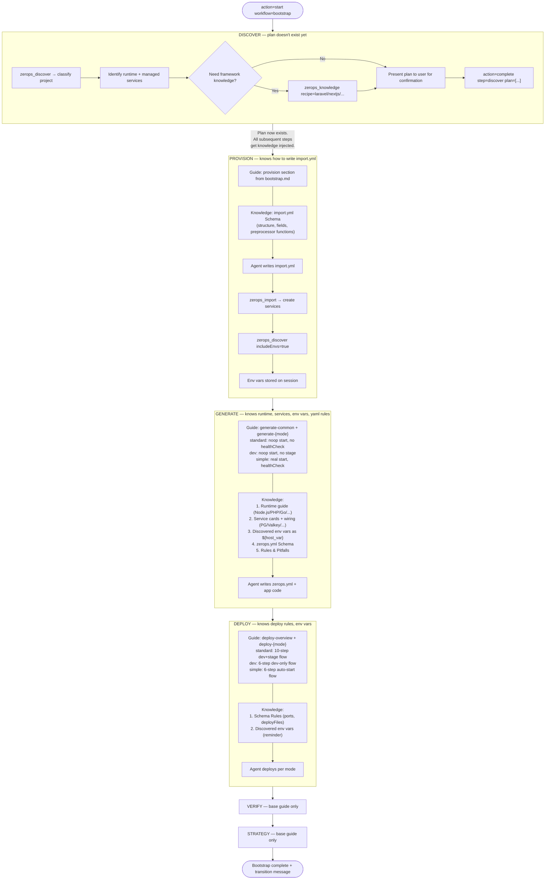
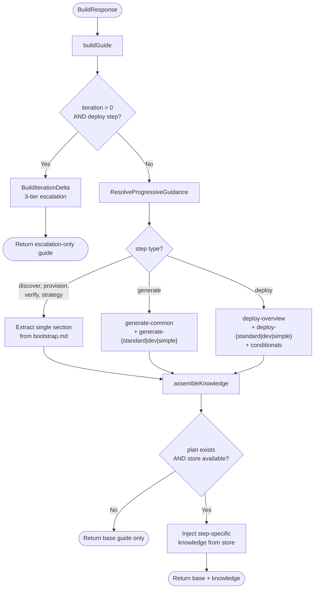
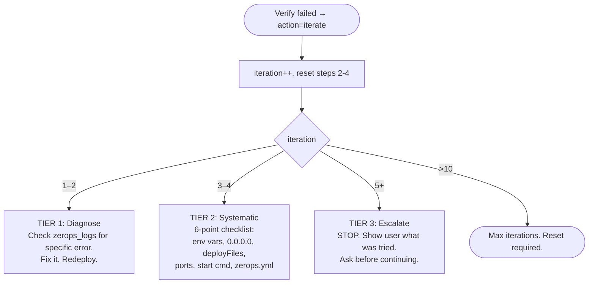

# Wave 1: Knowledge Delivery Flow

How each bootstrap step receives its guidance and platform knowledge. Everything runs in a **container environment** — local flow is not yet implemented (planned for Wave 4-5).

---

## 1. End-to-End Bootstrap Flow with Knowledge



**Key insight:** The plan is the pivot point. Before the plan exists (discover), knowledge delivery is manual — the agent calls `zerops_knowledge` if needed. After the plan exists (provision onwards), knowledge is injected automatically based on plan contents.

---

## 2. Guide Assembly — What Happens Inside BuildResponse



---

## 3. What Each Step Gets — Precisely

### discover

| Source | Content |
|--------|---------|
| Base guidance | `<section name="discover">` — project classification, stack identification, mode choice, plan submission |
| Injected knowledge | **None** — plan doesn't exist yet, `assembleKnowledge` returns empty |
| Agent-initiated | Optional: `zerops_knowledge recipe="..."` for framework-specific patterns |

**Why no injection here:** The agent needs to decide WHAT to build before the system can inject relevant knowledge. The agent uses `availableStacks` from the workflow response to validate types, and optionally loads a recipe if the user wants a specific framework.

### provision

| Source | Content |
|--------|---------|
| Base guidance | `<section name="provision">` — import.yml patterns, hostname rules, dev vs stage properties, env var discovery protocol |
| Injected knowledge | `import.yml Schema` H2 from core.md (field descriptions, type syntax, preprocessor functions) |

**Why this is sufficient for import.yml:** The base guidance covers mode-specific patterns (startWithoutCode, enableSubdomainAccess, mount). The schema covers field syntax and constraints. Service-specific details (like `objectStorageSize` for object-storage) are in the schema. The agent doesn't need runtime guides or service cards yet — those are for zerops.yml.

### generate (mode-filtered)

| Source | Content |
|--------|---------|
| Base guidance | `generate-common` (SSHFS rules, app requirements, /status spec, env var mapping) + `generate-{mode}` (zerops.yml rules specific to standard/dev/simple) |
| Injected knowledge | Runtime guide + service cards & wiring + discovered env vars + zerops.yml Schema + Rules & Pitfalls |

**This is the heaviest step.** The agent writes zerops.yml AND application code. It needs:
- **Mode section** to know whether to use noop or real start, whether to add healthCheck
- **Runtime guide** to know build patterns, port binding, framework gotchas
- **Service cards** to know how to wire dependencies (connectionString vs individual vars)
- **Discovered env vars** to know the exact `${hostname_varName}` references available
- **zerops.yml Schema** to get the structure right
- **Rules & Pitfalls** to avoid common mistakes

### deploy (mode-filtered)

| Source | Content |
|--------|---------|
| Base guidance | `deploy-overview` + `deploy-{mode}` + optional iteration/agents/recovery sections |
| Injected knowledge | Schema Rules (port ranges, deployFiles constraints) + discovered env vars (reminder) |

### verify, strategy

| Source | Content |
|--------|---------|
| Base guidance | Single section from bootstrap.md |
| Injected knowledge | None |

---

## 4. Mode Differences in Detail

### What each mode means for zerops.yml (generate step)

| | Standard | Dev | Simple |
|---|---|---|---|
| **Entries written** | Dev entry only (stage later) | Dev entry only | Single entry |
| **`start:`** | `zsc noop --silent` | `zsc noop --silent` | Real command |
| **`healthCheck:`** | None | None | Required |
| **Server startup** | Agent via SSH | Agent via SSH | Auto after deploy |
| **`deployFiles:`** | `[.]` | `[.]` | `[.]` |

### What each mode means for deployment (deploy step)

| | Standard | Dev | Simple |
|---|---|---|---|
| **Deploy flow** | 10 steps | 6 steps | 6 steps |
| **Services** | dev → verify → gen stage yml → cross-deploy stage → verify stage | dev → verify | deploy → auto-start → verify |
| **SSH start** | Yes (noop killed server) | Yes | No (real start auto-runs) |
| **Iteration cycle** | Edit → restart → test | Edit → restart → test | Edit → redeploy → test |
| **Stage entry** | Written after dev verified | N/A | N/A |

---

## 5. Iteration Escalation

When `iteration > 0` on the deploy step, `BuildIterationDelta` replaces the entire guide:



---

## 6. Context Recovery

```
Agent loses context (compaction / crash / new session)
    ↓
action="status"
    ↓
Engine loads session from disk (plan, env vars, step progress)
    ↓
buildGuide assembles fresh guide from:
  - bootstrap.md (embedded in binary)
  - knowledge store (embedded in binary)
  - session state (plan, env vars — on disk)
    ↓
Agent receives identical guide as original delivery
```

No tracking state to lose. No dedup to invalidate. The three data sources (bootstrap.md, knowledge store, session) are always available.

---

## 7. File Map

| File | Role |
|------|------|
| `workflow/bootstrap_guide_assembly.go` | `buildGuide`, `assembleKnowledge`, `formatEnvVarsForGuide`, `BuildTransitionMessage` |
| `workflow/bootstrap_guidance.go` | `ResolveProgressiveGuidance` (mode filtering), `BuildIterationDelta` (escalation), `extractSection` |
| `workflow/bootstrap.go` | `BuildResponse` → calls `buildGuide`, step state machine |
| `workflow/engine.go` | Engine with `environment` + `knowledge` fields |
| `workflow/environment.go` | `Environment` type (container/local), `DetectEnvironment` |
| `workflow/validate.go` | `ServicePlan.RuntimeBase()`, `DependencyTypes()` |
| `workflow/bootstrap_steps.go` | Short guidance text per step (shown in JSON alongside detailed guide) |
| `content/workflows/bootstrap.md` | All `<section>` content — the actual guidance text |
| `tools/knowledge.go` | `zerops_knowledge` MCP tool — always returns full content |
| `knowledge/engine.go` | `Provider` interface, `GetEmbeddedStore`, `GetBriefing`, `GetCore` |
