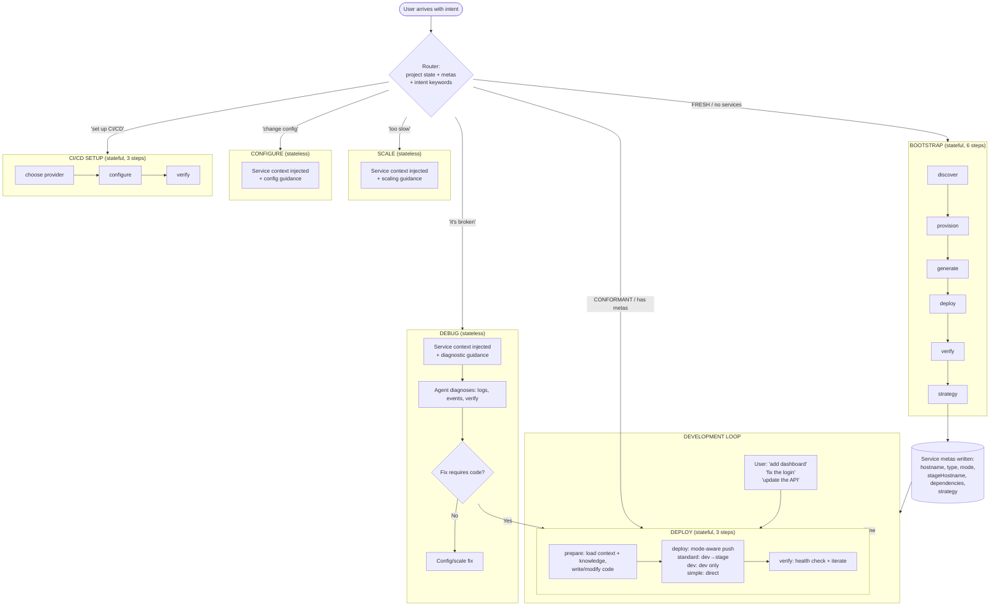
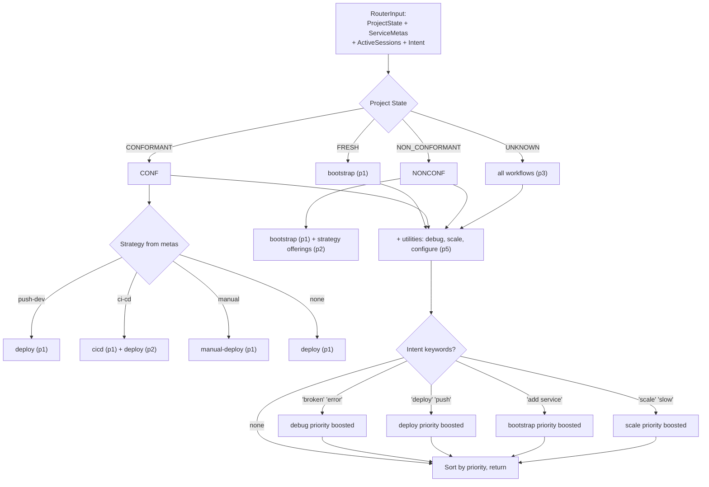
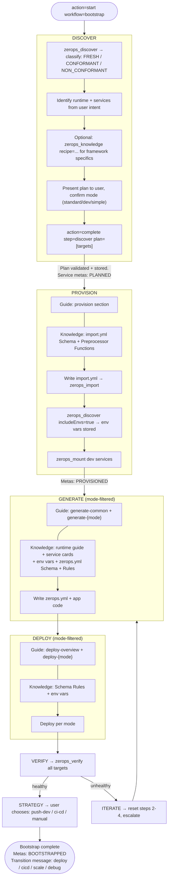
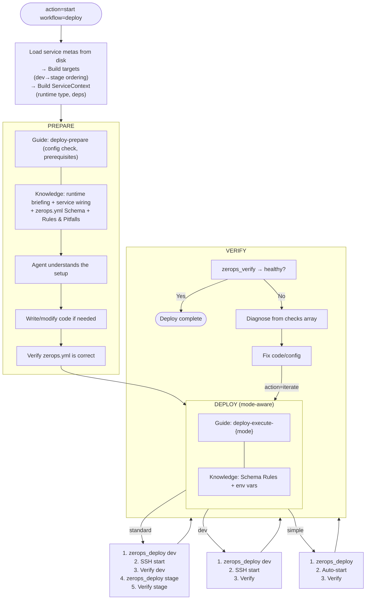
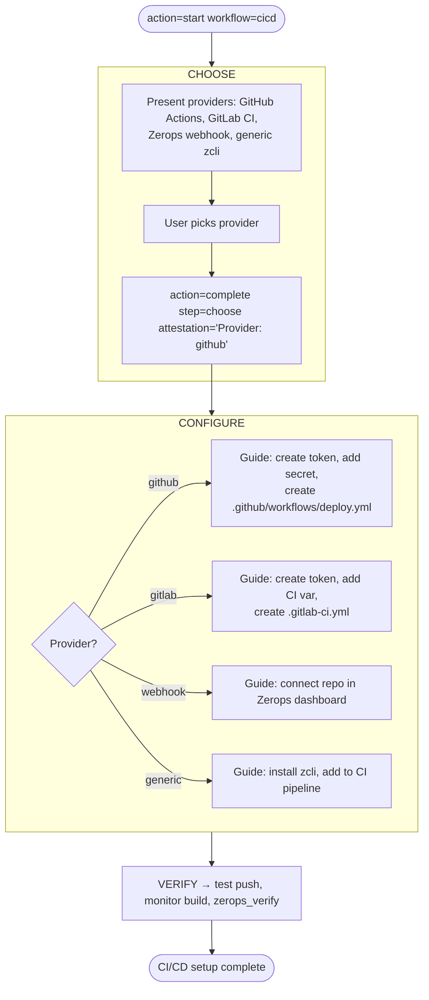

# ZCP Workflow System — Complete Flow Architecture

How the entire workflow system operates from first contact to ongoing development. Container environment only (local flow planned for Wave 4-5).

---

## 1. Project Lifecycle



**Key principle:** Bootstrap runs once. After that, deploy is the primary loop. Debug/scale/configure are side operations that may feed back into deploy.

---

## 2. Router — How Workflows Are Selected



---

## 3. Bootstrap Flow — Creating Infrastructure

6 steps. Plan is the pivot — before plan exists (discover), knowledge is manual. After plan (provision+), knowledge is injected automatically.



### What each step gets (knowledge injection)

| Step | Base guidance | Injected knowledge |
|------|--------------|-------------------|
| **discover** | Project classification, mode selection, plan submission | None (plan doesn't exist yet) |
| **provision** | import.yml patterns, hostname rules, env var discovery | import.yml Schema (+ Preprocessor Functions) |
| **generate** | generate-common + generate-{mode} (zerops.yml rules per mode) | Runtime guide + service cards + wiring + env vars + zerops.yml Schema + Rules & Pitfalls |
| **deploy** | deploy-overview + deploy-{mode} + conditionals | Schema Rules + env vars |
| **verify** | Verification protocol | None |
| **strategy** | Strategy options | None |

---

## 4. Deploy Flow — The Development Cycle

3 steps. This is the primary post-bootstrap workflow. Agent loads context, writes code, deploys, verifies.



### Deploy ServiceContext

At `DeployStart`, service metas are read and converted to `DeployServiceContext`:

```
ServiceMeta files → BuildDeployTargets() → DeployServiceContext {
    RuntimeType:     "nodejs@22"       // from first runtime meta
    DependencyTypes: ["postgresql@16"] // from dep metas
    DiscoveredEnvVars: (if available)
}
```

This enables `assembleDeployKnowledge` to inject **runtime-specific** and **dependency-specific** knowledge — same quality as bootstrap generate step.

---

## 5. Stateless Workflows — Operations with Context

Debug, scale, configure are stateless (no session, no steps). But they now receive **service context** — a summary of the project's services from metas.


The agent knows WHAT exists before starting to diagnose, scale, or configure. No blind `zerops_discover` needed to understand the setup.

### Cross-workflow transitions

Each stateless workflow ends with transition hints:

- **After debug:** → deploy (if code fix needed), scale, configure
- **After scale:** → debug (if still slow), deploy, configure
- **After configure:** → deploy (to apply changes), debug, scale

---

## 6. CI/CD Setup Flow

3 steps. Stateful, provider-specific guidance.



---

## 7. Mode Differences — Complete Matrix

### Modes affect generate, deploy, and iteration

| | Standard | Dev | Simple |
|---|---|---|---|
| **Services created** | dev + stage + managed | dev + managed | 1 runtime + managed |
| **zerops.yml entries** | Dev only (stage later) | Dev only | Single entry |
| **`start:`** | `zsc noop --silent` | `zsc noop --silent` | Real command |
| **`healthCheck:`** | None in dev | None | Required |
| **Server startup** | Agent via SSH | Agent via SSH | Auto after deploy |
| **Deploy order** | dev → verify → stage → verify | dev → verify | deploy → verify |
| **Stage entry** | Generated after dev verified | N/A | N/A |
| **Iteration** | Edit → SSH restart → test | Edit → SSH restart → test | Edit → redeploy → test |

---

## 8. Knowledge Injection — How It Works

### Guide assembly pipeline (shared by bootstrap + deploy)

```
BuildResponse()
  └─ buildGuide(step, iteration, env, kp)
       ├─ iteration > 0 on deploy? → BuildIterationDelta (3-tier escalation)
       ├─ ResolveProgressiveGuidance(step, plan, iteration)
       │    ├─ generate → generate-common + generate-{mode}
       │    ├─ deploy → deploy-overview + deploy-{mode} + conditionals
       │    └─ other → single <section> from markdown
       └─ assembleKnowledge(step, kp)
            └─ step-specific content from embedded knowledge store
```

### Bootstrap iteration escalation

| Iterations | Tier | Action |
|------------|------|--------|
| 1–2 | Diagnose | `zerops_logs severity="error"`, fix specific error |
| 3–4 | Systematic | 6-point checklist (env vars, 0.0.0.0, deployFiles, ports...) |
| 5+ | Escalate | STOP, show user what was tried, ask before continuing |
| >10 | Max | Session must be reset |

### Context recovery

```
Context lost (compaction / crash / new session)
  → action="status"
  → Engine loads session from disk
  → buildGuide assembles fresh guide from:
      bootstrap.md / deploy.md (embedded)
      + knowledge store (embedded)
      + session state (disk: plan, env vars, step progress)
  → Agent receives identical guide — no state to lose
```

---

## 9. Data Flow — What Gets Persisted Where

```
.zcp/state/
  registry.json              ← active session index
  sessions/{sessionID}.json  ← per-session state:
    WorkflowState {
      Bootstrap *BootstrapState  (plan, env vars, steps, strategies)
      Deploy    *DeployState     (targets, service context, steps)
      CICD      *CICDState       (provider, hostnames, steps)
    }
  services/{hostname}.json   ← service metas (survive session deletion):
    ServiceMeta {
      hostname, type, mode, stageHostname,
      dependencies, strategy, status
    }
```

**Service metas are the bridge between workflows.** Bootstrap writes them, deploy/debug/scale/configure read them. They carry the decisions forward: what runtime, what mode, what dependencies, what strategy.

---

## 10. File Map

| File | Role |
|------|------|
| **Bootstrap** | |
| `workflow/bootstrap.go` | BootstrapState, BuildResponse, step state machine |
| `workflow/bootstrap_guide_assembly.go` | `buildGuide`, `assembleKnowledge`, `formatEnvVarsForGuide` |
| `workflow/bootstrap_guidance.go` | `ResolveProgressiveGuidance`, `BuildIterationDelta`, `extractSection` |
| `workflow/bootstrap_steps.go` | Step definitions (name, category, tools, verification) |
| `content/workflows/bootstrap.md` | Section content: discover, provision, generate-{common,standard,dev,simple}, deploy-{overview,standard,dev,simple,iteration,agents} |
| **Deploy** | |
| `workflow/deploy.go` | DeployState, DeployServiceContext, `BuildDeployTargets`, `assembleDeployKnowledge` |
| `workflow/deploy_guidance.go` | `resolveDeployStepGuidance`, `ResolveDeployGuidance` (strategy-based) |
| `content/workflows/deploy.md` | Section content: deploy-prepare, deploy-execute-{overview,standard,dev,simple}, deploy-verify |
| **CI/CD** | |
| `workflow/cicd.go` | CICDState, provider constants, step logic |
| `workflow/cicd_guidance.go` | `resolveCICDGuidance` (provider-specific sections) |
| `content/workflows/cicd.md` | Section content: cicd-choose, cicd-configure-{github,gitlab,webhook,generic}, cicd-verify |
| **Shared** | |
| `workflow/engine.go` | Engine with env + knowledge, all Start/Complete/Status/Skip methods |
| `workflow/state.go` | WorkflowState (Bootstrap + Deploy + CICD), `IsImmediateWorkflow` |
| `workflow/environment.go` | Environment type (container/local) |
| `workflow/service_meta.go` | ServiceMeta CRUD, ListServiceMetas |
| `workflow/service_context.go` | `BuildServiceContextSummary` for stateless workflows |
| `workflow/router.go` | Route(), intent detection, strategy offerings |
| `workflow/session.go` | Session management, iteration, max iterations |
| **Tools** | |
| `tools/workflow.go` | Action dispatcher, `handleStart`, `detectActiveWorkflow` |
| `tools/workflow_bootstrap.go` | Bootstrap-specific handlers |
| `tools/workflow_deploy.go` | Deploy-specific handlers |
| `tools/workflow_cicd.go` | CI/CD-specific handlers |
| **Knowledge** | |
| `tools/knowledge.go` | `zerops_knowledge` MCP tool (scope, briefing, query, recipe) |
| `knowledge/engine.go` | Provider interface, GetEmbeddedStore, GetBriefing, GetCore |
| `knowledge/sections.go` | H2/H3 section parsing, runtime/service normalizers |
