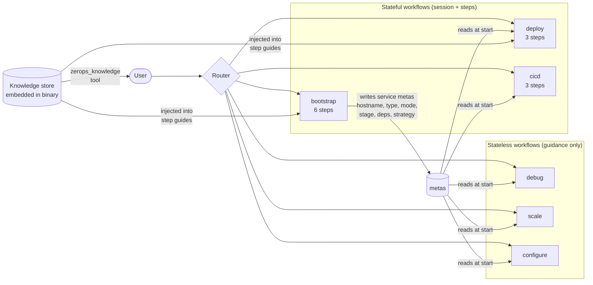
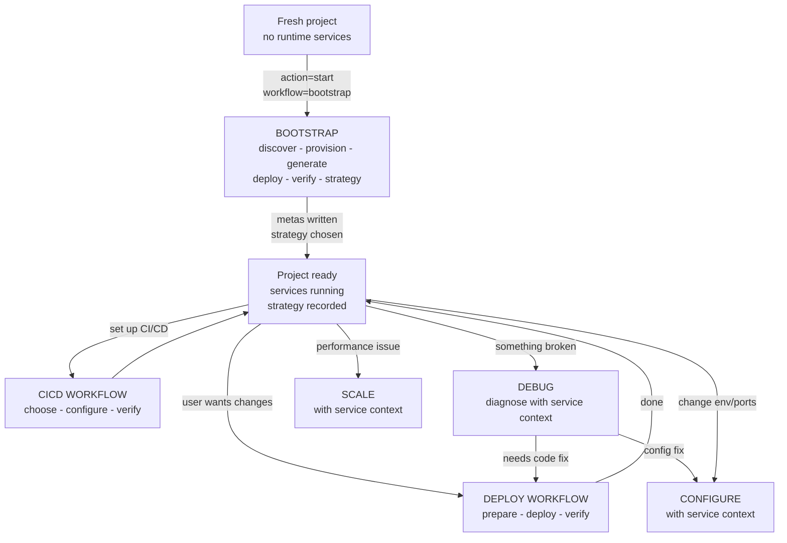
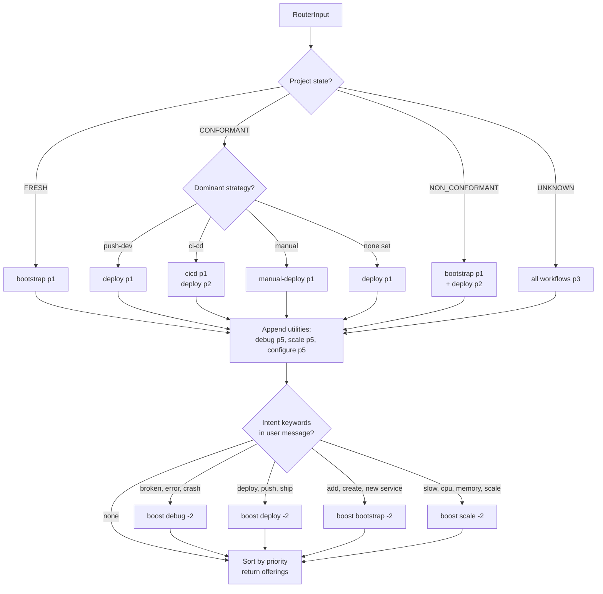
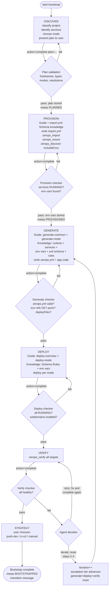
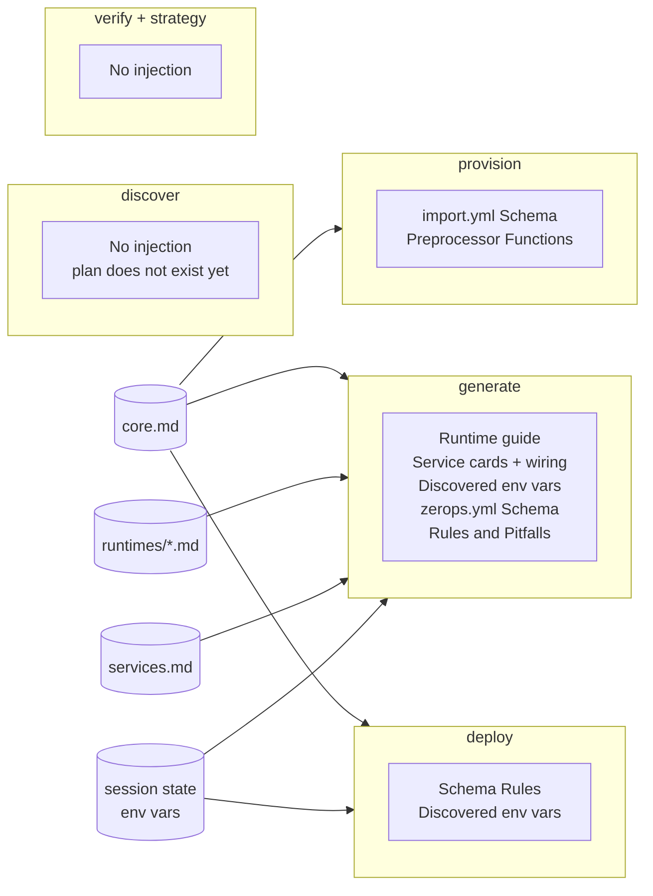
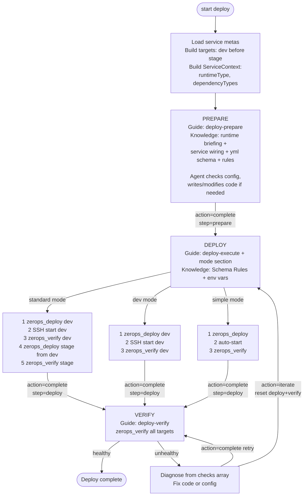
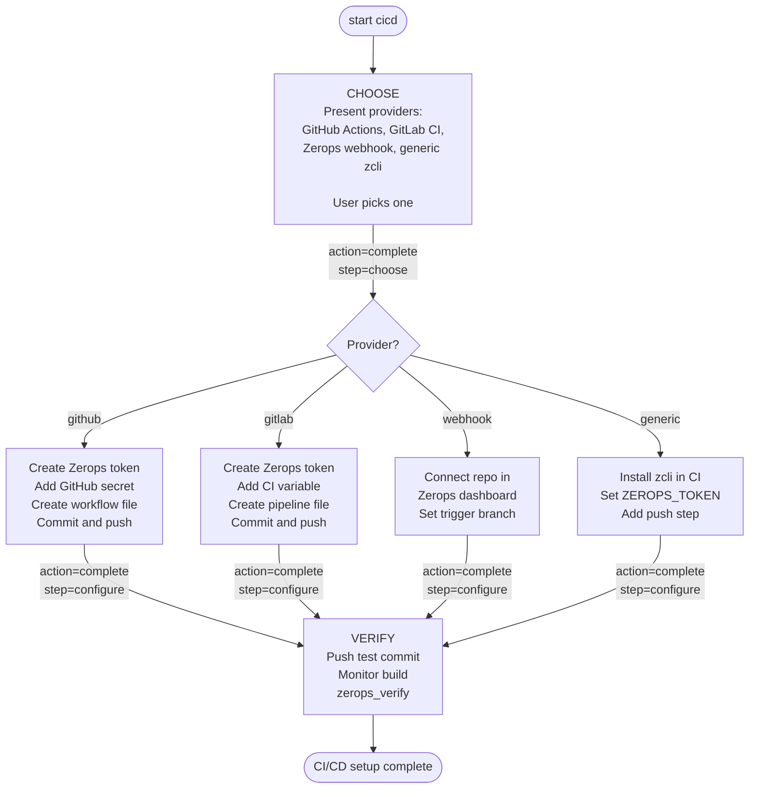
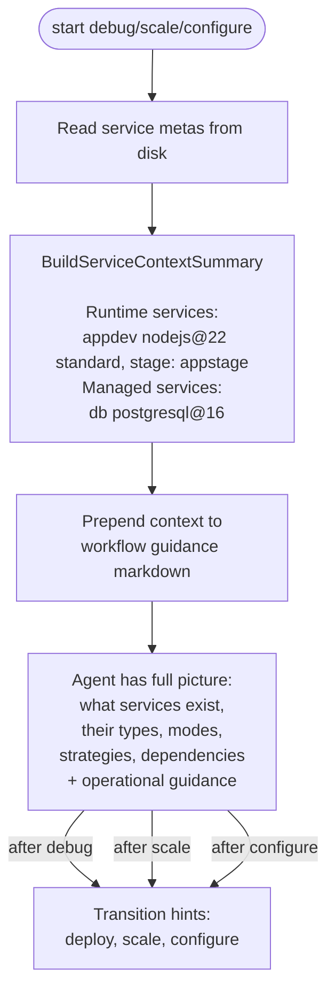
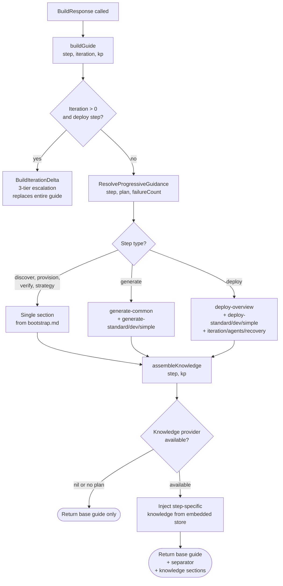
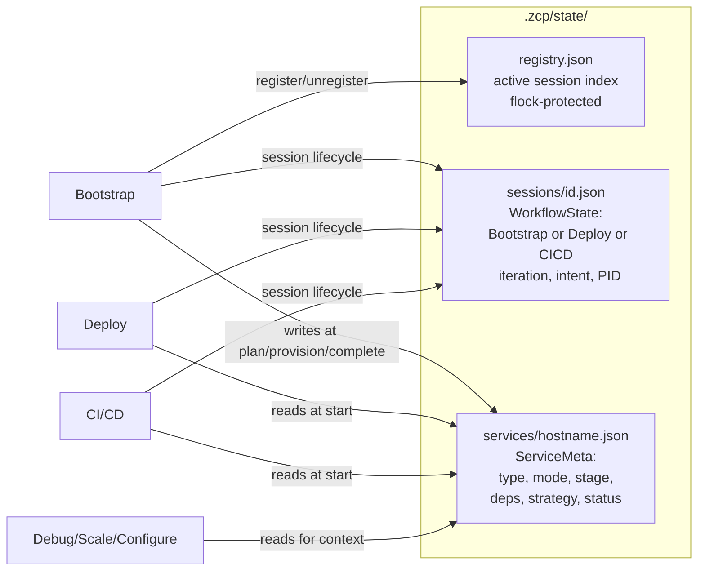

# ZCP Workflow System — Complete Flow Architecture

Container environment only. Local flow planned (Wave 4-5), architecture prepared but not implemented.

---

## 1. System Overview



**Bootstrap** creates infrastructure and writes service metas. All other workflows read metas for context. Knowledge is embedded and injected into guides automatically.

---

## 2. Project Lifecycle



Bootstrap runs once. Deploy is the primary loop. Debug/scale/configure are side operations.

---

## 3. Router

Determines which workflow to suggest based on project state, service metas, and user intent.



Priority: p1 = primary, p2 = secondary, p3 = unknown, p5 = utility. Intent boost reduces priority by 2.

---

## 4. Bootstrap Flow

Container-only. Mode-aware (standard/dev/simple). 6 steps with automated checkers.

### 4.1 Step sequence



### 4.2 Checker mechanics

```
action="complete" step="X" attestation="..."
  │
  ├─ Checker runs BEFORE step advances
  │
  ├─ IF Passed == false:
  │    Step stays in_progress
  │    Response includes CheckResult.checks array
  │    Agent can fix + retry action="complete"
  │
  └─ IF Passed == true:
       CompleteStep() → step marked complete
       Next step becomes in_progress
```

| Step | Checker | Validates | Side effects |
|------|---------|-----------|-------------|
| discover | `ValidateBootstrapTargets` | Hostnames a-z0-9 max 25, types vs live catalog, modes, stage derivation, resolutions, HA defaults | None |
| provision | `checkProvision` | All services RUNNING, env vars discoverable for managed deps | Stores env var names on session |
| generate | `checkGenerate` | zerops.yml parses, setup entry per dev hostname, env refs valid, ports defined, deployFiles defined | None |
| deploy | `checkDeploy` | All runtimes RUNNING, subdomain enabled for services with ports | None |
| verify | `checkVerify` | VerifyAll HTTP health for plan targets | None |
| strategy | None | User choice | None |

### 4.3 Iteration escalation

When verify fails and agent calls `action="iterate"`:

| Iteration | Tier | Guidance |
|-----------|------|----------|
| 1-2 | Diagnose | Check zerops_logs for specific error, fix, redeploy |
| 3-4 | Systematic | 6-point checklist: env vars, 0.0.0.0, deployFiles, ports, start cmd, zerops.yml |
| 5+ | Escalate | STOP. Present history to user. Ask before continuing. |
| >10 | Max | Session must be reset |

### 4.4 Knowledge injection per step



### 4.5 Mode differences

| | Standard | Dev | Simple |
|---|---|---|---|
| Services | dev + stage + managed | dev + managed | 1 runtime + managed |
| zerops.yml | dev entry only, stage later | dev entry only | single entry |
| start cmd | zsc noop --silent | zsc noop --silent | real command |
| healthCheck | none in dev | none | required |
| server start | SSH manual | SSH manual | auto after deploy |
| deploy | dev then cross-deploy stage | dev only | direct |
| iteration | edit on mount, SSH restart | same | edit on mount, redeploy |
| generate section | generate-standard | generate-dev | generate-simple |
| deploy section | deploy-standard | deploy-dev | deploy-simple |

---

## 5. Deploy Flow

Primary post-bootstrap workflow. 3 steps. Mode-aware. Reads service metas for context.



**ServiceContext** populated at start from metas:
- `RuntimeType` — e.g. nodejs@22 (from first runtime meta)
- `DependencyTypes` — e.g. postgresql@16, valkey@7.2 (from dep metas)
- Enables runtime-specific and dependency-specific knowledge injection

---

## 6. CI/CD Setup Flow

3 steps. Provider-specific guidance.



---

## 7. Stateless Workflows

Debug, scale, configure. No session. Service context from metas prepended to guidance.



---

## 8. Knowledge Injection Pipeline

Shared by bootstrap and deploy. Assembles fresh guide every time from embedded sources.



### Context recovery

All guide sources are always available:
- `bootstrap.md` / `deploy.md` — embedded in binary
- Knowledge store — embedded in binary
- Session state (plan, env vars, step progress) — on disk

`action="status"` rebuilds the identical guide. No tracking state to lose.

---

## 9. Data Persistence



Metas survive session deletion. They carry decisions forward across workflows.

---

## 10. Mode x Environment Matrix

### Implemented (container only)

| | Standard | Dev | Simple |
|---|---|---|---|
| Services | dev + stage + managed | dev + managed | 1 runtime + managed |
| zerops.yml | dev noop, stage later | dev noop | single real start |
| healthCheck | none in dev | none | required |
| Deploy | SSH self + cross-deploy | SSH self | SSH self |
| Start | SSH manual | SSH manual | auto |
| Iteration | SSHFS edit, SSH restart | same | SSHFS edit, redeploy |
| File access | SSHFS /var/www/hostname/ | same | same |

### Not implemented (local, Wave 4-5)

| Aspect | Container now | Local future |
|--------|--------------|-------------|
| Files | SSHFS mount | Local filesystem |
| Deploy | SSH git+zcli push | zcli push from local |
| Dev start | zsc noop + SSH | Real start always |
| Prereqs | Container auto | zcli + VPN + auth |
| Iteration | Mount edit, SSH restart | Local edit, zcli push |

Architecture ready: Environment type + DetectEnvironment exist. Content and tooling missing.

---

## 11. File Map

| File | Role |
|------|------|
| **Bootstrap** | |
| `workflow/bootstrap.go` | BootstrapState, BuildResponse, step state machine |
| `workflow/bootstrap_guide_assembly.go` | buildGuide, assembleKnowledge, formatEnvVarsForGuide |
| `workflow/bootstrap_guidance.go` | ResolveProgressiveGuidance, BuildIterationDelta, extractSection |
| `workflow/bootstrap_steps.go` | Step definitions: name, category, tools, verification |
| `content/workflows/bootstrap.md` | Sections: discover, provision, generate-common/standard/dev/simple, deploy-overview/standard/dev/simple/iteration/agents |
| **Deploy** | |
| `workflow/deploy.go` | DeployState, DeployServiceContext, BuildDeployTargets, assembleDeployKnowledge |
| `workflow/deploy_guidance.go` | resolveDeployStepGuidance, ResolveDeployGuidance |
| `content/workflows/deploy.md` | Sections: deploy-prepare, deploy-execute-overview/standard/dev/simple, deploy-verify |
| **CI/CD** | |
| `workflow/cicd.go` | CICDState, provider constants, step logic |
| `workflow/cicd_guidance.go` | resolveCICDGuidance |
| `content/workflows/cicd.md` | Sections: cicd-choose, cicd-configure-github/gitlab/webhook/generic, cicd-verify |
| **Engine** | |
| `workflow/engine.go` | All Start/Complete/Status/Skip/Iterate methods |
| `workflow/state.go` | WorkflowState with Bootstrap + Deploy + CICD fields |
| `workflow/session.go` | Session management, iteration, max iterations |
| `workflow/environment.go` | Environment type, DetectEnvironment |
| `workflow/validate.go` | Plan validation, RuntimeBase, DependencyTypes |
| `workflow/service_meta.go` | ServiceMeta CRUD |
| `workflow/service_context.go` | BuildServiceContextSummary for stateless workflows |
| `workflow/router.go` | Route, intent detection, strategy offerings |
| **Tools** | |
| `tools/workflow.go` | Action dispatcher, handleStart, detectActiveWorkflow |
| `tools/workflow_bootstrap.go` | Bootstrap handlers, step checkers |
| `tools/workflow_checks.go` | checkProvision, checkDeploy, checkVerify |
| `tools/workflow_checks_generate.go` | checkGenerate, zerops.yml validation |
| `tools/workflow_deploy.go` | Deploy handlers |
| `tools/workflow_cicd.go` | CI/CD handlers |
| **Knowledge** | |
| `tools/knowledge.go` | zerops_knowledge MCP tool: scope, briefing, query, recipe |
| `knowledge/engine.go` | Provider interface, GetEmbeddedStore, GetBriefing, GetCore |
| `knowledge/sections.go` | H2/H3 parsing, runtime/service normalizers |
