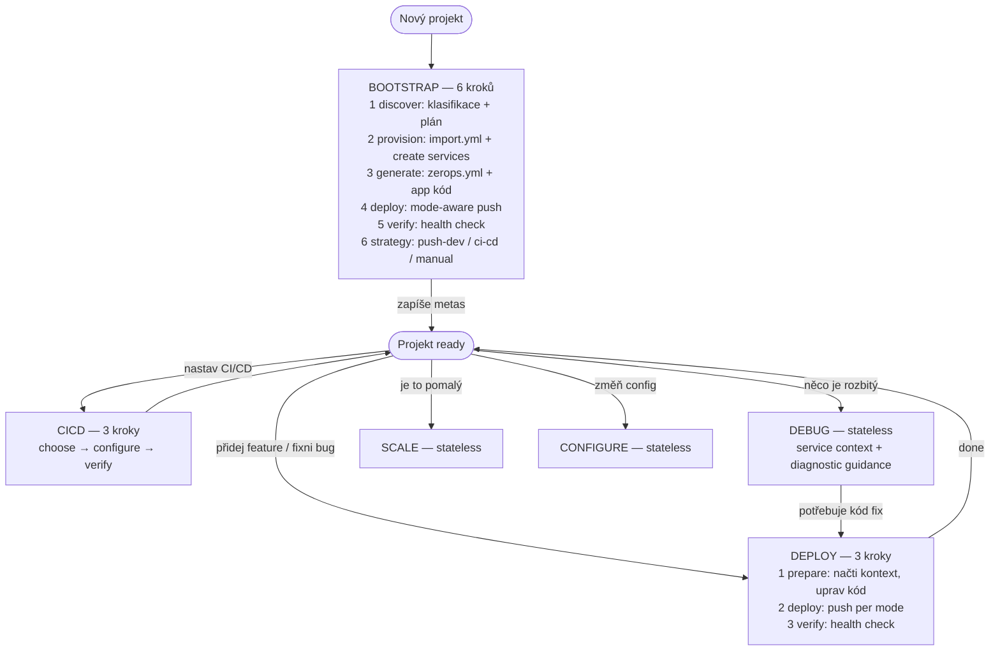
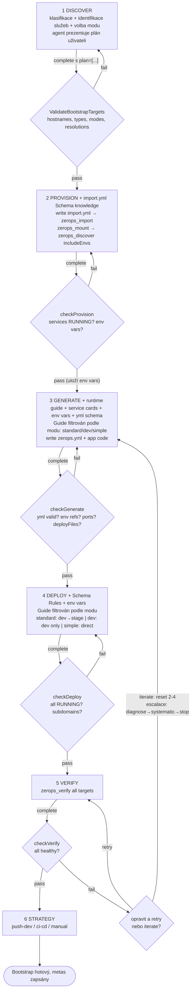
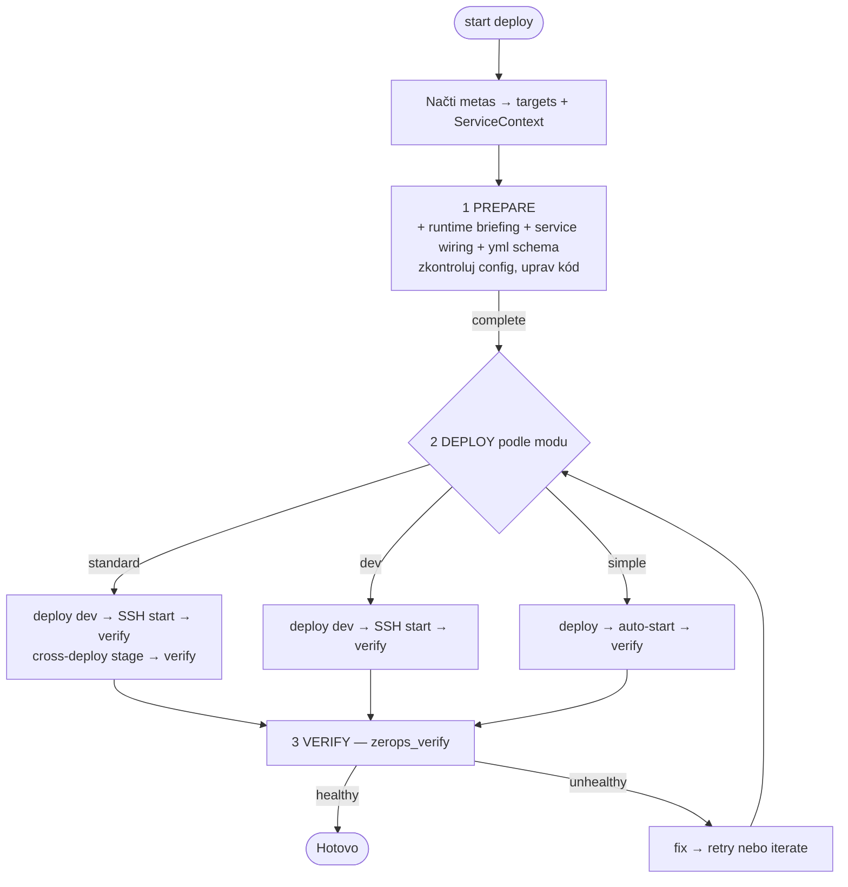

# ZCP Workflow System

## How it works

Bootstrap vytvoří infrastrukturu a zapíše service metas (typ, mode, stage, deps, strategie). Všechny další workflows čtou tyto metas. Knowledge (runtime guides, YAML schémata, service cards) je embedded v binárce a automaticky se injektuje do step guides.



---

## Bootstrap detailně

Každý krok má **checker** — automatickou validaci proti live API. Checker běží PŘED tím než krok postoupí. Když selže, step zůstane `in_progress` a agent dostane `CheckResult.checks` s konkrétními chybami. Může opravit a zkusit `complete` znovu, nebo zavolat `iterate` (reset kroků 2-4, návrat na generate).



**Co každý krok dostane za knowledge:**

| Krok | Injektovaná knowledge | Zdroj |
|------|----------------------|-------|
| discover | nic (plán neexistuje) | — |
| provision | import.yml Schema + Preprocessor Functions | core.md |
| generate | runtime guide + service cards + wiring + env vars + zerops.yml Schema + Rules & Pitfalls | core.md + runtimes/*.md + services.md + session |
| deploy | Schema Rules + env vars | core.md + session |
| verify, strategy | nic | — |

**Escalace při iteraci:** 1-2 = diagnose z logů, 3-4 = systematický 6-bodový checklist, 5+ = stop a ptej se uživatele.

---

## Deploy detailně

Primární post-bootstrap workflow. Při startu načte service metas → sestaví targets (dev před stage) a ServiceContext (runtime type, dependency types) pro knowledge injection.



---

## Mody

| | Standard | Dev | Simple |
|---|---|---|---|
| Services | dev + stage + managed | dev + managed | 1 runtime + managed |
| zerops.yml start | `zsc noop --silent` | `zsc noop --silent` | real command |
| healthCheck | ne (v dev) | ne | ano |
| Server start | agent přes SSH | agent přes SSH | auto po deploy |
| Deploy | dev → stage | dev only | direct |
| Iterace | edit na SSHFS → SSH restart | stejné | edit → redeploy |

---

## Stateless workflows

Debug, scale, configure — bez session. Dostanou service context (seznam služeb s typy, mody, strategiemi) prepended k guidance. Po skončení nabídnou přechod na jiný workflow.

---

## Router

Rozhoduje podle: project state (FRESH/CONFORMANT/NON_CONFORMANT) + strategy z metas + intent keywords v user zprávě.

| Stav | Nabídne |
|------|---------|
| FRESH | bootstrap |
| CONFORMANT + push-dev | deploy |
| CONFORMANT + ci-cd | cicd + deploy |
| NON_CONFORMANT | bootstrap + deploy |

Intent boost: "broken" → debug, "deploy" → deploy, "add service" → bootstrap, "slow" → scale.

---

## Context recovery

Všechny zdroje jsou vždy dostupné: markdown content (embedded), knowledge store (embedded), session state (disk). `action="status"` sestaví identický guide. Žádný tracking state, žádný dedup.

---

## Persistence

```
.zcp/state/
  sessions/{id}.json    ← WorkflowState (Bootstrap | Deploy | CICD)
  services/{host}.json  ← ServiceMeta (přežije smazání session)
```

---

## Container vs Local

**Teď: container-only.** SSHFS mount, SSH deploy, SSH start.

**Local (Wave 4-5, neimplementováno):** zcli push, lokální soubory, real start vždy (i pro dev). Architektura připravena (Environment type), content a tooling chybí. Detaily v `plans/wave4-5-local-flow.md`.
