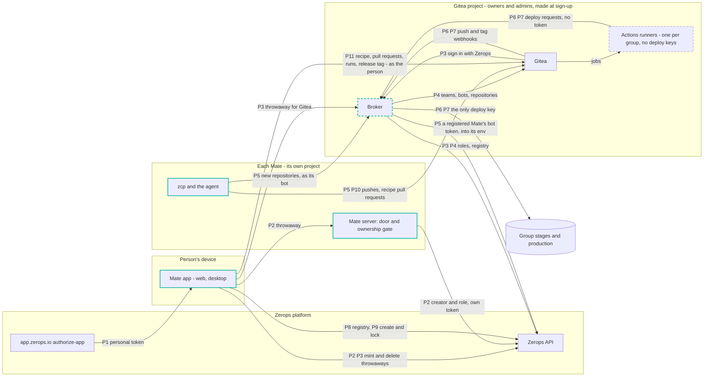
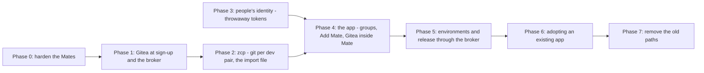
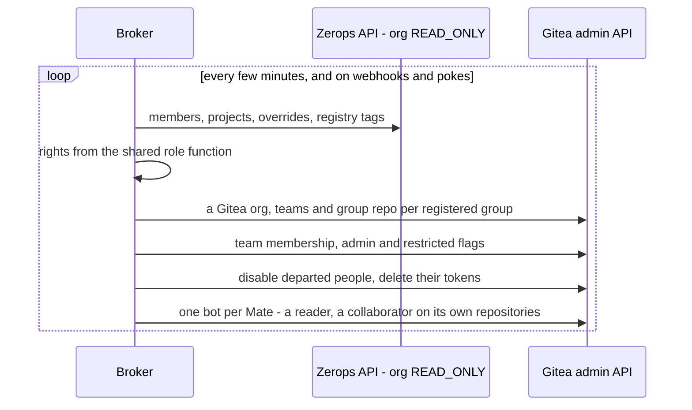
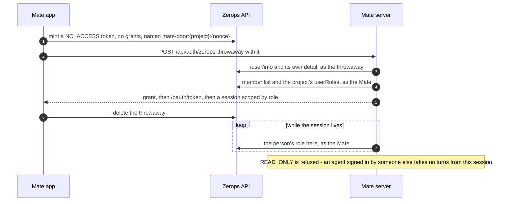
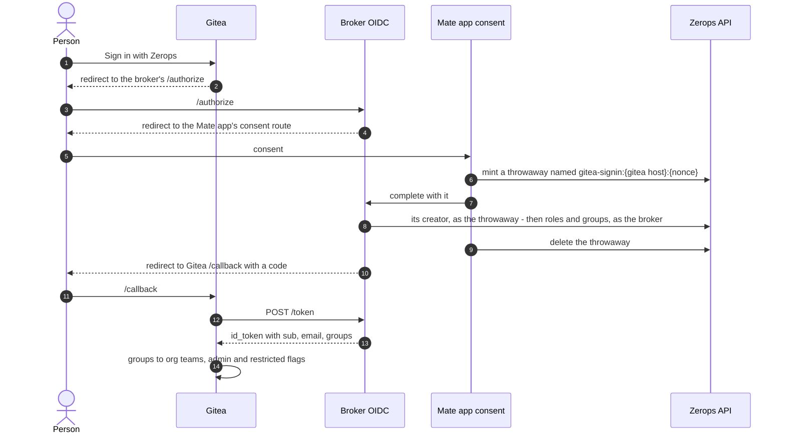

# Implementation guide: the Zerops auth backbone and the Mate lifecycle

Date: 2026-09-15; every decision closed 2026-09-16. The measured facts are the fork's ledger
sections of 2026-09-15; the earlier reasoning is
`plans/research/zerops-auth-backbone-2026-09-15.md` (partly superseded — see its banner); the
plain-language summary is `plans/zerops-auth-backbone-summary-2026-09-15.md`. This file is the *what
and in what order*. It is a plan, not a spec: when a slice lands, its decision moves into
`docs/spec-mate.md` and its measured behaviour into the ledger, and the slice is struck here.

**State (2026-09-17):** nearly all of this is built and most of it proven live — mate 0.11.5, zcp
v9.176.0, gitea-mate v2.1. Where each slice stands, with the commit that built it and the row or
test that proves it, is the fork's `docs/internals/zerops/primer.md`; the spec's §10 carries the
decisions as landed. This file stays the plan as decided: its *Today* bullets describe 2026-09-15,
the *Now* column of the map below and the *State* line under each phase say what changed.

Repos: **fork** = `~/www/z3` (`zeropsio/mate`), **zcp** = `~/www/zcp`, **recipe** =
`zeropsio/recipe-gitea`. Every slice follows the fork's disciplines: tests first (RED → GREEN,
table-driven), `vp test run <file>` and the touched package's typecheck, `vp check` before a push,
atomic English commits. Live checks run in the Onboarding org, or in the test org `Mate` when they
need a second person, on `probe:`-tagged resources that are deleted afterwards (memory
`live-probe-account`).

---

## Where the design stands

Every decision is made (D1–D20, § *Decisions*); four moved as they landed — D4, D17, D18, D20 (spec §10.2).

### The account

```
Zerops org (the owner)
├── Gitea project — owners and admins, created in the background at sign-up
│   ├── Gitea, Postgres, volume
│   ├── runners — one per group, awake only for its jobs, no deploy keys
│   └── broker — mirrors Zerops permissions into Gitea, signs people in to Gitea, gives Mates
│                their Gitea access, holds the only deploy key, deploys what protected branches
│                and tags allow
└── Acme — a group: registry entry and tags, no Zerops project of its own
    ├── Fen (Mate)  — zcp, a dev/stage pair per codebase (api, web), db
    ├── Nova (Mate) — the same shape, built from the recipe
    ├── stage          — follows main (the default)
    ├── stage-client-x — follows main + feature/invoices
    └── production     — gets code only through a release

Gitea org "acme"
├── acme/group — the recipe (every environment's import), which branches feed each stage,
│                release tags; main takes merges only from people with production rights
├── acme/api   — code, zerops.yaml, workflows
└── acme/web   — code, zerops.yaml, workflows
```

**How a Mate and Gitea learn who you are (D1).** When a person opens a Mate, the app mints a
throwaway Zerops token with no rights, named for that one Mate, and hands it over instead of the
person's own token. The Mate reads who created it and checks that person's role with its own token;
the app deletes the throwaway seconds later, and from then on the Mate re-checks the role itself.
Gitea sign-in works the same way, with the org's broker as the *Sign in with Zerops* provider. No
container ever sees a person's real Zerops token, and there is no central service.

### Who can do what

Zerops roles are the only source. The broker mirrors them into Gitea, a Mate's door reads them live,
and Zerops checks every deploy.

| In Zerops | In Gitea and Mate |
|---|---|
| org owner | everything; Gitea site admin |
| the creator of a Mate in the group (D11) | write to the group's code repos; propose recipe changes; the only writer in that Mate |
| everyone else in the org (`READ_ONLY`) | read the group's repos; see every Mate in the list, open none (D5) |
| access to the production project | merge recipe changes; release |
| a Mate | write to the code repos it created, landing on `main` through pull requests; propose recipe changes. It cannot deploy group stages or production, create projects, or move itself between groups |
| the person who signed an agent in | the only one who can run that agent (D6): recorded as a project tag, the composer hidden from everyone else, their turns refused by the server |

### Where every credential lives

| Credential | Where | Reaches |
|---|---|---|
| a person's personal Zerops token | the Mate app | the Zerops API only, never a container |
| a throwaway sign-in token | minted by the app for one Mate connection or one Gitea sign-in | proves who you are to that one receiver; no rights; deleted within seconds |
| each Mate's Zerops token (`ZCP_API_KEY`) | a sensitive variable of its `zcp` service (0.10, landed) | its own project at `BASIC_USER`; no longer persisted by self-deploy's `zcli login` (0.9, landed in zcp v9.176.0) |
| each Mate's Gitea token | its `zcp` service, written there by the broker's rights loop (D20) | write to the code repos it created |
| the broker's Zerops token | the broker's service env | read the org; `BASIC_USER` on the Gitea project, on every registered Mate's project (D20), and on the group stages and production — **the only deploy key** |
| the broker's signing key | the broker's service env | signs Gitea sign-in tokens (3.6) |
| Gitea's admin credentials | the Gitea project | nothing outside it |
| agent logins | each Mate | run only by the person who signed them in |
| deploy tokens in Gitea, a repository or a runner | — | none, anywhere |

The order of operations from no account to production with two Mates is § *The whole run*, near the
end.

---

## 0. The map

Solid boxes exist today; dashed boxes are new. Teal is Mate's own software.



| Path | What travels | Today (2026-09-15) | Target | Now (2026-09-17) |
|---|---|---|---|---|
| **P1** Sign in to the app | personal token, `authorize-app` hand-over | exists | unchanged; the token goes only to the Zerops API | unchanged |
| **P2** Open a Mate | a throwaway token: no rights, named for that Mate, deleted within seconds | the raw personal token, to every container, every 15 minutes | the Mate traces the throwaway to its creator and checks their role with its own token, then re-checks it itself; scopes by role; ownership gate | landed, mate 0.11.0: a throwaway per connect, the door reads its creator and the role with the Mate's key, sessions ended by the Mate's own re-check (spec §10.4) |
| **P3** Sign in to Gitea | OIDC code flow, `groups` claim | none | the org's broker as OIDC provider, its consent step a throwaway named for that Gitea; teams re-synced at every sign-in (prototype measured) | landed, gitea-mate v1 + mate 0.11.0: the broker is Gitea's OIDC provider, consent by throwaway; proven live 2026-09-16 |
| **P4** Keep Gitea honest | broker: org read token + Gitea admin | none | on a timer and on webhooks: teams, admin, departed people, bots, group orgs and repos | landed, gitea-mate v1: the rights loop every 3 min and after sign-ins and webhooks; a bad read writes nothing, a cap stops a pass |
| **P5** A Mate's Gitea access | the broker's rights loop writes the bot's token into the Mate's env for every registered Mate (D20); new repositories as the bot | the app writes the site-admin user's token into `zcp`'s env (`giteaCredential.ts`) | nobody asks: the registry entry authorizes, the loop delivers, zcp reads the live env store; the Mate asks the broker for repositories as its bot; its Zerops key stays home | landed, gitea-mate v2/v2.1 + mate 0.11.5: the loop delivers, nobody asks (D20); proven 2026-09-17 with nothing restarted |
| **P6** Deploy a group environment | the broker's one deploy key | production token in repo secrets (demo) | the broker deploys the head of the environment's source branch(es); workflows may orchestrate by calling it | landed, gitea-mate v1: a stage from its sources' head on the webhook, `POST /deploy` from a workflow with the job's token; proven live 2026-09-16 |
| **P7** Release | a protected tag on the group repo | tag + repo-secret production token (demo) | the tag lists each service's commit; a release workflow orchestrates; the broker deploys exactly those commits | built, not yet run live: the tag as the person (mate 0.11.0), judged on its pusher (gitea-mate v1) |
| **P8** Group membership | registry tags on the Gitea project | tags any Mate can write | written only by owners/admins; access widens only on a person's action | landed, mate 0.11.0: *Add project* writes the registry, a Mate is registered at birth, reach widens only on a person's action |
| **P9** Create an environment | container token + one-time delegation | token `ADMIN`, delegation kept | token `BASIC_USER`, delegation deleted | landed, mate 0.11.0: token `BASIC_USER`, delegation deleted, project isolated with the key on `zcp` |
| **P10** The recipe | the group repo: every tier's import and the environments | a mock store (H-27); clones are lossy and codeless | the Mate proposes it by pull request; a person with production rights merges | landed: the Mate proposes the recipe by pull request (zcp v9.176.0), *Add Mate* reads it from the group repo (mate 0.11.0); a second Mate joining from it is open (2.4) |
| **P11** Gitea inside Mate | Gitea OAuth2 (PKCE) acting as the person | none | Mate shows and drives environments, pull requests, runs and releases; Gitea enforces the person's mirrored rights | landed, mate 0.11.0: PKCE as the person, the Git tab, *Release* and *Roll back to this* |

---

## 1. Build order



Phase 0 needs no new infrastructure and closes the worst exposures. Phases 1–2 make Mates work with
Gitea and take one piece of Phase 3 with them: the broker's throwaway check (the first half of 3.6),
which is how the app proves who asks for a Mate's Gitea credential (1.5) — a Mate itself proves
nothing to anyone but with its bot's Gitea token. The rest of people's identity (Phase 3 — throwaways
at a Mate's door, the broker signing people in to Gitea) can be built beside them and is needed by
Phase 4, because people need their Gitea sign-in and the app acts in Gitea as the person.

### Decisions

| Id | Decision | Status | Blocks |
|---|---|---|---|
| D1 | How a Mate learns who you are | **decided 2026-09-16: (b) a throwaway token per connection.** Until now the app sends the person's personal token to the Mate's door — every org they belong to, never expiring — into a container its owner, its agent and the code the agent runs can change; the Mate's own token proves the Mate, never the caller. Chosen: at each connect the app mints a `NO_ACCESS` integration token with no grants, named for that one Mate; the door reads who created it and checks that person's role with its own token; the app deletes it seconds later; from then on the Mate re-checks the role itself, so nothing is re-sent. Each org's broker signs people in to Gitea the same way (3.6). **Measured 2026-09-15 (ledger, *A member's throwaway token as their identity*, *A member's rights and the tokens they made*):** `NO_ACCESS` and `READ_ONLY` members mint one from a personal token or a session; it names them; a Mate-shaped key resolves their role; a captured one cannot mint, raise itself or read a project — only org and own-token metadata; ~0.65 s per call, dead ~0.6 s after deletion. Rejected: (a) a central relay issuing passes, and a long-lived door key per person and Mate (Phase 3). (c) Zerops-issued short-lived assertions stays a platform request | Phase 3 |
| D2 | Where the relay runs | **closed 2026-09-16:** no relay for identity (D1). `infra/relay` stays T3 Connect's relay reworked for Zerops mobile notifications and environment linking (spec §9.2), outside this plan | — |
| D3 | Where group membership is authoritative | **decided 2026-09-16:** tags on the org's Gitea project (only OWNER/ADMIN can write) | 0.3, 1.2, 1.4 |
| D4 | Broker home | **decided 2026-09-16:** its own small service in the Gitea project, the binary from zcp (`zcp gitea broker`), reusing zcp's Zerops client, the role function and the recipe code | 1.3 |
| D5 | Admit `READ_ONLY` people to a Mate | **revised 2026-09-16: no.** A `READ_ONLY` person sees the Mate in the list and cannot open it: the conversation carries tool output — file contents, variable values, whatever the agent printed — and that is the Mate's and its owner's. Opening needs `BASIC_USER` or above on its project: its owner, and the org's owners and admins. No view scope is built | 3.4 |
| D6 | Ownership of OAuth-signed agents | **decided 2026-09-09: only the person who authorized an agent operates it; others see it.** Closed 2026-09-15, no backward compatibility: a login with no recorded signer (older logins, terminal logins, copied files) cannot run until someone signs in through Mate. **Recorded as a project tag (2026-09-16)** — `mate:signer:{agent}:{userId}`, written by the app as the person, which the Mate's own token cannot forge; the composer is hidden from everyone else and the server refuses their turns | 0.7 |
| D7 | Stage deploys | *superseded by D15 and D16* | — |
| D8 | Can a Mate release | **decided 2026-09-15: a per-group switch, off by default, owner-only**; switching it on puts the group's Mate bots in the releasers team | 5.5 |
| D9 | Integration tokens at the door (interim) | **decided 2026-09-16:** refuse, after checking the eval farm does not rely on them; 3.2 then admits only throwaways | 0.5 |
| D10 | Org `ADMIN`s in Gitea | **decided 2026-09-16:** teams by role, not site admin; site admin = org `OWNER` only | 1.4 |
| D11 | Is a Mate private to the person who created it | **decided 2026-09-15, narrowed by D5 on 2026-09-16: others see it listed, never open it.** Zerops-native form: org members are `READ_ONLY` with *can create projects*, and whoever creates a Mate owns its project (measured 2026-09-15: a `READ_ONLY` member with the flag is accepted, reads every project, cannot write where they did not create, and becomes `OWNER` of what they create); everyone sees every Mate listed, and only its owner and the org's owners and admins open it (D5); no plain member gets a terminal there or can copy its agent login. Org owners and admins keep their org-level rights in every project unless given a per-project override — they can write, and lift a login, anywhere. **Handing a Mate over** (one created for a colleague, a leaver's, a reassignment) is a project-role override to `OWNER` for the new person, written by an org owner or admin — without it the colleague is `READ_ONLY` there and gets only the view scope | 0.7, 0.8, 4.2, 4.3 |
| D12 | What a Mate's project holds | **decided 2026-09-15: every Mate keeps its own dev/stage pair.** The group's stages are something else (D16) | 2.2, 2.4 |
| D13 | Where the recipe lives | **decided 2026-09-15: never in a code repository** — an environment has many services from many repositories, so the full import lives in the group repo. With it: the published recipe layout (`zcp/internal/recipe/layout.go`), `main` protected to the group's releasers | 1.5, 2.2, 4.3, 5.2 |
| D14 | Adopting an existing app | **decided 2026-09-15: adoption is the new-app flow with existing source code** — an empty group with one Mate whose brief carries the source; the Mate produces the service repos and the import file, and environments come from the recipe. Nothing is adopted in place; a live project keeps running untouched until the owner moves its traffic | Phase 6 |
| D15 | Who holds deploy credentials, for **every** group environment | **decided 2026-09-16: (a)** — the broker holds the only deploy key; workflows orchestrate by calling it. Constraints: a release button alone cannot orchestrate a complex deployment, and a runner per stage makes no sense. Options: (a) the broker holds the only deploy key and deploys only what protected state allows, while workflows orchestrate by calling it; (b) a Gitea patch scoping a secret to protected refs (rejected for now, Phase 5); (c) a repository per environment (rejected, Phase 5); (d) the platform builds from Gitea itself, as it does from GitHub/GitLab — a platform request that could later replace the broker's deploy half. **(a)'s two unknowns measured 2026-09-15 (ledger, *The broker's key and a Gitea-layout archive*):** one org `READ_ONLY` token raised to `BASIC_USER` per project writes only where granted and takes new grants in place, and deploys a Gitea commit archive on its own once Gitea serves archives without the repository-name folder | Phase 5 |
| D16 | Group stages | **decided 2026-09-15: any number per group, each fed by a branch or a mix of branches (to show a client); the default one follows `main`; configurable** | 5.1 |
| D17 | The first brief: composed or sent | **decided 2026-09-15: sent automatically only when it is the person's own words from *What are we building?*; filled in, never sent, otherwise**. Today the app already sends a generated creation hand-off by itself (`useZeropsCreationJob.ts`); spec §4.8 / MC-8 record that, with this narrowing as open until 4.2 lands | 4.2 |
| D18 | Gitea starts at sign-up | **decided 2026-09-15: in the background as the account is created; later possibly from a pool** | 1.2 |
| D19 | GitHub and GitLab | **stated 2026-09-16: the account's Gitea is the only forge Mate drives.** Code on GitHub or GitLab comes in once (Phase 6; a push mirror back if wanted); from then on Gitea holds it and the broker is the only path to a group's stages and production. GitHub's environments and GitLab's protected variables are not driven by Mate — "Zerops roles are the one source" holds only where the forge's permissions are mirrored from Zerops, and that is Gitea. zcp's GitHub integration for group Mates goes (0.9, Phase 7) | 0.9, 2.3, Phase 6 |
| D21 | How a person is signed in to Gitea | **decided 2026-09-17 (the owner, on the run: "it should use the same login token I have"): the app proves the person to the broker with a throwaway, as at the door, and the broker — Gitea's site admin — makes their account exist bound to the OIDC source and mints a token that acts as them (`POST /person/token`).** Replaces 4.4's PKCE flow through Gitea's own pages (four screens for a person already signed in). Measured on the lab 2026-09-17 (fork ledger, *A person's Gitea token from the broker*). Gitea's own pages keep OIDC (3.6), the consent completing on its own | 4.4 |
| D20 | Who delivers a Mate's Gitea access | **decided 2026-09-17: the broker's rights loop, for every registered Mate, into its `zcp` service's variables, with the broker's own Zerops token granted `BASIC_USER` on the Mate project by the app at registration.** Replaces `POST /mate/credential` (the app, as the person, by a throwaway — brittle: a browser tab on the projects page finished a server-side setup, and delivered it with a restart mid-conversation; live run 2026-09-16). Measured 2026-09-17 (ledger, *Broker-shaped and Mate-shaped tokens against a seconds-old project*): a `READ_ONLY` token widened in place one second after the project's creation lists its services and writes plain and sensitive variables on the `NEW` zcp service, both tokens read them in clear, they are present once `ACTIVE`; zcp reads them from the live env store without a restart. Rejected: the Mate presenting its Zerops key to the broker (reverses "its key stays home"); a Mate-minted throwaway (unmeasured whether a token mints tokens). | 1.5 |

---

## Phase 0 — Harden the Mates

**State 2026-09-17:** landed in mate 0.11.0 and zcp v9.176.0; 0.5 folded into 3.2 (the door takes nothing but a throwaway).

### 0.1 Measure zcp on a `BASIC_USER` container token *(gate for 0.2)*

- **Why:** a shell in a Mate holds project `ADMIN` today (research F8). The fix is lowering the token.
- **Measured already (2026-09-15, ledger):** a `BASIC_USER` project token imports services (override
  included), sets plain and sensitive env, restarts and deletes services; tag writes answer `403`;
  `zcli push` works.
- **Still to run:** a throwaway Mate lowered to `BASIC_USER` driving a real task — SSH self-deploy,
  subdomain on an HTTP service, project env, logs, the full develop loop.
- **Done when:** a ledger section lists every operation as pass/fail; any `ADMIN`-only operation zcp
  needs is dropped or moved to a person's action.

### 0.2 Lower each Mate's token to `BASIC_USER` *(fork, client)*

- **Where:** `packages/client-runtime/src/zerops/createEnvironment.ts` (new step
  `secure-container-token` after `import-container`, `:227`), `runEnvironmentCreation.ts`,
  `groupReach.ts` (`buildGroupGrants` self role; `findMateIntegrationToken` accepts `ADMIN` or
  `BASIC_USER` on its project), `api.ts` (token `PUT`, `:1493-1522`).
- **Tests first:** `groupReach.test.ts` — a token found by either grant; an `ADMIN` self grant plans a
  write to `BASIC_USER`; a solo Mate is still lowered. `createEnvironment.test.ts` — step order
  `create-project → import-container → secure-container-token → …`.
- **The sign-up Mate:** a new account's first Mate is claimed from the platform's pool
  (`provisioning.ts`, `ZeropsProjectsPage.tsx:1282-1297`), not built by `createEnvironment.ts`, so no
  creation step runs on it; only the projects-screen reconcile (mounted during the sign-up wait)
  reaches it. **Measure first, in Q-11's live sign-up run:** whether the pool's token appears in the
  new owner's token list, its name (`findMateIntegrationToken` needs the `zcp-` prefix), its
  `createdByUser` and grants, whether it carries a delegation, and whether the owner can lower it.
- **Done when:** live, a fresh Mate's token answers `403` to `PUT /project/{own}` and zcp passes
  0.1's list; existing Mates are lowered on the next projects-screen read.

### 0.3 Group reach narrows by itself and widens only on a person's action *(fork, client)*

- **Why:** a Mate with `ADMIN` can tag itself into another group, and the background reconcile widens
  it (research F3).
- **Where:** `groupReach.ts` (`planGroupReach` returns `{narrow, widen}`),
  `apps/web/src/zerops/useZeropsGroupReach.ts` (applies `narrow` only); the flows that already run on
  a person's action (create-in-group, move-to-group in `ZeropsProjectsPage.tsx`) apply `widen`; a
  confirmation row for widen candidates ("Nova joined Acme — let it read 2 environments?").
- **Tests first:** a tag change alone yields `widen` and no write; removal yields `narrow` and a
  write; the confirmation applies exactly the confirmed widen.
- **Later (D3):** membership moves to the registry (1.2).

### 0.4 Delete the environment's delegation after creation *(fork, client)*

- **Where:** `api.ts` — `GET /client/{org}/integration-token/{tokenId}/delegation` and
  `DELETE …/delegation/{delegationId}` (a person's token; integration tokens cannot); step
  `drop-container-delegation` after `secure-container-token`, and the same deletion in the
  projects-screen reconcile for Mates the app did not create (the pool's).
- **Tests first:** the step deletes exactly the delegation on the new token and tolerates none.
- **Done when:** live, a new Mate's token lists no delegation; zcp's `launch-production` answers with
  its manual `launchKey` fallback (`internal/tools/launch_delegation.go`).

### 0.5 The door refuses integration tokens *(fork, server — interim until 3.2)*

- **Where:** `apps/server/src/zerops/ZeropsIdentity.ts` — after `/user/info`, read
  `GET /client/{clientId}/integration-token/{userInfo.id}`: `200` means an integration token → refuse
  with a new reason `zerops_integration_token_refused` (`packages/contracts/src/environmentHttp.ts`).
- **Check first:** zcp's eval farm and probe scripts that open Mate sessions with a project token.
- **Tests first:** person token admitted; integration token with `ADMIN`/`BASIC_USER` refused; the
  extra read failing → unavailable, not admitted.
- **After 3.2:** the one integration token the door takes is a throwaway — no grants, named for this
  Mate, seconds old — and the caller is its creator, never the token itself.

### 0.6 The *Update* verb gets the scope it needs *(fork, web + mobile)*

- **Why:** the web requests the five standard scopes; `zerops.mate.update` needs `exec:operate`
  (`apps/server/src/auth/RpcAuthorization.ts:100`).
- **Where:** `apps/web/src/connection/platform.ts:149-152,318-321`,
  `apps/mobile/src/connection/platform.ts:169-172`.
- **Tests first:** every RPC the web invokes (`apps/web/src/zerops/commands.ts`) is satisfiable by the
  scopes it requests — the class of bug, not the instance.

### 0.7 Show who signed an agent in, enforce it, and clean up after leavers *(fork, web + server)*

- **Show:** `ZeropsAgentAuthCard.tsx` renders
  `agentOwnershipNotice(resolveAgentOwnership({credPresent, authorizedBy, viewerSubject}))`; fix the
  module doc (`agentOwnership.ts:38`), which still calls it a disclosure, not a gate.
- **Record (D6):** when an agent sign-in succeeds, the app writes the signer onto the Mate's project as
  a tag, `mate:signer:{agent}:{userId}`, with the person's token; the server reads it with its own. The
  Mate's own token cannot write tags (measured), so neither it nor its agent can forge the record — a
  file in the container or an env var could be.
- **Enforce (D6):** the `orchestration.dispatchCommand` handler (`apps/server/src/ws.ts:1277`) refuses
  turn-starting commands on an OAuth-authorized agent whose recorded signer is not the session's
  subject; token-authorized agents are unaffected. For everyone but the signer the composer is
  replaced by "Signed in by {name} — only they can run this agent", with *Sign in with your own
  account*.
- **Leave:** the Mate server checks with its own token that each agent's recorded authorizer is still
  an org member (any token lists members, research F6) and signs the agent out when they are not.
- **Limit, said out loud:** the gate stops turns; it is a guardrail, not a lock. Everyone who can
  open a Mate (D5) can also write there, the terminal runs as the agent's user (no user switch in
  `apps/server/src/terminal/`), so each of them could copy the login file, and the Mate's owner can
  rewrite the tag besides. D6 keeps an org owner or admin from running a colleague's agent by habit
  or by accident, and records who signed it in; it does not claim to stop theft.
- **Tests first:** server table (mine / someone else / unrecorded / token agent × command kinds); card
  test per notice; the leave check (member / departed / member list unreadable → no sign-out).

### 0.8 One admission rule; verbs gated by role *(fork, web)*

- **Where:** `ZeropsProjectsPage.tsx:484-500` (row verbs), `accountScope.ts:46-52` vs
  `ZeropsInventoryProvider.tsx:519-529` (two creation rules), *Set up Mate* (`:547-596`).
- **Rule:** tag, rename and move need effective `OWNER`/`ADMIN`; creation needs `canCreateProjects`; a
  verb a person cannot finish is not offered.
- **Assign:** an org owner or admin hands a Mate to a person — a project-role override to `OWNER`
  for them (`PUT /project/{id}` `userRoles`; overrides are measured in both directions). The verb the
  hand-over cases in D11 need; the same call, lowered, takes a Mate away.

### 0.9 zcp stops handing its key out *(zcp)*

- **Forges:** `internal/tools/workflow_build_integration.go:331-343` writes `ZEROPS_TOKEN = ZCP_API_KEY`
  into GitHub secrets — remove; deploys go through the broker (Phase 5). Mask `GITEA_TOKEN`
  (`internal/ops/env.go:57-61`).
- **App containers:** self-deploy runs `zcli login -- <ZCP_API_KEY>` over SSH inside the app's dev
  container (`internal/ops/deploy_ssh.go:236`), leaving the Mate's key in that container's zcli
  config, where the app's dependencies run. Pass it to the one `zcli push` without persisting it.
- **The platform hands it out anyway:** `ZCP_API_KEY` is a variable of the Mate's *project*, and
  project variables reach every container in it — each app container, each build — whatever the
  isolation (zcp's env-lifecycle spec, measured 2026-05-28). Removing the `zcli login` is worth doing
  and does not close this; 0.10 does, by moving the key onto the `zcp` service.
- **Tests first:** no `ZCP_API_KEY` in build-integration output; no `zcli login` in the SSH command;
  the masking table.

### 0.10 A Mate's project isolates its services *(fork, client)*

- **Why (measured 2026-09-16, ledger *What a container sees of its project-mates*):** every Mate
  project on the live account runs `envIsolation: none` — the platform's development-container
  recipe sets it, with `sshIsolation: vpn service@zcp` — so each app container and each build in the
  project sees every sibling's variables as `{hostname}_{key}`: `zcp_GITEA_TOKEN`,
  `zcp_VSCODE_PASSWORD` and `zcp_ZCP_AGENT_OAUTH_CLAUDE_CODE`, the agent's login, among them. zcp
  needs none of it: its every sibling read goes through the API (zcp's env-lifecycle spec, resolved
  2026-05-28). Stage and production projects made through the old launch path carry the same setting
  and a `ZCP_API_KEY` project variable (`beviro-crm-prod`, `beviro-crm-stage`, `Acme Docs - stage`).
- **Where:** a step `isolate-project-env` after `import-container` in `createEnvironment.ts`: the
  project variable `envIsolation` updated to `service` (`PUT /project-env/{id}`; read the entries
  through `POST /project/search` — the creator is the project's OWNER, measured); `ZCP_API_KEY` read
  as the creator (the recipe writes it `sensitive: false`, in clear), written as a sensitive *service*
  variable on `zcp`, deleted from the project (`DELETE /project-env/{id}`), then **every service in
  the project restarted** — the store is rewritten within seconds, but a running process keeps the
  sibling variables it captured at start until it restarts, and the app's own containers are the
  ones that matter. `sshIsolation` stays `vpn service@zcp` — zcp's SSH into the app containers is
  the one cross-service path it needs. The projects-screen reconcile applies the same to existing
  Mates and the pool's; a stage or production project keeps neither the key nor `none`.
- **Measured 2026-09-16 (ledger, *Isolation flipped live, the key moved, the tag budget, a service
  asleep*):** the flip reaches the env store of a running container in ≤ 7 s with no restart, and
  only a restart clears a running process; zcp boots unchanged with the key as a service variable
  and the platform does not write the project entry back — not after five minutes, not after a
  second restart.
- **Tests first:** step order; the reconcile plan for a `none` project, for one already `service`,
  and for a stage project carrying a key; every service restarted after the flip, `zcp` last.

**Release:** 0.9 ships with any zcp release; 0.2–0.8 as one mate release after 0.1 passes (zcp resolves
mate from the release manifest; containers pick it up at their next restart).

---

## Phase 1 — Gitea at sign-up and the broker (P4, P5, P8)

**State 2026-09-17:** landed as gitea-mate v1–v2.1 and mate 0.11.0–0.11.5, proven live 2026-09-16/17. As landed: Gitea comes with the org's first *New project*, not at sign-up (D18); the broker is `zeropsio/gitea-mate`, its own repository (D4); a Mate's access is delivered by the loop (D20). Open: 1.1's restore, 1.4's app-side leaver flow, 1.6's cross-org proof.

### 1.1 Harden the recipe *(recipe)*

- `app.ini`: `REQUIRE_SIGNIN_VIEW=true`, `[repository] DEFAULT_PRIVATE=private`,
  `USER_MAX_CREATION_LIMIT=0`, `DEFAULT_ALLOW_CREATE_ORGANIZATION=false`,
  `ALLOW_ONLY_EXTERNAL_REGISTRATION=true`, `ENABLE_PASSWORD_SIGNIN_FORM=false`, no reverse-proxy auth
  (the lab showed `X-WEBAUTH-USER` is not gated by trusted proxies), SSH off, bounded
  `SESSION_LIFE_TIME`, `[oauth2_client] ENABLE_AUTO_REGISTRATION=true`,
  `USERNAME=preferred_username` with the broker sending a name derived from the Zerops user id, never
  the e-mail's local part (two people's `jan@` would collide), `ACCOUNT_LINKING=disabled` — every
  person arrives through the broker and there is no local account to link to, so `auto` would only
  ever match the site admin; `[cors]` on for the Mate app's origins (P11) — every origin the app
  runs from, port included, listed literally in `ALLOW_DOMAIN` (it matches strings: `localhost` does
  not cover `127.0.0.1` — measured), the desktop and mobile shells' origins among them, `Authorization`
  kept in `HEADERS`;
  `[repository] PREFIX_ARCHIVE_FILES=false`, so a commit archive deploys as a Zerops app version as-is
  (the default repository-name folder fails the build — measured).
- `admin-init.sh`: the site admin renamed away from `mate`; the OIDC source added from env
  (`gitea admin auth add-oauth --provider openidConnect --group-claim-name groups --admin-group
  org:owner --group-team-map-removal`), pointing at the org's broker (3.6).
- **What it costs at rest:** the recipe imports `postgresql:ha@18` (`giteaRecipe.ts:26`) and three
  runner containers (`:40-53`) for every account. Neither is needed: Postgres becomes `postgresql@18`
  `NON_HA` — one org's Gitea on one node, durability from `gitea dump` and the platform's database
  backups — and a runner service starts at `minContainers: 1` and sleeps when idle (1.6). What is
  left running for an account that never adds a project is Gitea, one Postgres and the broker.
- The broker as a second service (1.3); a runner service per group (1.6); the project left on the
  default `envIsolation: service`, so a runner job cannot read Gitea's variables; a scheduled
  `gitea dump` to object storage, and its restore — a fresh Gitea project fed the dump, the broker's
  token re-minted and re-granted from the registry, every Mate's bot token re-issued — written down
  and run once on a probe before anyone needs it; merge PR #1 (region).
- **Done when:** a rebuilt probe Gitea refuses anonymous reads and password sign-in, and a job on the
  runner finds no `web_*` variable in its environment.

### 1.2 Gitea at sign-up; the registry *(fork, client)*

- **When (D18):** right after sign-up, in the background, on the new owner's session — ~3 min to a
  Gitea with its own admin credentials (measured 175 s), while the person does anything else. An org
  that exists without Gitea gets it when an owner first opens Mate; a non-owner is told who can.
  *Add Gitea* stays only as a repair path. A pool of ready Gitea projects can replace this later.
- **Where:** `api.ts` `createToolProject` (`:1074-1130`), `tools.ts`, `giteaRecipe.ts`, the sign-up
  hand-over (`ZeropsSessionProvider.tsx` `adoptHandover`), new
  `packages/client-runtime/src/zerops/groupRegistry.ts`.
- **Creation:** by an owner, as a reconcile, not a script — each step checks what exists before it
  acts (project, services up, admin credentials published, broker token, OIDC source, webhooks), so a
  closed tab or a failed call resumes from wherever it stopped the next time an owner opens the app.
  Mint the broker's token — org `READ_ONLY`, `BASIC_USER` on the Gitea project itself (for 1.6's
  runner services); stage and production grants are added by 5.2 — and write it into the broker's
  vault at import; the broker's signing key is generated there by the import preprocessor
  (`<@generateRandomString>`), so it never passes through the browser; the broker in the same project
  is the Gitea's sign-in provider (3.6). The app refuses to delete the Gitea project while groups are
  registered.
- **Who reaches the project:** its owners and admins — org `ADMIN`s keep their org rights there, as
  everywhere, and the registry needs them writing (D3). Everyone else is `READ_ONLY`, which reads the
  project but never its secrets: a sensitive variable comes back `REDACTED` to `READ_ONLY`, in clear
  only to `BASIC_USER` and above on that project (measured 2026-09-16, ledger *What a container sees
  of its project-mates*). No per-project override is needed, and none is written.
- **Registry (D3):** tags on the Gitea project (`mate:gm:{group}:{project}:{role}`, plus the group's
  name), written only by OWNER/ADMIN — the platform enforces it; the group tree and group reach read
  it; per-project tags stay as display hints. The budget is measured: a project's tag list may be
  65 534 bytes of compact JSON, no count limit — about 2 500 entries of the registry's shape — and
  every org-wide project read carries them (60 KB at 2 000 tags), so entries stay short and the
  registry moves to a small file in a repository the broker owns if an account ever nears it. The
  write is `PUT /project/{id}` with `name`, `description`, `tagList`, `publicIpV4Shared` and
  `maxCreditLimit`, never `userRoles`.

### 1.3 The broker — its shape *(as landed: `zeropsio/gitea-mate`, its own repository — D4)*

A small stateless service, not a platform. No database, cache or queue of its own: everything it must
know already lives somewhere authoritative, so a restart is always safe.

| It needs | Where that lives |
|---|---|
| who may do what | Zerops roles, read live; a ~30 s in-memory copy for the loop |
| which projects form a group | the registry tags on the Gitea project (D3) |
| which branches feed each environment, and its gates | the group repo's `main` (5.1) |
| what was released | protected tags on the group repo |
| what is deployed where | Zerops app versions named by commit; Gitea commit statuses it writes |
| its credentials and signing key | sensitive env on its own service |
| sign-in codes for Gitea | in memory for a minute; a restart only means signing in again |

- **One Zerops token:** org `READ_ONLY` plus `BASIC_USER` on the group stages and production.
  Adding an environment adds a grant to that token (`PUT …/integration-token/{id}`), so no new secret
  ever travels to the broker — measured 2026-09-15: such a token wrote only where granted, and a grant
  added to it worked with the unchanged value on the first call.
- **API — five endpoints, none taking a Zerops key:** `POST /mate/credential` (the app, as the
  person, by a throwaway — 1.5) and `POST /mate/repository` (a Mate, with its bot's Gitea token);
  `POST /deploy` and `GET /deploy/{id}` (a job's Gitea token names the repository; what is deployed is
  decided by protected state alone); `POST /hooks/gitea` (HMAC). No open poke:
  the timer and the webhooks are the triggers, and nothing a runner job can reach starts a pass. Plus
  Gitea's sign-in as an OIDC provider — discovery, `/authorize`, `/token`, `/userinfo`, JWKS (3.6).
  No code-exchange pass-through: the browser completes Gitea's PKCE exchange itself once `[cors]`
  lists its origin (measured 2026-09-16), and the app calls Gitea directly as the person (4.4).
- **The loop also catches up:** each pass compares every environment's desired head (5.1) with the
  commit sha in the deployed app version's name — every deploy names its version by the sha, which is
  what makes the comparison possible; an app version carries no source ref of its own — and deploys
  the difference. Gitea does not retry a webhook it could not deliver, so a push during downtime would
  otherwise wait for the next push. **Proof:** broker down, two pushes, broker up → one deploy, of
  the second sha. And when the group
  repo's recipe changes, the pass imports the delta (a new service, changed scaling) into each
  environment built from it before deploying there; its key may (0.1).
- **Never executes repository code:** it moves archives from Gitea to Zerops, and Zerops builds.
  Mixed-branch environments are merged with plain `git merge` in a throwaway working copy.
- **Runs as:** one service in the Gitea project (`maxContainers: 1`, ~0.25 GB), its own subdomain for
  Mates, `web:3000` and the runners inside the project; `GITEA_ADMIN_TOKEN` /
  `GITEA_ADMIN_PASSWORD` referenced from `web` — a reference resolves in the broker's container and
  nowhere else (1.6).
- **Being inside the project proves nothing to it:** the runners share its network and reach its port
  without the subdomain, so every endpoint checks the caller — `/deploy` and `/mate/repository` a
  Gitea token, `/hooks/gitea` the HMAC, `/mate/credential` a throwaway — and nothing a job can reach
  starts a pass.
- **If it is down:** Gitea serves every existing session and every token, and Mates keep theirs; new
  sign-ins to Gitea (it is the only provider), new Mate credentials, deploys and permission changes
  wait; the next pass catches up.
- **If it is taken:** whoever holds the broker holds Gitea's admin, the deploy key — `BASIC_USER` on
  every stage and production, which deletes services and sets sensitive env (0.1) — and the signing
  key that signs anyone in to Gitea. That is the whole account's code and its production. It is why
  the broker is small, executes no repository code, and reads only variables of its own; the runners
  beside it are the nearest untrusted code, and they get no path into it but the five endpoints.
- **A durable table, if ever needed** (an audit log): in the Postgres the project already runs.
- **Size, estimated:** 2–3k lines of Go plus tests, and the sign-in endpoints.

### 1.4 Rights mirror (P4) *(broker + shared role function)*



- **The role function:** a pure module — `packages/shared/src/zeropsRoles.ts` in the fork, a Go twin
  in zcp — mapping effective role per environment to Mate scopes, Gitea teams and the release right;
  one fixture file copied into both repos and asserted equal. Fixtures include overrides that lower an
  OWNER and a project created by a `canCreateProjects` member (its OWNER).
- **Teams per group:** read, write, release. Site admin = org `OWNER` only (D10). Departed people are
  disabled and their tokens deleted (admins can delete other users' tokens — lab). Until a group has
  a production project, its releasers are the org's owners and admins — the recipe is merged (step 8)
  before production exists (step 12); a fixture for it.
- **A bad read writes nothing.** A member list, project list or registry read that fails or comes
  back partial ends the pass with no destructive write — no disabling, no token deletion, no team
  removal, no narrowing of a Mate's reach (0.3) — and a pass that would change more than a cap's worth
  of people or tokens stops and reports instead. The same rule in every reconcile, tested with a
  truncated list and a `5xx`.
- **People lowered or leaving, on the Zerops side (measured 2026-09-15):** lowering a person leaves
  the tokens they made with their old grants, and Zerops refuses to remove a member who still holds
  tokens. An owner can regenerate another person's token (the owner becomes its creator; the old value
  dies at once) and delete another person's tokens — both measured in the test org. Integration tokens
  can do neither, so this runs with an owner's session in the app, not in the broker: the broker
  reports tokens whose creator no longer has the rights they carry; *Remove member* marks the leaver
  first (`mate:leaving:{userId}` on the Gitea project), and the projects-screen reconcile finishes the
  mark from any session, in order and idempotently: for each of the leaver's Mate keys, mint a new
  key of the same shape as the owner (`NO_ACCESS` + `BASIC_USER` on that project, the next
  generation in its name), write it into the Mate's `zcp` service env, restart, confirm the Mate
  answers, and only then delete the leaver's — the Mate is never without a key; the same for the
  broker's key if the leaver minted it (1.2), copying its grant list onto the new one; regenerate
  (which kills the old value at once — measured) stays the fallback when a mint is refused; delete
  the leaver's other tokens; remove the member; clear the mark. A closed tab leaves a mark, not a
  half-removed person. What `force` would delete instead is Q-16.
- **Zerops sends no membership event.** Gitea's webhooks drive the loop for code; for people, the
  timer is the only sync, so a removed or lowered person is one interval stale in Gitea (their
  Zerops rights end at once — the door re-checks, 3.3). A membership-change event is a platform
  request, beside D1 (c) and D15 (d).
- **Tests first:** Go table tests for rights; a fake Gitea for the sync; the fail-safe rows.

### 1.5 Mate access (P5) *(broker)*

- **Credential — delivered by the broker's rights loop, asked for by nobody** *(D20, 2026-09-17;
  replaces the app-as-person fetch that shipped in mate 0.11.0–0.11.4)*. The registry entry the
  owner writes (`mate:gm:{group}:{project}:mate`) is the authorization. On every pass the loop makes
  each registered Mate's access true: the bot exists (restricted, in its group's readers), the bot
  has a live token (`mate/{bot}/{n}`, generation *n+1* minted when none is live), and the Mate's
  `zcp@1` service carries `GITEA_URL`, `MATE_BROKER_URL` (plain) and `GITEA_TOKEN` (sensitive),
  written with the broker's own Zerops token, which the app grants `BASIC_USER` on the Mate's
  project at registration — the same in-place widening it does for stages (measured 2026-09-16).
  No restart: zcp reads the three from the container's live env store, rewritten by the platform
  within seconds of a service write (measured 2026-09-16, 2026-09-17), and waits with backoff
  before that. A write onto a service still `NEW`/`READY_TO_DEPLOY` is accepted and present once
  `ACTIVE` (measured 2026-09-17), so at sign-up the variables usually precede the first boot; the
  account's very first project, where the broker is itself still building, is served on the
  loop's first pass. The Mate's Zerops key still never leaves its container, and still no broker
  endpoint takes one. Why the change: the fetch depended on a browser tab on one route repeating
  the ask until Gitea was up, then restarted the Mate mid-conversation to deliver it (live run
  2026-09-16, journal screen 11).
- **Bots:** `gitea admin user create --user-type bot`, `restricted`, `max_repo_creation 0`,
  `allow_create_organization false`, in its group's readers; **write as a collaborator on the
  repositories it created**, nowhere else. A bot's token is `write:repository`, so its reach is
  exactly the collaborator grants, and a token lifted from one Mate reaches that Mate's repositories,
  not the group's.
- **Repositories:** `POST /mate/repository {name}`, authenticated with the bot's own Gitea token —
  the broker resolves it against Gitea (`GET /api/v1/user`), which names the bot and so its org —
  creates a service repo in that org only (bots cannot create repositories), adds the bot as its
  collaborator, and returns the canonical clone URL — no `.git` suffix; the platform's clone
  preflight fails on one, in 0.3 s and without a log line.
- **Ensure never rotates; rotate overlaps.** A credential request for a Mate that already has a
  live token returns nothing new (`ensure`). Rotation — a compromised Mate, a leaver, a schedule — is
  its own call: the broker mints generation *n+1* under the name `mate/{bot}/{n+1}` (the number lives
  in the name; no store), the app writes it into the Mate, and the rights loop revokes every older
  generation only once the newest is ten minutes old — never on the same pass. So a crash between
  mint and write leaves two live tokens for ten minutes, never a dead Mate, and two interleaved
  rotations converge on one live token. The same rule for the Zerops keys the leave flow replaces
  (1.4). **Proof:** two rotations started together → exactly one live token after the grace period. Every code repository's
  `main` is protected: people with write merge, bots and the broker never push it — a Mate lands
  through pull requests (2.4), and a stolen bot token cannot move a stage. The group repo is created
  by the rights loop when a group is registered, `main` protected to releasers, `env/*` writable only
  by the broker (5.1).
- **Tests first:** a credential request for a project outside the registry (refused — the registry
  decides) and by a person who is neither its owner nor an org owner or admin (refused); a repository
  request whose bot belongs to another org (refused).

### 1.6 The runner pool *(recipe + broker)*

- **One runner service per group, in the Gitea project** — a service `runner-{group}` registered to
  the group's Gitea org (`POST /orgs/{org}/actions/runners/registration-token`), never the
  instance-wide route. Not a project of its own (the runner addon already imports into the Gitea
  project, `giteaRecipe.ts:40-53`); not one pool for the account either: our runners run jobs in host
  mode on one shared container (no Docker on Zerops), so anything a job leaves behind reads the jobs
  that follow — with one pool, a process left by group A's job reads group B's job token and pushes
  to B's repositories. Per group, that reach is what the group's writers already have. The
  registration token goes in the service's own vault at import, never argv; zcli pinned by checksum.
  Labels (`runs-on`) route jobs; only the registration scope isolates them. **Proof:** a workflow in
  org Y whose `runs-on` names org X's runner label stays queued.
- **What lets them sit beside Gitea:** a container reads only its own service's variables — Zerops
  isolates environments per service unless a project sets `envIsolation: none`, which injects every
  sibling's resolved values, secrets included, as `{hostname}_{key}` (ledger, *What a container sees
  of its project-mates*). So the project keeps the platform default: never `none`, never
  `service@runner-*`, and Gitea's `GITEA_ADMIN_TOKEN` and `DB_PASSWORD` stay unreadable from a job.
  Project-level variables ignore isolation, so the Gitea project holds none that matter.
- **And what that costs:** a job can open `web:3000` and the broker's port directly, so neither may
  trust the private network — Gitea's header auth stays off (1.1) and the broker checks the caller on
  everything that changes state (1.3). Both already hold; the co-location is what makes them
  load-bearing.
- No deploy keys on runners, ever (Phase 5). Between jobs the runner kills the job's process group and
  starts from a fresh working directory; that is hygiene, not a boundary.
- **It runs only for its jobs.** The broker imports a group's runner when the group's first workflow
  appears (`minContainers: 1`, `maxContainers: 3`, one job per container) and removes it with the
  group; its token holds `BASIC_USER` on the Gitea project for that (1.2). Idle, the service is
  stopped; Gitea's `workflow_job` webhook (`queued`) makes the broker start it, and a quiet spell
  makes it stop it again (`PUT /service-stack/{id}/start|stop`); under load the platform's horizontal
  autoscaling adds containers up to the cap. **The Gitea side is measured (2026-09-16):** with no
  runner online, `workflow_job` `queued` reaches an org-level hook 3.5 s after the push, naming the
  labels and the repository; a runner registered afterwards takes the waiting job within a second of
  starting; `in_progress` and `completed` follow. A job nobody takes is cancelled after
  `ABANDONED_JOB_TIMEOUT` (24 h by default; the recipe sets 2 h so a wake that failed surfaces the
  same day) at a 6-hourly sweep. The API's runner `status` stays `online` after the process is gone
  — the broker tracks its own start/stop, never that field — and a queued run shows under
  `…/actions/runs`, not `…/actions/tasks`. **The platform side too:** `BASIC_USER` on the project
  stops and starts a service (`READ_ONLY` is `403`), each direction settling in about six seconds
  before the runner's own start; a stopped service has `startOnProjectStart: false`, so nothing but
  the broker wakes it. Whether a stopped service is charged is not in the API — a question for the
  platform, not a probe. When the platform's sandbox primitive lands, each job
  gets a sandbox of its own instead of a container in a service — that ends the shared-container
  caveat above for good, and the per-group split stays only as a Gitea registration scope.

---

## Phase 2 — zcp: git per dev pair and the import file (P5, P10)

**State 2026-09-17:** 2.1–2.3 landed in zcp v9.176.0 and proven on a real Mate 2026-09-16; 2.4 open.

### 2.1 Git per dev pair, as early as possible *(zcp)*

- Right after bootstrap creates a dev/stage pair: read `GITEA_URL` and `GITEA_TOKEN` from the live
  env (the app wrote them when the Mate was made, 1.5 — at sign-up they can land minutes after the
  Mate is up, so wait for them, with backoff), ask the broker for the pair's service repo as its bot,
  run `git-push-setup` against it (works on Gitea unchanged: the username is ignored when a token is
  the password), push.
- **Today:** zcp creates no remote repositories; `git-push-setup` needs a user-supplied URL and token;
  `GITEA_URL` only toggles a paragraph of agent context and nothing reads `GITEA_TOKEN`/`GITEA_REPO`.
- **Tests first:** the bootstrap hook table (Gitea up / not yet / refused); one repository per pair.

### 2.2 The import file in the group repo *(zcp)*

- As soon as the services exist, zcp proposes the recipe to the group repo, and keeps it current on
  every service change (a new service, different scaling), always as a pull request from the Mate's
  branch; a person with production rights merges.
- **Content:** the published recipe layout (`internal/recipe/layout.go`: tier directories, each a
  whole-project `import.yaml` with a README). The AI Agent tier comes from the Mate's own project (its
  dev/stage pairs and managed services, D12); stage and production from the production transform
  (`bundle.BuildLaunch`: rename, `startWithoutCode`, HA, `minContainers` ≥ 2). Each runtime's
  `buildFromGit` names its service repo and `zeropsSetup` its setup; secrets are generated or
  `REPLACE_ME` (`export`'s classification).
- **Today:** the import the agent writes in bootstrap is never persisted; `export` covers **one**
  runtime building from its own origin; the composer has no caller (`7b5bf673`). New: a group-wide
  export, a caller, the pull request.

### 2.3 Gitea as a forge kind; workflows *(zcp)*

- A Gitea forge kind (today github, gitlab, unknown — `internal/topology/git_pat.go:42-46`) matched on
  the `GITEA_URL` host; forge-aware delivery (`topology/delivery.go:42-49`); `.gitea/workflows`
  emission for tests and orchestration that deploy through the broker's action (5.4), never with a
  Zerops token; commit identity = the bot; `agents_git_host.md` and the git atoms reconciled.

### 2.4 Joining from the recipe *(zcp)*

- A Mate created from the recipe (4.3) adopts the imported services (`route=adopt`), clones each
  runtime's service repo per the recipe's `buildFromGit`, syncs it to `main` (atom
  `develop-git-push-start-from-remote`, measured with two Mates on one repository), deploys each with
  its setup, runs migrations and seeds; from then on it works on a branch and lands through pull
  requests.
- Fix the adopt-time git-push reconcile: it runs at discover and skips services whose state is not
  complete yet (`adopt_gitpush_reconcile.go:51`) — a no-op on a first adoption.

---

## Phase 3 — People's identity: throwaway tokens (P2, P3)

**State 2026-09-17:** landed in mate 0.11.0 (the door's member-list key fixed in 0.11.1) and gitea-mate v1; proven live 2026-09-16.

A person's own Zerops token never reaches a container (D1). Opening a Mate hands it a throwaway
instead, and Gitea sign-in goes through the org's broker the same way.



### 3.1 The app mints and deletes throwaways *(fork, client)*

- `packages/client-runtime/src/authorization/zerops.ts`: at connect, `POST
  /client/{org}/integration-token` with the person's token — `roleCode: NO_ACCESS`, no project
  grants, no flags, name `mate-door:{projectId}:{nonce}` — presents its value at the door (3.2), then
  `DELETE`s it whether the door admitted or refused. On start the app deletes the person's
  `mate-door:*` and `gitea-signin:*` tokens older than five minutes, left behind by a crash.
- Works from a personal token and from a plain sign-in session, with no sudo step (measured).
- **Tests first:** the mint body (no grants, the name); deletion after admission, refusal and a
  network error; the value is never persisted.

### 3.2 The door accepts only a throwaway *(fork, server)*

- A bootstrap method `zerops-throwaway` beside `zerops-identity` (`EnvironmentAuthPolicy.ts`,
  `EnvironmentAuth.ts:664`). `/user/info` with the presented token gives its id; its self-read must
  show `NO_ACCESS`, no grants, no flags, the name `mate-door:{this project}:…` and a `created` within
  five minutes of the Zerops API's own `Date` header — never the container's clock, whose skew would
  lock everyone out. The caller is its `createdByUser`. With the Mate's own token, the member list gives the caller's org
  role and status and the project's `userRoles` any override; the role function (1.4) turns the
  effective role into scopes, replacing the single `zeropsGrantScopes` (`ZeropsIdentityGate.ts:46`).
- Refused: any grant, **any flag** (`canCreateProjects`, finances), another name, a stale token, a
  creator who is not an `ACTIVE` member, a token from another org, and any other integration token
  (0.5). The flag check is load-bearing: a token minted through a delegation names the *delegating*
  person as its creator, and every Mate's key today carries a one-use delegation of exactly the shape
  `NO_ACCESS` + *can create projects* (measured, ledger *Zerops auth surface*) — so a Mate could mint
  a token that names its creator. A flagged token is not a throwaway, whoever made it; 0.4 removes
  the delegations besides, but the door does not rely on that.
- **Tests first:** a table of those refusals; each role's scopes.

### 3.3 The Mate re-checks roles itself *(fork, server)*

- A session from 3.2 lives until its person is removed or their role on the project changes, or a day
  passes: the server re-reads the member list and its project's `userRoles` with its own token every
  few minutes and ends the sessions affected. The client then connects again with a fresh throwaway
  and gets the new scopes; it re-sends nothing in between, so the 15-minute re-mint
  (`credentialRenewal.ts`, spec §3.3) goes.
- **Tests first:** removal ends the session within one re-check; a role change ends it; a failed read
  keeps sessions for one more interval, then ends them.

### 3.4 `READ_ONLY` sees a Mate and cannot open it *(fork, web + server)*

- The list shows every Mate to every member — name, owner, the face's state from the identity cache —
  and a row the person cannot open says so in place ("Jan's Mate — only Jan opens it") instead of
  hiding or greying itself. The door refuses `READ_ONLY` with a reason of its own
  (`zerops_read_only`, `environmentHttp.ts`), never the generic permission error; `projectAccess.ts`
  keeps listing `READ_ONLY` projects as visible, not openable. Nothing about `orchestration:read`
  changes: today it also opens the Data Console, `/var/www` reads and the browser stream
  (`RpcAuthorization.ts:71-76,96,106-107`), which is exactly why no cut-down scope is worth building.
- **Tests first:** the row state per role; the door's refusal reason; a `READ_ONLY` project stays in
  the tree.

### 3.5 The client stops sending Zerops tokens to containers *(fork, client)*

- `connection/onboarding.ts` and `credentialRenewal.ts` lose the personal-token paths;
  `serverCompatibility.ts` raises the minimum server version to the one carrying 3.2–3.3.
- **Done when:** a probe Mate's door never sees a personal Zerops token, and a removed member loses
  access within one re-check.

### 3.6 The broker signs people in to Gitea *(zcp broker + fork)*



- Discovery, `/authorize`, `/token`, `/userinfo` and JWKS on the broker's subdomain; its signing key
  in its service env; codes short-lived and in memory, so a restart only means signing in again.
  Gitea's OIDC source is added at import (1.1). Claims from the role function: `org:owner`,
  `g:{group}:read|write|release`.
- A provider per org is safe only because no personal token reaches it: a personal token also works
  in its holder's other orgs.
- **Prototype (measured 2026-09-15):** six real Zerops identities landed in the right teams; a role
  change applied at the next sign-in; a deleted identity was refused. Gitea sessions are never
  re-validated, so departures are the broker's job (1.4).

### Rejected: a relay (D1 a)

A central service taking each person's token once, issuing two-minute passes for one Mate, and acting
as Gitea's sign-in provider. It works, but it is one more service to deploy and run, it holds
everyone's tokens for a moment, and every Mate and Gitea would depend on it. `infra/relay` stays the
mobile-notification relay (spec §9.2), outside this plan.

### Rejected: a long-lived door key per person and Mate

The same kind of token, kept instead of minted per connection. It would be stored on every device,
pile up in the org's token list, and block removing its owner — Zerops refuses to remove a member who
holds tokens (measured).

---

## Phase 4 — The app: groups, Add Mate, Gitea inside Mate (P8, P9, P11)

**State 2026-09-17:** landed in mate 0.11.0–0.11.3; the brief and the agent step removed 2026-09-16 (D17 as landed); the onboarding design pass open (the journal); a second Mate from the recipe unproven (2.4).

### 4.1 *Add project* creates a virtual group *(fork)*

- A group has no Zerops project of its own: *Add project* writes the registry entry (owner/admin) and
  the broker makes the Gitea org, teams and group repo. The group tags land on each member project as
  it is created.
- **Today:** the wizard (`ZeropsNewProjectWizard.tsx`) mints a group id and creates `<name> - dev` in
  one go, with no recipe or template choice.

### 4.2 The first Mate and the brief *(fork)*

- A project in the group with tags at creation and the zcp container (`createEnvironment.ts`), locked
  by 0.2 and 0.4 — or the pool's project from sign-up tagged into the group, which saves ~2 minutes.
- The brief carries what to build and that zcp's two jobs start at once (Phase 2). *Add project* asks
  *What are we building?*; those words, and only those, are sent by themselves once the agent is
  signed in (D17). A generated hand-off — today's `creationHandoff.ts` job — is filled in and left for
  the person to send.

### 4.3 *Add Mate* from the recipe *(fork)*

- Read the recipe from the group repo's `main` (as the person, 4.4); convert each tier to
  import-ready form in a pure module — every `buildFromGit` + `zeropsSetup` becomes
  `startWithoutCode` (the platform cannot clone a private repository and refuses `zeropsSetup` without
  `buildFromGit`), with the source map kept for 2.4.
- `create-project` (group tags) → `import-container` → `import-recipe` with the AI Agent tier → 0.2 /
  0.4; a non-owner's new Mate waits for an owner's registry write before it gets reach and a bot. Its
  user signs in their own agent (D6).
- **Today:** the client's recipe read (`readRecipeGroup`, `api.ts:1160-1172`) targets a mocked Zerops
  endpoint (H-27); it moves to Gitea. *Add Mate* imports an empty zcp or a lossy, codeless clone
  (`recipeExport.ts`).

### 4.4 Gitea inside Mate (P11) *(fork)*

**As landed (D21, 2026-09-17):** the token that acts as the person comes from the broker on a throwaway, not from Gitea's OAuth pages; the PKCE client below was built (mate 0.11.0) and removed (0.11.6, gitea-mate v3).

- **Auth:** Gitea is an OAuth2 provider — authorization code with PKCE, public clients, granular
  scopes since 1.23 (Gitea docs). The Mate app gets a token that acts as the person, so Gitea enforces
  that person's rights (mirrored from Zerops); the broker is not in the path. Gitea's API refuses
  other origins by default (measured `Failed to fetch`), hence `[cors]` in 1.1; with it, a browser
  on a listed origin runs the whole PKCE flow — `/authorize` as a top-level navigation, the
  `POST /login/oauth/access_token` with a preflight and no client secret, then the API as the person
  (measured 2026-09-16 in Chromium, ledger *A job's token, the queued-job webhook and the browser's
  exchange*). The token endpoint is wrapped in Gitea's CORS handler by design (`web.go:616`).
- **What it drives** (all in Gitea's current API): repositories and branches; pull requests — review
  and merge, recipe changes included; branch and tag protection; Actions runs, jobs, logs, rerun,
  cancel, workflow dispatch; commit statuses (the broker's deploy results); tags.
- **What Mate shows per group:** every environment — each Mate's pairs, the group stages, production —
  with the branch and commit it runs and its last deploy; open pull requests; runs with logs; releases.
  Per Mate: the Git tab (4.5). State by polling, or webhooks forwarded by the broker (the API has no
  event stream).

### 4.5 The Git tab — in every Mate's right panel *(fork, web + server)*

- **Two sources, one tab.** Which branch a Mate is on is the working copy's fact, not Gitea's: the
  checkout lives in the dev container, and the Mate server already streams it per mount —
  `subscribeVcsStatus` with `headRef`, `aheadCount`, `behindCount`, `aheadOfDefaultCount`
  (`packages/contracts/src/git.ts:198-234`), over the same SSH path as the diff panel. Gitea adds
  what that branch means outside the container: the pull request open from it, its checks, the last
  workflow run, and which environment picks it up on merge. The tab joins the two by remote and
  branch (`GITEA_URL` + repository, `giteaCredential.ts`).
- **Per code repository, one block.** First line: `api · feature/invoices ↑3 ↓0 · 2 files changed`.
  Second: where it goes — `PR #12 open · checks green · stage picks it up on merge`; with no pull
  request, *Open pull request*; behind `main`, *Update from main* (`vcs.pull`); unpushed, *Push*. A dev
  pair with no repository yet shows the step 2.1 is waiting on. A codebase the Mate has not touched
  shows `main` and nothing else.
- **The group below, in the same tab:** each stage and production with the branch and commit it runs
  (the broker's commit statuses and Zerops version names), releases, and the open pull requests to the
  group repo — recipe changes. The per-group view of 4.4, placed where the person is.
- **Actions run as the person** (4.4): open, review and merge a pull request, rerun a job, dispatch a
  workflow, release; Gitea enforces the mirrored rights, and the tab carries no token of its own.
  Checkout-side actions (`vcs.switchRef`, `vcs.createRef`, `vcs.pull`) go through the Mate server as
  the agent's user, for the Mate's owner only (D11).
- **Placement and shape:** a fourth right-panel kind `git` beside `diff`, `browser` and `data`
  (`RightPanelTabs.tsx`, `RightPanelKind`); mobile shows each repository's first line. The branch is
  the name; checks are a `StatusDot` and one word; no status prose (design system R5).
- **Freshness:** the checkout side is the live subscription; the Gitea side refreshes when the tab
  opens, after each action, and on the webhooks the broker forwards.
- **Each fact from the party that can prove it, never inferred from another:** the branch from the
  container; what the person may do from a probe with their own Gitea token (`GET /repos/{o}/{r}`
  and its `permissions`), not from the mirrored role; that the Mate is provisioned from the broker's
  receipt for its bot token, not from the presence of `GITEA_TOKEN`; that the remote is healthy from
  a live `git ls-remote` through the Mate server, not from the last push; what is deployed from the
  sha in the app version's name, not from the branch head. A tab that mixes these shows "configured"
  for a broken setup.
- **Today:** `git.resolvePullRequest` and `GitWorkflowService` are shaped for GitHub; a Gitea forge
  kind in the fork mirrors zcp's (2.3). The right panel knows diff, browser and data.
- **Tests first:** the join (branch ↔ pull request ↔ environment) as a pure module; every block
  state — no repository, unpushed, behind `main`, pull request open with checks, merged and deploying;
  the owner-only gate on checkout actions.

---

## Phase 5 — Environments and release through the broker (P6, P7)

**State 2026-09-17:** 5.1–5.4 landed and proven live on a stage 2026-09-16; 5.5–5.6 built, no live release yet.

> **D15 (a), decided:** the broker holds the only deploy key. Gitea gives every job all org and repo
> secrets — only fork pull requests are excluded
> (`models/secret/secret.go:160`, v1.27.3) — and has no environments, so no deploy key goes into CI.

### 5.1 Environments are declared in the group repo *(broker + fork)*

- Each group environment has a name, a tier (stage or production) and its sources: one branch, several
  branches, or, for production, protected `v*` tags on the group repo. The default is one stage
  following `main`; any number more (D16) — `stage-client-x` following `main` + `feature/invoices`.
- A mix is realised by the broker as a branch `env/<name>`, rebuilt by merging the sources whenever
  one moves; a conflict leaves the environment on its last good merge and reports it (commit status,
  Mate). Only the broker writes `env/*`.
- Gates the broker enforces live in the same file (e.g. production only with commits already live on a
  named stage), and whether an environment deploys on every push to its sources or only when a
  workflow asks (5.4).

### 5.2 *Add stage*, *Add production* *(fork)*

- The project is created in the group from the recipe's Stage or Production tier (import-ready, 4.3),
  services empty; the app adds the project to the broker's token grants (no secret travels) and writes
  the environment's sources (5.1) — a direct commit for someone with merge rights, a pull request
  otherwise.
- Public access after the first deploy (`enable-subdomain-access` is refused before code — measured).
- **Today:** the app can create stage and production projects, with no pipeline-first shape.

### 5.3 The broker deploys *(broker)*

- **Trigger:** a Gitea push webhook on a source branch (or `env/*` after a re-merge), a release tag, or
  a workflow's `POST /deploy`.
- **Decision from protected state only:** an environment deploys the head of its source ref;
  production deploys the commits listed by the newest release tag **the broker approved** — a tag
  whose pusher had production rights when it arrived, recorded as a commit status
  `mate/release: approved` on the tagged commit at that moment (5.5). A tag it refused gets
  `mate/release: refused` and is never "newest": a restart, a catch-up pass or a later
  `POST /deploy {production}` all read the statuses, not the tag list. The caller picks the
  environment, never the commit and never a ref, so a Mate or a job calling it can at most trigger an
  approved deploy.
- **Per service, in the tier's priority order:** where a stage version built from that commit exists,
  the target is production and the two setups share their `build` section, promote it (the measured
  path: `GET /app-version/{id}/app-code` → `POST /service-stack/{prod}/app-version` → `PUT …/upload`
  → `PUT …/build-and-deploy` with the commit's `zerops.yaml` and setup); otherwise take
  `GET /repos/{o}/{r}/archive/{sha}.tar.gz` from Gitea and upload it the same way — measured with the
  broker's token shape: `ACTIVE` in 59 s from a flat archive (1.1 turns the prefix off; the broker
  could strip it instead). Versions are named by commit; production's also by release and tagger.
- A queue per environment, newest commit wins; results written as Gitea commit statuses.

### 5.4 Workflows orchestrate; the broker enforces *(zcp emission + a small action)*

- Workflows run on the group's runner with no Zerops token. A deploy step is a small action calling
  `POST /deploy {environment, service, repository}` with the job's token (`github.token`) and waiting
  on the status. **How the broker knows the caller (measured 2026-09-16):** `GET /api/v1/user` with
  that token answers the synthetic `gitea-actions` user (`id: -2`) with the *task* id in
  `login_name`; `GET /repos/{claimed}/actions/jobs/{taskId}` with the same token answers `200` only
  for the repository the job really runs in — `404` for every other, public ones included — and
  names its `run_id`, `head_sha` and `head_branch`. Never `GET /repos/{claimed}` alone: that is `200`
  for any public repository. The token dies 0.1 s after the job ends, so it cannot be replayed; the
  proving call needs the workflow's default permissions or an explicit `actions: read`. What such a
  token can also do — list every repository, org and runner on the instance by name — is a Gitea
  limit worth knowing: names cross groups, contents do not. Existing Gitea CI files keep working;
  only a deploy step changes — `zcli push` with a `ZEROPS_TOKEN` secret becomes the action:

  ```yaml
  on: { push: { tags: ["v*"] } }
  jobs:
    release:
      steps:
        - uses: actions/checkout@v4
        - run: npm ci && npm test
        - uses: mate/deploy@v1          # the broker deploys what the release tag lists
          with: { environment: production, service: api }
        - run: ./scripts/smoke-test.sh
        - uses: mate/deploy@v1
          with: { environment: production, service: web }
  ```

- Zerops builds from the commit and its `zerops.yaml`, as `zcli push` does today; files a workflow
  generates are not what gets deployed. Each environment deploys on every push to its sources, or only
  when a workflow asks, so tests can gate a stage (5.1). A service repository's workflows deploy its
  own service to stages; the release workflow lives in the group repo, beside the release tags.
- Gates that matter are the broker's (5.1): a workflow can add checks and order steps, but cannot
  deploy what protected state did not approve or skip a broker gate.
- One-off privileged tasks such as migrations run inside Zerops — `initCommands` with
  `zsc execOnce` in the service's `zerops.yaml` — never on a runner with production credentials.

### 5.5 Release *(fork + broker)*

- *Release* in Mate shows, per service, what stage runs against what production runs, then creates a
  protected tag `v{semver}` on the group repo **as the person** (4.4), listing each service's commit.
  Only releasers can create `v*` — mirrored from production rights in Zerops, no admin override
  (measured).
- The tag's webhook (signed, names the pusher — measured) reaches the broker, which re-checks the
  pusher's production rights in Zerops and writes `mate/release: approved` or `refused` on the tagged
  commit — the mirror lags a role change by minutes, so the Gitea team is not the last word — then
  deploys the listed commits of an approved tag, directly or as the group's release workflow requests
  them. A refused tag stays in Gitea as a record and deploys nothing, ever.
- D8: Mates release only when an owner turns on the group's switch (off by default); turning it on
  adds the group's Mate bots to releasers, and for a tag a bot pushed the broker checks the switch
  instead. A person's tag is checked as the person, switch or no switch.
- **Proof:** a tag the broker refused stays refused after a broker restart and after a
  `POST /deploy {production}`; a later approved tag deploys; a rollback tag listing the earlier
  commits deploys them.

### 5.6 Rollback

- A rollback is a release: a new tag, created as the person, listing the commits an earlier tag
  listed (a tag name is never reused, and `/deploy` takes no ref). The broker redeploys what it
  lists — promoting an older stage version, or redeploying the previous production app version
  (zcp's R2 primitive, `635046e8`). *Release* in Mate offers it as one click on any earlier release.

### Rejected: a release repository per app (D15 c)

A second repository per app holding a fixed "deploy commit X to production" workflow, the production
token as its secret and a runner in the production project. Its premise is right — in Gitea, write
access to a repository reaches every secret and runner in it (lab) — but it only fences a key the
broker makes unnecessary. It mirrors Zerops's production permission into Gitea with a sync delay (no
membership webhook); records deploys as a token rather than a person (lost entirely once the token is
deleted, measured); needs read credentials for every service repo once an app is multi-repo; puts a
runner into every production project, a live customer's included on adoption; forces a different
mechanism per git host; and with any number of stages (D16) becomes a repository per environment.

### Rejected for now: deploy secrets on runners (D15 b)

A Gitea patch could hand a secret only to runs on protected refs matching its pattern, at the one
place Gitea already withholds secrets from fork pull requests. It keeps arbitrary scripts with
credentials in workflows, but our runners share one host-mode container between jobs, so a secret on
a runner is exposed to whatever an earlier job left behind. Revisit only with a fresh runner per
privileged job.

---

## Phase 6 — Adopting an existing app

**State 2026-09-17:** open — nothing built.

Adoption is the first-app flow with existing source code in place of a description (D14). Nothing is
adopted in place: the Mate builds the app anew in its own project, and the recipe it writes is what
stages and production are created from.

| # | Step | Actor · credential | Exists? |
|---|---|---|---|
| 1 | *Add project* with *I have code*: a repository URL per codebase; optionally the Zerops project that runs it today, for its shape | person | new |
| 2 | The group, its Gitea org and group repo, the first Mate (4.1, 4.2) | app, broker | as 4.1 |
| 3 | **The source goes into the brief, and only source.** A repository URL — a private GitHub one is migrated by the broker with the person's GitHub token, once, optionally keeping a push mirror; code that exists only on a disk is pushed by the person into a service repo the app creates (`POST /mate/repository` as the owner, the push command shown). A running project's app version is never the input: `GET /app-version/{id}/app-code` is a snapshot of whatever was last uploaded — the pushed tree for a CLI deploy, build output for a git build — with no history and no promise of matching anyone's working copy. The running project contributes at most its scrubbed export as a shape hint (`recipeFromProjectExport`) | app · person's session | read and scrub exist |
| 4 | The Mate turns it into an app: services into its own project, a `zerops.yaml` per codebase — written if missing, repaired if its setups do not match — proven in its dev/stage pairs | Mate · `ZCP_API_KEY` | tools exist; the brief is new |
| 5 | Git per dev pair and the import file, exactly as Phase 2 | Mate | Phase 2 |
| 6 | Stages and production from the recipe (Phase 5). The old project keeps running untouched until the owner moves its traffic and retires it | person | Phase 5 |
| 7 | Nothing is copied from production: external keys arrive as `REPLACE_ME` and the person sets dev values; the dev database starts empty and the migrations and seeds fill it | person, Mate | classification exists in `export` |

---

## Phase 7 — Remove the old paths

**State 2026-09-17:** the raw-token door, the re-mint, the mock store and the lossy clone are gone; *Set up Mate* remains for a project with no container; zcp's delegated launch and the `prodCd` track remain; the spec section is §10.

- The raw-token door (`zerops-identity` with a Zerops token) and the client's 15-minute re-mint
  (`credentialRenewal.ts`) once the minimum server version covers 3.2–3.3; the interim refusal (0.5)
  folds into 3.2's rules.
- `recipeStoreMock.ts` and H-27; the lossy *Clone `<Mate>`* option built on `recipeFromProjectExport`
  (the export read stays for adoption); `giteaCredential.ts`'s one-user model.
- *Set up Mate* — adoption in place is gone (D14); *Add Gitea* except as a repair path.
- zcp's delegated launch and the `prodCd` GitHub track for group Mates.
- Spec: a `spec-mate.md` section for the backbone (role function, paths, the door's methods, the
  broker) and §5.4 rewritten for groups; `spec-workflows.md` §10 for launch.

---

## The whole run — from no account to production with two Mates

One owner, one new app, in order. *Waits on* is what must be true before a step can start; steps whose
inputs are ready run in parallel.

| # | Step | Actor | Waits on |
|---|---|---|---|
| 1 | Register on app.zerops.io: the org (owner), a pool project with its zcp container, the personal token back to the app | person, platform | — |
| 2 | The Gitea project: hardened recipe, the broker, its token and signing key (~3 min) — as landed, made by step 3's *New project* (D18) | app, owner's session | 1 |
| 3 | *Add project* "Acme": the registry entry → the broker makes the Gitea org, teams and group repo | person, app, broker | 2 |
| 4 | The first Mate: a project in the group with zcp (or the pool's project tagged in); token lowered, delegation deleted, isolation set; the broker's rights loop delivers its bot's Gitea token into its `zcp` service (D20) | app, broker | 3 |
| 5 | The door, by throwaway token; the owner signs the agent in (recorded as a tag); the words from *What are we building?* go out by themselves (D17) | app, person | 4 |
| 6 | Bootstrap: services into its own project; for each dev pair a service repo from the broker, as its bot; `git-push-setup`, push | Mate 1 | 5 |
| 7 | The import file proposed to the group repo as soon as the services exist, kept current by pull request | Mate 1 | 6 |
| 8 | Merge the recipe — production's shape is decided here | person | 7 |
| 9 | Develop: code and `zerops.yaml` per codebase, deployed into its own dev/stage pairs | Mate 1 | 6 |
| 10 | *Add stage* (sources: `main` by default): the project from the Stage tier; the broker's token gains it | person, app | 8 |
| 11 | The broker deploys stage from `main`'s head — directly, or when a workflow on the pool calls it; public access | broker | 10 |
| 12 | *Add production*: the project from the Production tier, empty; the broker's token gains it | person, app | 8 |
| 13 | *Release*: the protected tag on the group repo, created as the person; the release workflow orchestrates; the broker deploys the listed commits; public access | person, broker | 11, 12 |
| 14 | *Add Mate*: a project in the group, zcp, the AI Agent tier; token locked; an owner confirms a non-owner's | person, app | 8 |
| 15 | Mate 2: its bot; the door by throwaway token; its user signs in their own agent; clone each service repo, deploy its pairs, migrations and seeds | broker, person, Mate 2 | 14 |

The person acts eight times: register, add the project, sign the agent in, merge the recipe, add
stage, add production, release, add the second Mate (whose user signs in their own agent). The merged
recipe (8) gates stage, production and the second Mate. As of 2026-09-17 steps 1–11 have each run live
at least once (2 happens inside 3); 12 is built and 13 has not run live; 14 is built and 15 — the second
Mate joining from the recipe — is open (2.4). The primer keeps this current.

---

## Migrating live accounts

- **Mate tokens:** lowered by the projects-screen reconcile after 0.2 ships (idempotent `PUT`).
- **Delegations:** deleted by the same reconcile.
- **Gitea:** repositories under the site-admin `mate` user move to group orgs; each Mate's
  `mate/{bot}` token is deleted once its bot exists; repositories turn private; the runners stay
  where they are, and the project's `envIsolation` is checked to be the default (1.6).
- **Repo secrets holding production tokens** (`gitea-deploy-*-prod`): deleted once the broker deploys;
  the tokens revoked.
- **Recipes for existing groups:** each group's Mate proposes its recipe once 2.2 ships. Acme Docs
  first needs its drift resolved — its dev environment runs a different application than its stage and
  production (research 2026-09-06 §3.10) — so its recipe is written from what production runs.

## Verifying on the live account

Every slice that changes platform behaviour gets one live check in Onboarding — or in the test org
`Mate` when it needs a second person — with `probe:`-tagged resources, listed and deleted afterwards,
the org's counts diffed before and after, and a ledger row written by the main session.
